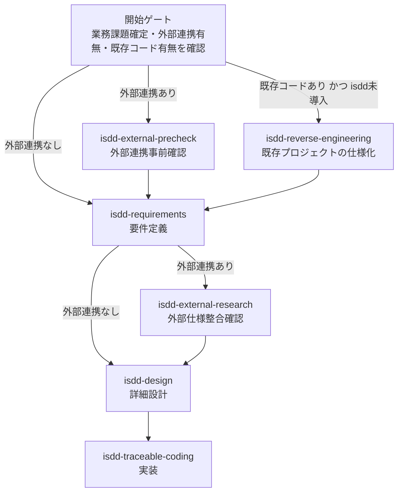
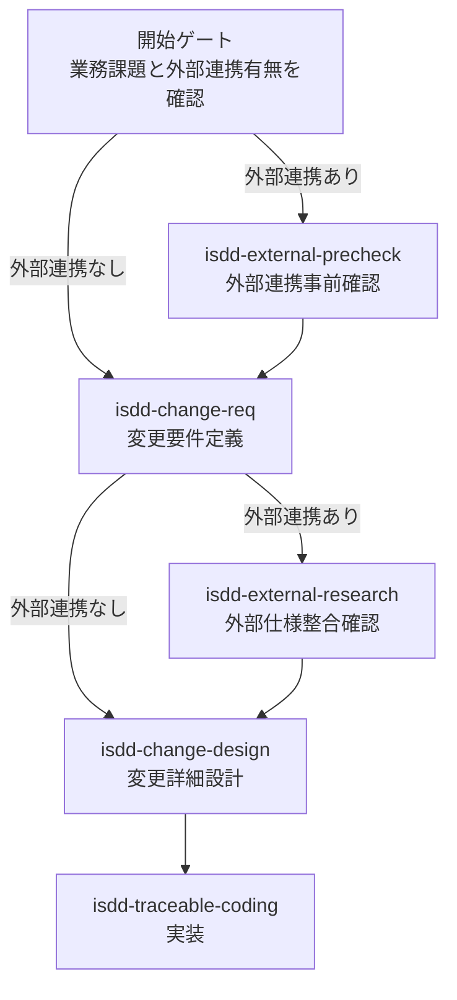
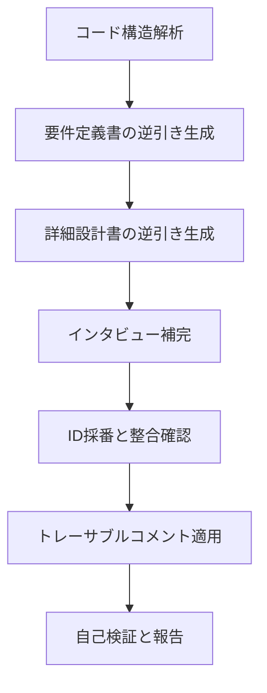
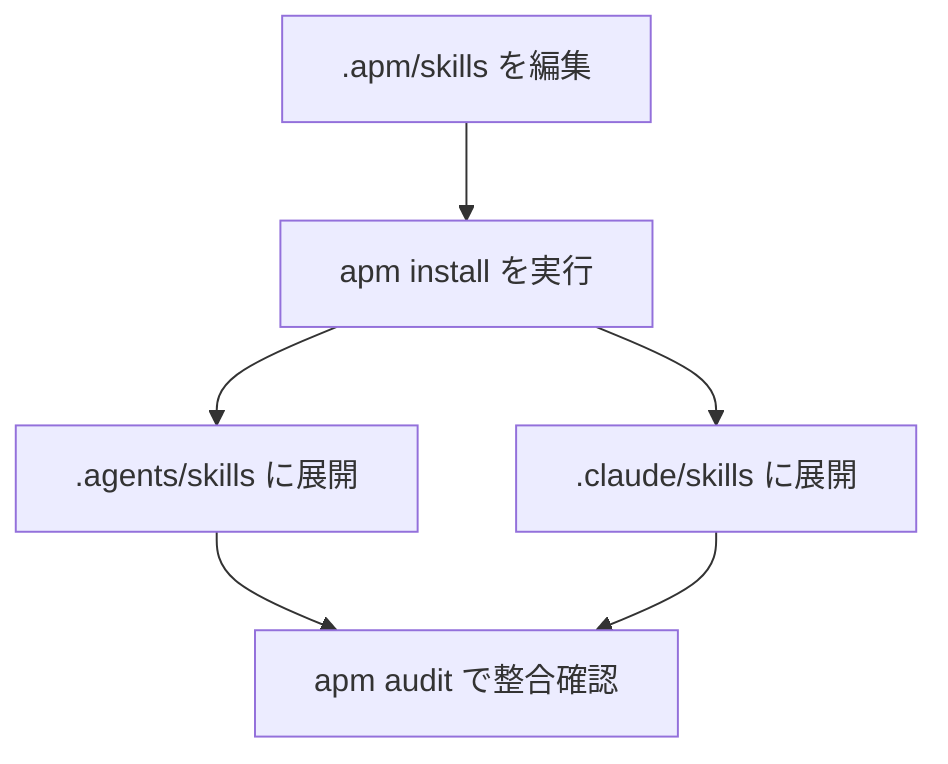

# 対話駆動仕様開発 - 要件・設計・ソースをIDで一貫追跡する

isdd（Interview-driven Spec-driven Development）はインタビュー駆動で仕様を確定して、要件・設計・ソースをIDで一貫追跡しながら、開発を進める手法です。

このディレクトリは、isdd を実行するためのスキル群の原本を APM 形式で管理します。

## 背景と目的

isdd は、AI 実装で起こりやすい次の問題を抑制することを目的とします。

1. 要件の曖昧さによる意図しない実装差分
2. 変更時の影響範囲不明による品質低下
3. 仕様とコードの対応関係が失われることによる保守性低下

そのため、isdd では要件と設計を先に確定し、実装では要件 ID と設計 ID を基準にトレーサビリティを維持します。

---

## 開発フロー全体像

### 新規開発フロー



### 変更フロー



### 既存プロジェクト適用フロー



---

## スキル一覧

| スキル名 | 役割 | 主な成果物 |
|---|---|---|
| isdd-requirements | インタビュー駆動で要件定義書を作成する | docs/requirements.md |
| isdd-design | 要件定義書から詳細設計書と実装タスクを作成する | docs/detail_design.md、.history/[日付]-[タスク名]/tasks.md |
| isdd-change-req | 既存要件に対する変更要件定義書を作成する | .history 配下の change_requirements.md |
| isdd-change-design | 変更要件から変更詳細設計書と実装タスクを作成する | .history/[日付]-[タスク名]/change_detail_design.md、.history/[日付]-[タスク名]/tasks.md |
| isdd-external-precheck | 外部連携の接続可否・認証方式・主要制限を事前確認する | precheck_report.md |
| isdd-external-research | 外部連携先の詳細仕様を調査し要件との整合を確認する | alignment_report.md、external 配下調査成果物 |
| isdd-reverse-engineering | 既存コードから要件・設計を逆引きし isdd 化する | docs/requirements.md、docs/detail_design.md |
| isdd-traceable-coding | 要件 ID と設計 ID に基づく実装コメント規則を適用する | 各ソースファイルのトレーサブルコメント |
| isdd-common | 共通参照ルールを提供する基盤スキル | skills/isdd-common/references 配下の定義ファイル |

---

## サブエージェント一覧

| エージェント名 | 主な利用スキル | 役割 |
|---|---|---|
| code-structure-analyzer | isdd-reverse-engineering | 既存コードの構造解析を分離実行する |
| external-research-investigator | isdd-external-research | 外部ライブラリ候補の調査と評価を実行する |
| db-schema-extractor | isdd-external-research | 外部 DB スキーマ情報の抽出を実行する |

---

## 共通リファレンスとスクリプト

isdd-common の references 配下に全スキルで参照する共通ルール、scripts 配下に整合性検証スクリプトを格納します。

### references/

| ファイル | 内容 |
|---|---|
| id-definitions.md | 要件 ID と設計 ID の定義 |
| document-rules.md | 仕様書・設計書の記述ルール |
| requirements-chapters.md | 要件定義書の章構成 |
| design-chapters.md | 詳細設計書の章構成 |
| design-completeness.md | 設計網羅性の確認ルール |
| design-tasks-rules.md | 実装タスク化のルール |
| hearing-complexity-rules.md | ヒアリング共通ルール |

### scripts/

| スクリプト | 用途 | 実行例 |
| --- | --- | --- |
| rq_integrity_checker.py | 要件定義書の RQ-* 内部整合性を検証（BKマッピング・フォーマット） | `python3 rq_integrity_checker.py docs/requirements.md` |
| rq_ds_link_checker.py | 要件ID（RQ-*）と設計ID（DS-*）の対応欠落・重複・不整合を検証 | `python3 rq_ds_link_checker.py docs/requirements.md docs/detail_design.md` |
| trace_comment_coverage_checker.py | ソースコードのトレーサブルコメント付与率と記載不足を検証 | `python3 trace_comment_coverage_checker.py src/` |

---

## バージョン管理

各スキルは SKILL.md の frontmatter に metadata.version を持ち、同一リリースでは全スキルのバージョンを揃えて管理します。

---

## 本リポジトリでの APM 運用

このリポジトリでは、スキルの編集対象と展開先を明確に分離します。

- 編集対象（原本）: .apm/skills
- 展開先（生成物）: .agents/skills と .claude/skills

運用上の扱いは次のとおりです。

1. スキルの編集は必ず .apm/skills で行う。
2. 展開先ディレクトリの内容は手編集しない。
3. 展開反映は apm install で行う。
4. 差分整合の確認は apm audit で行う。

展開ターゲットは apm.yml で claude と agent-skills を固定しているため、apm install の実行で .claude/skills と .agents/skills の双方へ同時に展開されます。



---

## Waza 評価運用

評価資材は `evals/[skill-name]/` 配下に配置し、評価は `evals/run-all.sh` で実行する。`waza run --discover` はこのリポジトリのスキル原本が `.apm/skills/` にあるため使用しない。

### 特定スキルのみ実行

```bash
bash evals/run-all.sh real isdd-change-design
bash evals/run-all.sh real isdd-requirements isdd-design
```

### 全スキル一括実行

```bash
bash evals/run-all.sh real
```

### mock モードについて

`eval.mock.yaml` は現状どのスキルにも存在しないため、`bash evals/run-all.sh mock` は未整備。

### 単体実行（デバッグ用）

```bash
waza run evals/[skill-name]/eval.copilot.yaml --context-dir evals/[skill-name]/fixtures -v
```

---
