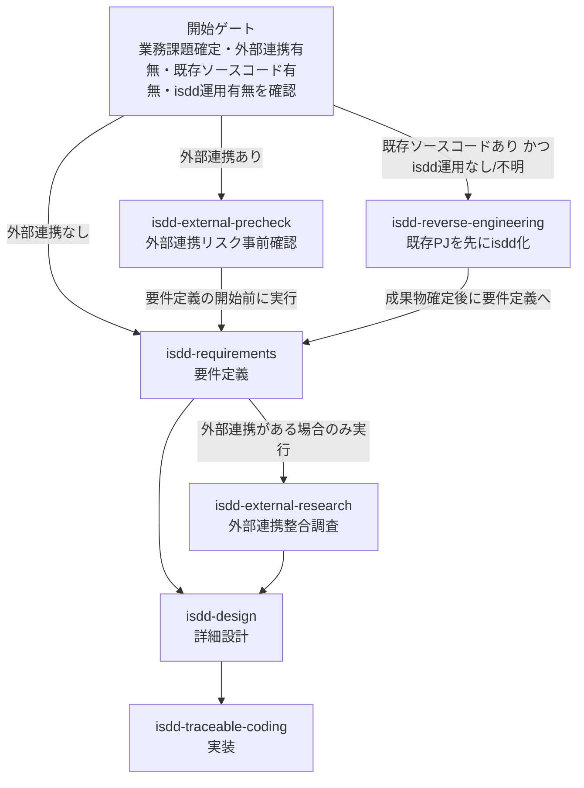
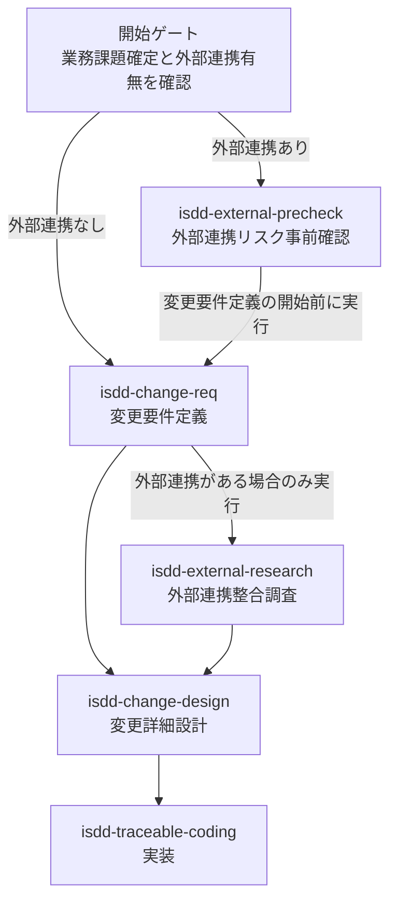
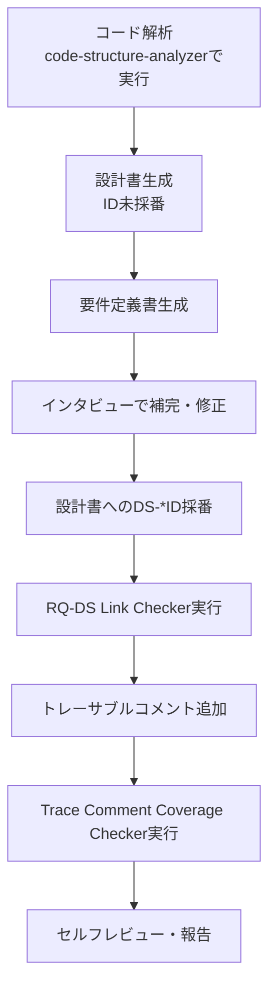

# isdd スキル群

**isdd（Interview-driven Spec-driven Development）** は、インタビュー駆動で仕様書を作り、仕様書からコードへのトレーサビリティを保ちながら開発を進める仕様駆動開発メソッドです。

本ディレクトリはその実践を支援する Agent Skills のセットです。

---

## 背景・設計思想

AIに「適当に」コードを生成させると次の2つの問題が発生する。

1. **改良のたびに既存機能が壊れる** — 要件が曖昧なままだとAIが勝手に解釈して設計意図を無視した上書きをする。
2. **コードレビューができない** — 非エンジニアはコードを読めず、エンジニアでもAIが短時間で生成した数千行を全行レビューするのは非現実的。

isdd はこの問題を「古典的なウォーターフォール（要件定義書 → 設計書 → コード）をAIに適用する」ことで解決する。

```
要件定義書 → 設計書 → コード
```

**コードレビューが不要になる根拠：** AIに「要件定義書・設計書に従ってコードを書く」と指示するため、設計書が正しければコードも正しくなる。人間がレビューするのは設計書の「画面遷移図」と「画面イメージ」だけでよく、DB設計やクラス設計の確認は不要。

**非エンジニアが使える根拠：** kiroのようなEARS形式（`WHEN/IF/THEN + モジュール名`）ではなく、AIがユーザーに1問ずつ平易な言葉で質問するインタビュー形式を採用している。修正すべきドラフトを渡すより、質問に答える方が参入障壁が低い。

**仕様書のポイント：**
- 各要件に「この機能が無いと何が困るか」の根拠を明示させる（曖昧な要件の排除）
- 将来拡張・一般論・ベストプラクティスを勝手に追加しない（スコープ膨張の防止）
- 不足情報があればユーザーに質問し、完全になるまで終了しない（AIのサボり防止）

---

## 開発フロー全体像

### 新規開発フロー



### 変更フロー



### 既存PJ適用フロー



---

## スキル一覧

### 新規開発フロー

| スキル名 | 役割 | 主な成果物 |
|---|---|---|
| `isdd-external-precheck` | 要件定義前に外部連携システムの接続可否・認証方式・主要制限のみを確認する軽量事前調査。外部連携がある場合のみ実行する | `precheck_report.md` |
| `isdd-requirements` | 業務課題（`RQ-BK-*`）を先に確定し、課題に紐づく要件のみで MVP に絞った矛盾のない要件定義書を作成する | `docs/requirements.md` |
| `isdd-external-research` | 要件定義書または変更要件定義書の出力後に、外部連携システムの詳細調査を行い要件との整合性を確認する。外部連携がある場合のみ実行する | `alignment_report.md`、`external/[システム名]/docs/research.md`、`src/`、`mock/`、`e2e/` |
| `isdd-design` | 要件定義書をもとに詳細設計書を作成し、実装タスクを生成する | `docs/detail_design.md`、`docs/tasks.md` |
| `isdd-traceable-coding` | 要件ID・設計IDをコードコメントに付与し、仕様とコードのトレーサビリティを維持する | 各ソースファイルへのIDコメント付与 |

### 変更フロー

| スキル名 | 役割 | 主な成果物 |
|---|---|---|
| `isdd-change-req` | 変更対象の業務課題（`RQ-BK-*`）を先に確定し、課題に紐づく変更要件のみで変更要件定義書を作成する。変更は「[追加]」「[削除]」で表現し「変更」は使わない | `.history/[YYYYMMDD]-[タスク名]/change_requirements.md` |
| `isdd-change-design` | 変更要件定義書をもとに変更詳細設計書を作成し、差分設計の網羅性をチェックする | `.history/[YYYYMMDD]-[タスク名]/change_detail_design.md`、`docs/tasks.md` |

### 既存PJ適用フロー

| スキル名 | 役割 | 主な成果物 |
|---|---|---|
| `isdd-reverse-engineering` | 既存ソースコードから要件定義書・設計書を逆引き生成し、トレーサブルコメントを追加する。コード解析は `code-structure-analyzer` サブエージェントに委譲する | `docs/requirements.md`、`docs/detail_design.md` |

---

## サブエージェント一覧

各スキルが特定の処理を委譲するサブエージェント。エージェントファイルは `.claude/agents/` に格納する。

| エージェント名 | 委譲元スキル | 役割 |
|---|---|---|
| `code-structure-analyzer` | `isdd-reverse-engineering` | 既存ソースコードの構造解析（大量のコード読み込みをメイン会話から隔離） |
| `external-research-investigator` | `isdd-external-research` | 外部連携ライブラリ候補の調査・評価（比較表・推奨理由・リスク評価を返却） |
| `db-schema-extractor` | `isdd-external-research` | DB接続または公開リファレンスからスキーマ情報を抽出（`.env` 未作成時は停止、秘密情報は出力しない） |

---

## チェックスクリプト一覧

`isdd-reverse-engineering` スキルが自動実行する検証スクリプト。格納場所は `.agents/skills/isdd-reverse-engineering/scripts/`。

| スクリプト名 | 実行タイミング | 役割 |
|---|---|---|
| `rq_ds_link_checker.py` | 要件定義書・設計書の逆引き生成後 | 要件ID（`RQ-*`）と設計ID（`DS-*`）の対応欠落・重複・不整合を検出する |
| `trace_comment_coverage_checker.py` | トレーサブルコメント付与後 | コードへのID付与状況を検査し、未付与・不足・カバレッジ率をレポートする |

---

## 共通リファレンス（`isdd-common/references/`）

全スキルから参照する共通定義ファイル群。各スキルの SKILL.md から参照するのみで、直接編集は原則行わない。

| ファイル | 内容 |
|---|---|
| `id-definitions.md` | 要件ID（`RQ-*`）・設計ID（`DS-*`）の体系・命名規則の完全定義 |
| `document-rules.md` | 仕様書・設計書の作成ルール（markdown形式、mermaid使用、コード例禁止など） |
| `requirements-chapters.md` | 要件定義書の必須章立て（セクション1〜6）とCRUDテーブル形式の定義 |
| `design-chapters.md` | 詳細設計書の必須章立て（言語・FW選定、DB設計、E2Eテスト設計を含む全セクション） |
| `design-completeness.md` | 詳細設計書の完全性チェックリスト |
| `design-tasks-rules.md` | `tasks.md` 作成ルール（実装タスクの粒度・形式） |

---

## バージョン管理

各スキルの `SKILL.md` frontmatter に `metadata.version` でバージョンを管理する。

```yaml
metadata:
  version: "1.0.9"
```

ある程度の検証をしたら、スキル群を全て同じバージョンに揃えてリリースバージョンを振り直す。

---

## 対応AIツール

isdd スキル群は以下のAIツールで使用できる。スキルファイルの格納場所はツールによって異なる。

| ディレクトリ | GitHub Copilot | Claude Code | OpenCode | Codex |
|---|:---:|:---:|:---:|:---:|
| `.agents/skills/` | ✓ | ✗ | ✓ | ✓ |
| `.claude/skills/` | ✓ | ✓ | ✓ | ✗ |

4ツール全カバーのため、本リポジトリでは `.agents/skills/` と `.claude/skills/` をハードリンクで同期している。どちらのディレクトリを編集しても同じファイルを更新することになる。

**各ツールのスキル起動方法：**

| ツール | 起動方法 |
|---|---|
| GitHub Copilot | プロンプト内容に応じて自動選択 |
| Claude Code | `/skill-name` で明示起動、またはプロンプトに応じて自動起動 |
| OpenCode | `$skill-name` または `/skill-name` で明示起動 |
| Codex | プロンプト内で `$skill-name` を使った明示起動、または説明に基づく自動起動 |

---

## 技術選定ポリシー

`isdd-design` および `isdd-change-design` で設計書を生成する際のデフォルト技術選定ルール。特段の理由がなければ以下を採用する。

### 言語・フレームワーク

| 条件 | 採用技術 |
|---|---|
| 特段の理由がない場合 | Python |
| GUIが必要でシンプルな画面遷移 | Python + Streamlit |
| GUIが必要で複雑な画面遷移・部品が必要 | Vue (Vuetify) + FastAPI |

Vue + FastAPI 構成の場合、以下を設計書に**必ず**明記する。
- フロントエンド：マルチステージビルドで npm ビルド後 nginx で配信
- バックエンド：nginx でリバースプロキシ（エンドポイントは `/api/`）

### データベース

| 条件 | 採用DB |
|---|---|
| ~100万件以内かつ単純なアプリ | SQLite |
| 上記以外 | PostgreSQL |

DBが不要な場合は設計書に「DB設計は行わない」と明記する。

### 起動方式

すべてのシステムは **docker compose** で起動することを前提に設計する。DB スキーマ・初期ユーザーなどの初期化は起動時に自動化する。

### コード品質

- クラス設計は **SOLID原則** を遵守する
- Python コーディングは **PEP8** に準拠し、型ヒントと docstring を付与する
