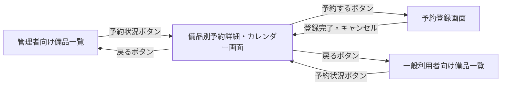
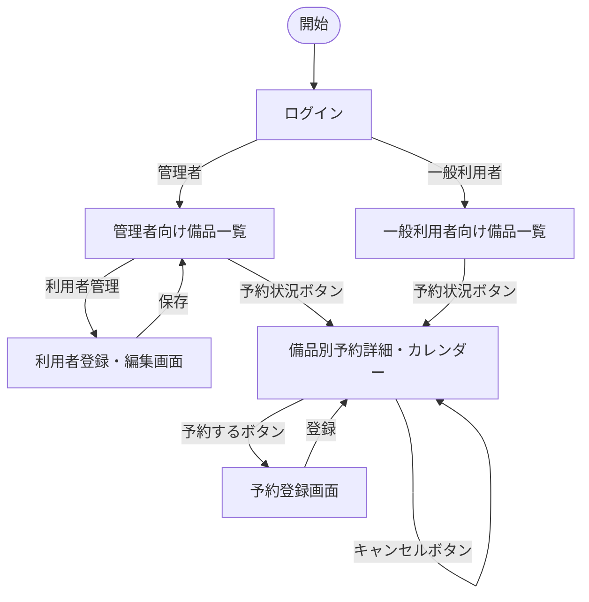

# 変更要件定義書 — 部署マスタ連携 & 備品予約機能追加

作成日: 2026-05-06  
対応 precheck_report: `external/neon-department-db/docs/precheck_report.md`

---

## 1. 目的・前提

### 変更のビジョン

備品管理・貸出管理アプリに「所属部署の可視化」と「備品の期間予約」を追加し、  
部署別の備品利用状況の把握と、計画的な備品確保を実現する。

### 変更なし

変更なし。既存要件定義書 `docs/requirements.md` セクション1 を参照。

### 追加用語

| 用語 | 定義 |
|---|---|
| 部署 | 外部DBで管理される組織単位（例: 営業部・開発部） |
| 予約 | 利用者が特定の備品を指定した期間（開始日〜終了日）で事前確保すること |
| 予約済み | 少なくとも1件の有効な予約が存在し、かつ現在貸出中でない備品のステータス（システム内値: reserved） |
| 予約期間 | 予約の開始日から終了日までの日付範囲（両端含む） |
| 予約の重複 | 同じ備品に対し、既存予約の予約期間と新規予約の予約期間が1日以上重なること |

---

## 2. 業務

### 変更なし

変更なし。既存要件定義書 `docs/requirements.md` セクション2 を参照。

### 2-1. 業務課題一覧（変更分）

**[追加] 新規業務課題**

| RQ-BK-ID | 対応業務（RQ-BZ-*） | 業務課題 | 現状の問題 | 業務影響 | 解決状態 |
|---|---|---|---|---|---|
| RQ-BK-NO-DEPT-VISIBILITY | RQ-BZ-EQUIPMENT-MANAGEMENT | 利用者の所属部署が不明で部署別の備品利用状況が把握できない | 利用者情報に部署情報がなく、貸出先として氏名のみが表示される | 部署ごとの備品使用状況が把握できず、備品管理の粒度が粗い | 外部DBから部署名を取得し、利用者情報・貸出一覧・利用者一覧に所属部署が表示される |
| RQ-BK-NO-RESERVATION | RQ-BZ-EQUIPMENT-MANAGEMENT | 備品の事前予約ができず、計画的な備品確保ができない | 先着順の貸出のみで、将来の日程で備品を確保する手段がない | 需要の高い備品が争奪戦になり、必要な時に備品を確保できない | 利用者が備品を期間（開始日〜終了日）で予約でき、重複なく日程を確保できる |

### 業務の範囲・担当者（変更分）

| 担当者 | 追加される業務範囲 |
|---|---|
| 管理者 | 利用者の部署登録・備品の予約登録・予約キャンセル |
| 一般利用者 | 備品の予約登録・自分の予約のキャンセル |

---

## 3. 機能要件

### 入力データ（変更分）

**[追加]** 外部連携（Neon PostgreSQL の部署マスタ）からの部署データ取得が加わる。

### 出力データ

変更なし。既存要件定義書 `docs/requirements.md` セクション3 を参照。

### 外部連携

#### [削除] deprecated 要件

| RQ-ID | 削除区分 | deprecated 理由 | 解消される業務課題（RQ-BK-*） |
|---|---|---|---|
| RQ-EX-NO-EXTERNAL-INTEGRATION | [削除] deprecated | 外部DB（Neon PostgreSQL）への部署マスタ連携が追加されるため「外部連携なし」という前提が無効になる | RQ-BK-NO-DEPT-VISIBILITY |

#### [追加] 新規外部連携

| RQ-ID | カテゴリ | 機能名 | 対応業務課題ID（RQ-BK-*） | この機能が無いと何が困るか |
|---|---|---|---|---|
| RQ-EX-FETCH-DEPARTMENT-MASTER | 外部連携 | 部署マスタ・ユーザー照合取得（Neon PostgreSQL） | RQ-BK-NO-DEPT-VISIBILITY | 部署名を画面表示時に取得できず、貸出一覧・利用者一覧で部署情報が欠落する |

**RQ-EX-FETCH-DEPARTMENT-MASTER の詳細:**

| 項目 | 仕様 |
|---|---|
| 接続先 | Neon PostgreSQL（`demo_departments` テーブル、`demo_users` テーブル） |
| 接続方法 | PostgreSQL 直接接続（接続プーラー PgBouncer 経由） |
| 使用ライブラリ | SQLAlchemy 2.0 + psycopg2-binary（NullPool 設定必須） |
| 接続情報管理 | 環境変数 `EXTERNAL_DB_URL` に接続文字列を格納する。コードへの直書き禁止 |
| 取得オペレーション | ログインIDによる部署名取得: `demo_users.user_id = 内部利用者のlogin_id` で照合し、JOIN で `demo_departments.department_name` を取得する |
| アクセス種別 | SELECT のみ（INSERT/UPDATE/DELETE 禁止） |
| 照合失敗時 | `demo_users.user_id` に一致するレコードがない場合は「不明」を返す。内部DBは変更しない |
| 接続失敗時 | 部署名表示欄には「不明」を表示し、他の操作は継続可能とする |
| Neon オートサスペンド | 無操作5分後にDBが停止し、初回接続時に最大数秒の応答遅延が発生する可能性がある。`RQ-NF-EXTERNAL-DB-TIMEOUT` で対応を規定する |

### 機能一覧（変更分）

#### [追加] 新規機能

| RQ-ID | カテゴリ | 機能名 | 対応業務課題ID（RQ-BK-*） | この機能が無いと何が困るか |
|---|---|---|---|---|
| RQ-FT-FETCH-DEPT-BY-LOGIN-ID | 業務機能 | ログインIDによる部署名動的取得 | RQ-BK-NO-DEPT-VISIBILITY | 部署名を表示できず、誰のどの部署の備品かが不明になる |
| RQ-FT-DEPT-NAME-API | 業務機能 | 部署名取得APIエンドポイント | RQ-BK-NO-DEPT-VISIBILITY | フロントエンドが非同期で部署名を取得するためのバックエンドAPIがなくなる |
| RQ-FT-DISPLAY-DEPT-IN-LOAN | 業務機能 | 貸出画面・一覧への部署表示 | RQ-BK-NO-DEPT-VISIBILITY | 貸出先の所属部署が分からず、どの部署が何を使っているか不明になる |
| RQ-FT-MAKE-RESERVATION | 業務機能 | 備品の期間予約 | RQ-BK-NO-RESERVATION | 利用者が希望期間に備品を確保する手段がなく、貸出争奪が継続する |
| RQ-FT-CANCEL-RESERVATION | 業務機能 | 予約キャンセル | RQ-BK-NO-RESERVATION | 予約を取り消す手段がなく、不要な予約が残り他の利用者が予約できなくなる |
| RQ-FT-VIEW-RESERVATION-CALENDAR | 業務機能 | 備品別予約カレンダー表示 | RQ-BK-NO-RESERVATION | 予約済み期間を視覚的に確認できず、重複した予約申請が増加する |

**RQ-FT-FETCH-DEPT-BY-LOGIN-ID の詳細:**

| 項目 | 仕様 |
|---|---|
| 取得タイミング | 画面の初期表示後に JavaScript（Fetch API）で非同期取得する。画面本体のレンダリングは外部DBの応答を待たない |
| 取得前の表示 | 部署名表示箇所に「取得中...」をプレースホルダーとして表示する |
| 照合方法 | フロントエンドが `RQ-FT-DEPT-NAME-API` エンドポイントを呼び出し、バックエンドが `demo_users.user_id = 内部利用者のlogin_id` でマッチングし JOIN で `demo_departments.department_name` を取得する |
| 照合成功時 | 取得した `department_name`（例: 営業部）で「取得中...」を置き換える |
| 照合失敗時 | 「不明」で「取得中...」を置き換える。内部DBへの書き込みは行わない |
| 外部DB接続失敗時 | 「不明」で「取得中...」を置き換える。他の表示・操作は継続可能とする |

**RQ-FT-DEPT-NAME-API の詳細:**

| 項目 | 仕様 |
|---|---|
| エンドポイント | `GET /api/department/by-login-id` |
| リクエストパラメータ | `login_id`（クエリパラメータ、必須） |
| レスポンス（成功） | `{ "department_name": "営業部" }`（HTTP 200） |
| レスポンス（照合失敗） | `{ "department_name": "不明" }`（HTTP 200） |
| 認証 | ログイン済みユーザーのみ呼び出し可。未認証は HTTP 401 を返す |
| 外部DB接続失敗時 | `{ "department_name": "不明" }`（HTTP 200）を返す。エラーはサーバーログに記録する |

### 全画面仕様（変更分）

#### [追加] 既存画面への追加仕様

**RQ-UI-BORROWER-LIST-DEPT-COLUMN — 利用者一覧画面への部署列追加**

| RQ-ID | 項目 | 仕様 |
|---|---|---|
| RQ-UI-BORROWER-LIST-DEPT-COLUMN | 追加表示内容 | 部署名列を利用者一覧に追加する |
| RQ-UI-BORROWER-LIST-DEPT-COLUMN | 対応業務課題 | RQ-BK-NO-DEPT-VISIBILITY |

**RQ-UI-LOAN-FORM-DEPT-DISPLAY — 貸出登録画面の貸出先選択への部署名追加**

| RQ-ID | 項目 | 仕様 |
|---|---|---|
| RQ-UI-LOAN-FORM-DEPT-DISPLAY | 貸出先選択欄の変更 | ドロップダウンの選択肢を「利用者名（部署名）」の形式で表示する（例: 田中太郎（営業部）） |
| RQ-UI-LOAN-FORM-DEPT-DISPLAY | 対応業務課題 | RQ-BK-NO-DEPT-VISIBILITY |

**RQ-UI-ADMIN-LIST-DEPT-DISPLAY — 管理者向け備品一覧への部署名・予約状態追加**

| RQ-ID | 項目 | 仕様 |
|---|---|---|
| RQ-UI-ADMIN-LIST-DEPT-DISPLAY | 貸出先情報への部署追加 | 貸出中の備品行に「貸出先利用者名（部署名）」を表示する（例: 田中太郎（営業部）） |
| RQ-UI-ADMIN-LIST-DEPT-DISPLAY | 対応業務課題 | RQ-BK-NO-DEPT-VISIBILITY |

**RQ-UI-ADMIN-LIST-RESERVATION-STATUS — 管理者向け備品一覧への予約ステータス追加**

| RQ-ID | 項目 | 仕様 |
|---|---|---|
| RQ-UI-ADMIN-LIST-RESERVATION-STATUS | ステータス表示の拡張 | ステータス列に「予約済み（reserved）」を追加する。表示優先順位: 貸出中 ＞ 予約済み ＞ 在庫 |
| RQ-UI-ADMIN-LIST-RESERVATION-STATUS | 予約詳細へのリンク | 各備品行に「予約状況」ボタンを追加し、押下で RQ-UI-RESERVATION-CALENDAR-SCREEN に遷移する |
| RQ-UI-ADMIN-LIST-RESERVATION-STATUS | 対応業務課題 | RQ-BK-NO-RESERVATION |

**RQ-UI-GENERAL-LIST-RESERVATION-STATUS — 一般利用者向け備品一覧への予約ステータス追加**

| RQ-ID | 項目 | 仕様 |
|---|---|---|
| RQ-UI-GENERAL-LIST-RESERVATION-STATUS | ステータス表示の拡張 | ステータス列に「予約済み（reserved）」を追加する。表示優先順位は管理者向けと同じ |
| RQ-UI-GENERAL-LIST-RESERVATION-STATUS | 予約詳細へのリンク | 各備品行に「予約状況」ボタンを追加し、押下で RQ-UI-RESERVATION-CALENDAR-SCREEN に遷移する |
| RQ-UI-GENERAL-LIST-RESERVATION-STATUS | 対応業務課題 | RQ-BK-NO-RESERVATION |

#### [追加] 新規画面

**RQ-UI-RESERVATION-CALENDAR-SCREEN — 備品別予約詳細・カレンダー画面**

| 項目 | 仕様 |
|---|---|
| 対象ロール | 全利用者 |
| 表示内容 | 対象備品の備品ID・備品名・現在のステータス、予約一覧（予約者名・部署名・開始日・終了日の一覧）、予約期間カレンダー（月次カレンダー形式で予約期間をハイライト表示） |
| 操作（全利用者） | 「予約する」ボタン（備品のステータスに関わらず常に表示）→ RQ-UI-RESERVATION-FORM-SCREEN へ遷移 |
| 操作（予約者本人・管理者） | 自分の予約行に「キャンセル」ボタンを表示する。管理者は全予約の「キャンセル」ボタンを表示する |
| キャンセル後 | 当該画面を再表示し、キャンセルされた予約が一覧から消えていること |
| 「戻る」ボタン | 遷移元の備品一覧画面に戻る |
| 対応業務課題 | RQ-BK-NO-RESERVATION |

**RQ-UI-RESERVATION-FORM-SCREEN — 予約登録画面**

| 項目 | 仕様 |
|---|---|
| 対象ロール | 全利用者 |
| 表示内容 | 対象備品の備品ID・備品名 |
| 入力項目（一般利用者） | 開始日（日付入力、必須）、終了日（日付入力、必須、開始日以降） |
| 入力項目（管理者） | 開始日（必須）、終了日（必須）、予約者（ドロップダウンで利用者を選択） |
| 重複チェック | 登録ボタン押下時に、同じ備品の既存予約期間と重複しないかを確認する。重複している場合はエラーメッセージを表示し登録を拒否する（「指定期間は既に予約されています」） |
| 登録後 | RQ-UI-RESERVATION-CALENDAR-SCREEN に遷移し、登録した予約が一覧に表示されること |
| 「キャンセル」ボタン | RQ-UI-RESERVATION-CALENDAR-SCREEN に戻る（登録は行わない） |
| 対応業務課題 | RQ-BK-NO-RESERVATION |

### 画面一覧（変更分）

**[追加] 新規画面**

| RQ-ID | カテゴリ | 画面名 | 対応業務課題ID（RQ-BK-*） | この画面が無いと何が困るか |
|---|---|---|---|---|
| RQ-UI-RESERVATION-CALENDAR-SCREEN | 画面 | 備品別予約詳細・カレンダー画面 | RQ-BK-NO-RESERVATION | 備品の予約状況を確認・予約・キャンセルする導線がなくなる |
| RQ-UI-RESERVATION-FORM-SCREEN | 画面 | 予約登録画面 | RQ-BK-NO-RESERVATION | 予約の開始日・終了日を入力する画面がなくなる |

**[追加] 既存画面への追加仕様**

| RQ-ID | カテゴリ | 追加仕様名 | 対応業務課題ID（RQ-BK-*） | この追加が無いと何が困るか |
|---|---|---|---|---|
| RQ-UI-BORROWER-LIST-DEPT-COLUMN | 画面追加仕様 | 利用者一覧への部署列追加 | RQ-BK-NO-DEPT-VISIBILITY | 利用者一覧で所属部署が確認できなくなる |
| RQ-UI-LOAN-FORM-DEPT-DISPLAY | 画面追加仕様 | 貸出登録画面の貸出先選択への部署名表示 | RQ-BK-NO-DEPT-VISIBILITY | 貸出登録時に貸出先の部署が分からなくなる |
| RQ-UI-ADMIN-LIST-DEPT-DISPLAY | 画面追加仕様 | 管理者向け備品一覧への部署名追加 | RQ-BK-NO-DEPT-VISIBILITY | 一覧で貸出先の部署が確認できなくなる |
| RQ-UI-ADMIN-LIST-RESERVATION-STATUS | 画面追加仕様 | 管理者向け備品一覧への予約ステータス・予約状況ボタン追加 | RQ-BK-NO-RESERVATION | 予約済み備品のステータスが分からず、予約詳細への導線がなくなる |
| RQ-UI-GENERAL-LIST-RESERVATION-STATUS | 画面追加仕様 | 一般利用者向け備品一覧への予約ステータス・予約状況ボタン追加 | RQ-BK-NO-RESERVATION | 一般利用者が予約済み備品のステータスと予約詳細を確認できなくなる |

### 画面遷移図（変更分）

変更後の追加遷移のみ示す。既存遷移は `docs/requirements.md` セクション3 を参照。

### ユーザー利用フロー（変更分）

### ログ・監視・アラート

変更なし。既存要件定義書 `docs/requirements.md` セクション3 を参照。

---

## 4. データ

### 内部データ / 外部データの区別（変更分）

#### [削除] deprecated 要件

| RQ-ID | 削除区分 | deprecated 理由 | 解消される業務課題（RQ-BK-*） |
|---|---|---|---|
| RQ-DT-NO-EXTERNAL-DB | [削除] deprecated | Neon PostgreSQL への外部DB接続が追加されるため「外部DB接続なし」という前提が無効になる | RQ-BK-NO-DEPT-VISIBILITY |

#### [追加] 新規データ区分

| RQ-ID | 区分 | データ名 | 説明 | 対応業務課題ID（RQ-BK-*） |
|---|---|---|---|---|
| RQ-DT-DEPARTMENT-EXTERNAL | 外部データ | 部署データ | 外部DB（`demo_departments`・`demo_users`）から読み取り専用で取得する部署情報。アプリ内DBには保存しない。login_id で demo_users を照合し、部署名を動的に取得する | RQ-BK-NO-DEPT-VISIBILITY |
| RQ-DT-RESERVATION-INTERNAL | 内部データ | 予約データ | アプリ内DBで管理する備品予約情報 | RQ-BK-NO-RESERVATION |

### データ保持期間（変更分）

#### [追加] 新規データ保持期間

| RQ-ID | データ名 | 保持期間 | 理由 | 対応業務課題ID（RQ-BK-*） |
|---|---|---|---|---|
| RQ-DT-RESERVATION-RETENTION | 予約データ | 利用者によるキャンセル操作、または備品の返却操作（end_date が返却日より前の予約を自動削除）まで保持する | 固定の時間的保持期間は設けない。キャンセル操作（手動）または返却操作（end_date < 返却日の予約を自動削除）でレコードを削除する | RQ-BK-NO-RESERVATION |

### 外部DB接続先（変更分）

#### [追加] 新規接続先

| RQ-ID | 接続先 | 接続方法 | 環境変数 | 対応業務課題ID（RQ-BK-*） |
|---|---|---|---|---|
| RQ-DT-EXTERNAL-DB-NEON | Neon PostgreSQL（`demo_departments`・`demo_users`） | PostgreSQL 直接接続（SSL必須、接続プーラー経由、SQLAlchemy 2.0 + psycopg2-binary、NullPool） | `EXTERNAL_DB_URL` | RQ-BK-NO-DEPT-VISIBILITY |

### 業務エンティティ一覧（変更分）

#### [追加] 新規エンティティ

| RQ-ID | カテゴリ | 業務エンティティ名 | 対応業務課題ID（RQ-BK-*） | この業務エンティティが無いと何が困るか |
|---|---|---|---|---|
| RQ-DT-RESERVATION-ENTITY | 業務エンティティ | 予約 | RQ-BK-NO-RESERVATION | 備品の予約情報を記録できず、期間重複チェックと確保管理が不可能になる |

**RQ-DT-EQUIPMENT-RESERVED-STATUS — 備品エンティティのステータス拡張**

| RQ-ID | 内容 | 対応業務課題ID（RQ-BK-*） |
|---|---|---|
| RQ-DT-EQUIPMENT-RESERVED-STATUS | 備品エンティティのステータスに「予約済み（reserved）」を追加し、在庫（available）・予約済み（reserved）・貸出中（loaned）の3値とする。ステータスの優先順位: 貸出中 ＞ 予約済み ＞ 在庫。予約済みは「有効な予約が1件以上存在し、かつ現在貸出中でない状態」と定義する | RQ-BK-NO-RESERVATION |

#### 予約エンティティの属性

| 属性名 | 型 | 制約 | 説明 |
|---|---|---|---|
| 予約ID | UUID | 主キー、自動生成 | 予約を一意に識別するID |
| 備品ID | 文字列 | 必須、FK→備品 | 予約対象の備品ID |
| 利用者ログインID | 文字列 | 必須、FK→利用者 | 予約した利用者のログインID |
| 開始日 | 日付 | 必須 | 予約期間の開始日（YYYY-MM-DD形式） |
| 終了日 | 日付 | 必須、開始日以降 | 予約期間の終了日（YYYY-MM-DD形式） |

---

## 4-1. CRUDテーブル（全エンティティ）

| エンティティ名 | Create | Read（一覧） | Read（詳細） | Update | Delete | 備考 |
|---|---|---|---|---|---|---|
| 備品 | ○ | ○ | × | ○ | ○ | 変更なし。Createは管理者のみ。Read一覧は全利用者。Update/Deleteは管理者のみ |
| 利用者 | ○ | ○ | × | △ | ○ | 変更なし。操作権限変更なし（全操作管理者のみ）。部署は外部DBから動的取得 |
| 貸出状態 | ○ | × | × | × | ○ | 変更なし。管理者のみ。Create=貸出操作、Delete=返却操作 |
| 予約 | ○ | ○ | × | × | ○ | Createは全利用者（一般利用者は自分自身のみ、管理者は任意の利用者で登録）。Read一覧は全利用者（RQ-UI-RESERVATION-CALENDAR-SCREENで表示）。Updateなし（修正はキャンセル→再登録）。Delete=キャンセル操作（一般利用者は自分の予約のみ、管理者は全て） |

---

## 5. 非機能要件

### [追加] 新規非機能要件

| RQ-ID | カテゴリ | 非機能要件名 | 対応業務課題ID（RQ-BK-*） | この非機能要件が無いと何が困るか |
|---|---|---|---|---|
| RQ-NF-EXTERNAL-DB-TIMEOUT | 性能 | 外部DB接続タイムアウトを5秒以内に設定する。タイムアウト発生時は部署名表示欄に「不明」を表示し、他の操作は継続可能とする | RQ-BK-NO-DEPT-VISIBILITY | タイムアウト設定がないと外部DB停止時にアプリ全体が無応答になる |
| RQ-NF-EXTERNAL-DB-READONLY | セキュリティ | 外部DB（Neon PostgreSQL）に対してSELECT以外のSQL（INSERT/UPDATE/DELETE）を実行してはならない | RQ-BK-NO-DEPT-VISIBILITY | 誤った書き込み操作が外部DBを破壊するリスクがある |
| RQ-NF-RESERVATION-CONFLICT-PREVENTION | セキュリティ・整合性 | 同一備品への重複予約（期間が1日以上重なる予約）をDBトランザクションで排他制御し、同時リクエスト時でも重複を許可しない | RQ-BK-NO-RESERVATION | 同時予約リクエストで重複予約が発生し、予約の信頼性が損なわれる |

---

## 6. テスト用利用シナリオ（変更分）

### [追加] 新規テストシナリオ

| RQ-ID | テスト目的 | 前提条件 | テスト手順 | 期待される結果 | 対応業務課題ID（RQ-BK-*） |
|---|---|---|---|---|---|
| RQ-TS-VERIFY-DEPT-DISPLAY-FROM-EXTERNAL | 画面が即時表示され、非同期で外部DBから部署名が取得・更新されること | 管理者でログイン済み、外部DB接続可能、login_id が demo_users.user_id に存在する利用者が登録済み | 1. 利用者一覧画面を開く 2. 画面の初期表示を確認する（部署名欄に「取得中...」が表示されること） 3. 非同期取得完了後を確認する | 2. 画面本体（備品名・利用者名等）が部署名取得を待たず即時表示される 3. 「取得中...」が demo_departments から取得した部署名に置き換わる | RQ-BK-NO-DEPT-VISIBILITY |
| RQ-TS-VERIFY-DEPT-DISPLAY-IN-LOAN | 貸出登録時に貸出先利用者の部署名が表示されること | 管理者でログイン済み、部署ありの利用者が存在する | 1. 在庫備品の「貸出」ボタンを押す 2. 貸出登録画面の貸出先ドロップダウンを確認する | ドロップダウンに「利用者名（部署名）」の形式で選択肢が表示される | RQ-BK-NO-DEPT-VISIBILITY |
| RQ-TS-VERIFY-DEPT-DISPLAY-IN-EQUIPMENT-LIST | 備品一覧の貸出先情報に部署名が表示されること | 管理者でログイン済み、貸出中の備品が存在し、その貸出先利用者に部署が設定されている | 1. 管理者向け備品一覧を開く | 貸出中の備品行に「貸出先利用者名（部署名）」が表示される | RQ-BK-NO-DEPT-VISIBILITY |
| RQ-TS-VERIFY-RESERVATION-CREATE | 一般利用者が備品を期間指定で予約できること | 一般利用者でログイン済み、在庫状態の備品が存在する | 1. 備品一覧から対象備品の「予約状況」ボタンを押す 2. カレンダー画面で「予約する」を押す 3. 予約登録画面で開始日・終了日を入力して登録する | カレンダー画面に戻り、登録した予約期間がカレンダーにハイライト表示される。備品一覧のステータスが「予約済み」に変わる | RQ-BK-NO-RESERVATION |
| RQ-TS-VERIFY-RESERVATION-CONFLICT | 重複する期間の予約が拒否されること | 一般利用者でログイン済み、ある備品に「2026-06-01〜2026-06-05」の予約が存在する | 1. 同じ備品に「2026-06-03〜2026-06-07」の期間で予約を試みる | 「指定期間は既に予約されています」エラーが表示され、予約が登録されない | RQ-BK-NO-RESERVATION |
| RQ-TS-VERIFY-RESERVATION-NON-OVERLAP | 重複しない期間の複数予約が許可されること | 一般利用者でログイン済み、ある備品に「2026-06-01〜2026-06-05」の予約が存在する | 1. 同じ備品に「2026-06-10〜2026-06-15」の期間で予約を試みる | 予約が正常に登録され、カレンダーに両方の予約期間が表示される | RQ-BK-NO-RESERVATION |
| RQ-TS-VERIFY-RESERVATION-CANCEL | 予約者本人が自分の予約をキャンセルできること | 一般利用者でログイン済み、当該利用者の予約が存在する | 1. 該当備品の「予約状況」ボタンを押す 2. カレンダー画面で自分の予約行の「キャンセル」ボタンを押す | カレンダー画面から該当予約が消え、他に予約がない場合は備品ステータスが「在庫」に変わる | RQ-BK-NO-RESERVATION |
| RQ-TS-VERIFY-ADMIN-CANCEL-OTHERS-RESERVATION | 管理者が他の利用者の予約をキャンセルできること | 管理者でログイン済み、他の利用者の予約が存在する | 1. 該当備品の「予約状況」ボタンを押す 2. 他の利用者の予約行にある「キャンセル」ボタンを押す | 該当予約がカレンダーから消える | RQ-BK-NO-RESERVATION |
| RQ-TS-VERIFY-RESERVATION-TO-LOAN | 管理者が予約済み備品に対して貸出操作でき、返却時に期間終了済み予約が自動削除されること | 管理者でログイン済み、予約が存在し、備品が在庫または予約済み状態 | 1. 管理者向け備品一覧から該当備品の「貸出」ボタンを押す 2. 貸出登録画面で予約者を選択して登録する 3. 備品を返却する | 2. 備品ステータスが「貸出中」に変わる 3. end_date が返却日より前の予約が自動削除される。残予約がなければ備品ステータスが「在庫」になる | RQ-BK-NO-RESERVATION |
| RQ-TS-VERIFY-EXTERNAL-DB-FAILURE | 外部DBへの接続失敗時に部署名が「不明」と表示されること | 外部DBが接続不可の状態（環境変数に不正な値を設定） | 1. 利用者一覧画面または備品一覧画面を開く | 部署名表示欄に「不明」が表示される。他の画面表示・操作は継続可能 | RQ-BK-NO-DEPT-VISIBILITY |

---

## 業務課題と要件の対応表（変更後）

### 既存の業務課題への対応

変更なし。既存要件定義書 `docs/requirements.md` の対応表を参照。

### [追加] 新規業務課題への対応

| RQ-BK-ID | 業務課題 | 対応する要件ID |
|---|---|---|
| RQ-BK-NO-DEPT-VISIBILITY | 利用者の所属部署が不明で部署別の備品利用状況が把握できない | RQ-EX-FETCH-DEPARTMENT-MASTER, RQ-FT-FETCH-DEPT-BY-LOGIN-ID, RQ-FT-DEPT-NAME-API, RQ-FT-DISPLAY-DEPT-IN-LOAN, RQ-UI-BORROWER-LIST-DEPT-COLUMN, RQ-UI-LOAN-FORM-DEPT-DISPLAY, RQ-UI-ADMIN-LIST-DEPT-DISPLAY, RQ-DT-DEPARTMENT-EXTERNAL, RQ-DT-EXTERNAL-DB-NEON, RQ-NF-EXTERNAL-DB-TIMEOUT, RQ-NF-EXTERNAL-DB-READONLY, RQ-TS-VERIFY-DEPT-DISPLAY-FROM-EXTERNAL, RQ-TS-VERIFY-DEPT-DISPLAY-IN-LOAN, RQ-TS-VERIFY-DEPT-DISPLAY-IN-EQUIPMENT-LIST, RQ-TS-VERIFY-EXTERNAL-DB-FAILURE |
| RQ-BK-NO-RESERVATION | 備品の事前予約ができず、計画的な備品確保ができない | RQ-FT-MAKE-RESERVATION, RQ-FT-CANCEL-RESERVATION, RQ-FT-VIEW-RESERVATION-CALENDAR, RQ-UI-ADMIN-LIST-RESERVATION-STATUS, RQ-UI-GENERAL-LIST-RESERVATION-STATUS, RQ-UI-RESERVATION-CALENDAR-SCREEN, RQ-UI-RESERVATION-FORM-SCREEN, RQ-DT-RESERVATION-INTERNAL, RQ-DT-RESERVATION-RETENTION, RQ-DT-RESERVATION-ENTITY, RQ-DT-EQUIPMENT-RESERVED-STATUS, RQ-NF-RESERVATION-CONFLICT-PREVENTION, RQ-TS-VERIFY-RESERVATION-CREATE, RQ-TS-VERIFY-RESERVATION-CONFLICT, RQ-TS-VERIFY-RESERVATION-NON-OVERLAP, RQ-TS-VERIFY-RESERVATION-CANCEL, RQ-TS-VERIFY-ADMIN-CANCEL-OTHERS-RESERVATION, RQ-TS-VERIFY-RESERVATION-TO-LOAN |

### [削除] deprecated 要件一覧

| deprecated RQ-ID | deprecated 理由 |
|---|---|
| RQ-EX-NO-EXTERNAL-INTEGRATION | 外部DB（Neon PostgreSQL）への部署マスタ連携が追加されるため |
| RQ-DT-NO-EXTERNAL-DB | Neon PostgreSQL への外部DB接続が追加されるため |
| RQ-DT-BORROWER-DEPT-ATTRIBUTE | 内部DBへの department_id 追加は行わない。部署は外部DBから動的取得するため不要 |
| RQ-FT-SELECT-DEPARTMENT | 利用者登録・編集フォームへの部署ドロップダウン追加は行わない。部署は外部DBから自動取得するため不要 |
| RQ-UI-BORROWER-FORM-DEPT-FIELD | 登録フォームへの部署選択UIは追加しない。外部DB動的取得に変更したため不要 |
