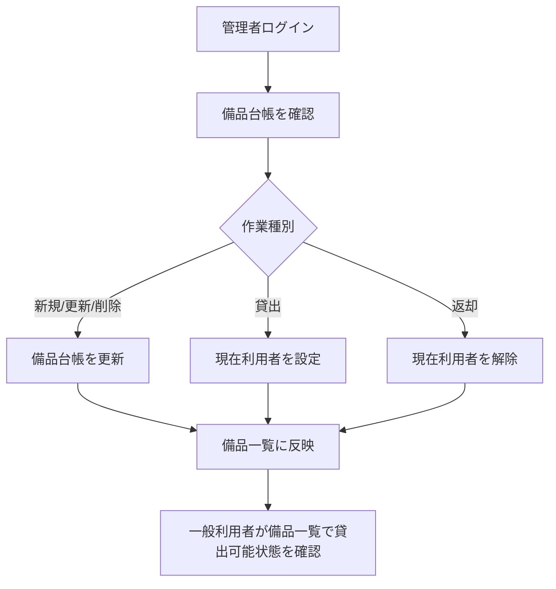
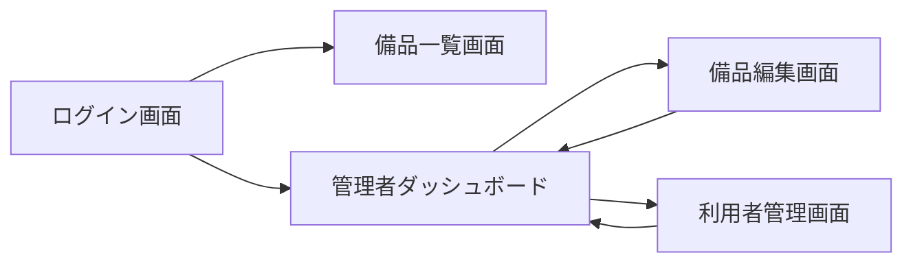
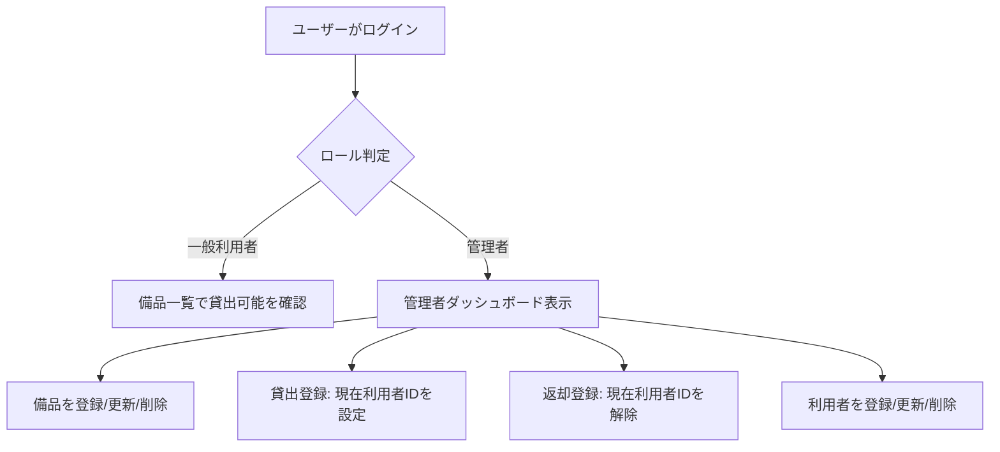

# 備品管理・貸出管理アプリ 要件定義書（MVP）

## 1. 目的・前提

### 1.1 システムの目的
- RQ-BZ-ASSET-LENDING-MANAGEMENT: 備品管理・貸出管理業務を単一台帳で運用し、現在の貸出状況を即時に把握できる状態を実現する。
  - この要件が無いと何が困るか: 担当者ごとの台帳分断が継続し、備品の所在確認と貸出可否判断が遅延する。

### 1.2 用語集
- 備品: 業務で貸出対象となる物品。
- 資産管理番号: 備品を一意に識別する業務上の識別子。
- 現在利用者: 現在その備品を借用中の利用者。未貸出時は空欄。
- 貸出可能: 備品に現在利用者が紐づいていない状態。

### 1.3 提供形態
- RQ-UI-APPLICATION-TYPE-GUI（対応業務課題ID: RQ-BK-INCONSISTENT-ASSET-LEDGER）: 本システムはGUI（Web画面）で提供する。
  - この要件が無いと何が困るか: 現場利用者の操作負荷が上がり、運用定着が遅れる。

## 2. 業務

### 2.1 対象業務一覧
- RQ-BZ-ASSET-LENDING-MANAGEMENT: 備品台帳管理・貸出管理業務

### 2.2 業務フロー

### 2.3 業務の範囲・担当者
- 管理者: 備品登録・編集・削除、貸出登録、返却登録、利用者管理、一覧参照。
- 一般利用者: 備品一覧参照（貸出可能か確認）のみ。

### 2.4 業務課題・KPI

#### 2-1. 業務課題一覧（必須）
| RQ-BK-ID | 業務課題 | 現状の問題 | 業務影響 | 解決状態 |
|---|---|---|---|---|
| RQ-BK-INCONSISTENT-ASSET-LEDGER | 備品台帳の不統一 | 担当者ごとに台帳が分散し情報が一致しない | 最新情報の特定に時間がかかる | 単一台帳で資産管理番号と備品名を一元管理できる |
| RQ-BK-UNKNOWN-CURRENT-BORROWER | 現在利用者の即時把握不能 | 誰が借りているか即座に分からない | 貸出可否判断が遅れる、所在確認に工数がかかる | 備品ごとに現在利用者を即時表示できる |

### 2.5 KPI
- RQ-NF-KPI-RECORD-LEAKAGE-RATE（対応業務課題ID: RQ-BK-UNKNOWN-CURRENT-BORROWER）: 記録漏れ率を月5%未満にする。
  - この要件が無いと何が困るか: 改善成果を判定できない。
- RQ-NF-KPI-NO-UNKNOWN-ITEM（対応業務課題ID: RQ-BK-UNKNOWN-CURRENT-BORROWER）: 所在不明件数を月0件にする。
  - この要件が無いと何が困るか: 所在不明リスクの残存を検知できない。

### 2.6 解決すべき課題と対応方針
- RQ-FT-UNIFY-ASSET-LEDGER（対応業務課題ID: RQ-BK-INCONSISTENT-ASSET-LEDGER）: 備品を単一台帳で管理する。
  - この要件が無いと何が困るか: 台帳不整合が解消されない。
- RQ-FT-SHOW-CURRENT-BORROWER（対応業務課題ID: RQ-BK-UNKNOWN-CURRENT-BORROWER）: 備品ごとに現在利用者を保持・表示する。
  - この要件が無いと何が困るか: 現在の貸出状況を即時確認できない。

### 2.7 システム化による見込み経営効果
- RQ-OP-SOFT-SAVING-SEARCH-TIME（対応業務課題ID: RQ-BK-INCONSISTENT-ASSET-LEDGER）: 所在確認時間を1件あたり平均10分から5分へ短縮する（Soft Saving）。
  - この要件が無いと何が困るか: システム化の効果を業務改善として示せない。

## 3. 機能要件

### 3.1 入力データ
- 人手入力: 備品（資産管理番号、備品名、現在利用者ID）、利用者（ログインID、氏名、パスワードハッシュ、ロール）。
- 外部連携入力: なし。

### 3.2 出力データ
- 備品一覧（資産管理番号、備品名、貸出可能/貸出中、現在利用者名）。
- 利用者一覧（ログインID、氏名、ロール）。

### 3.3 外部連携
- RQ-EX-NO-EXTERNAL-INTEGRATION（対応業務課題ID: RQ-BK-INCONSISTENT-ASSET-LEDGER）: 外部システム連携は行わない。
  - この要件が無いと何が困るか: MVP範囲が拡大し、短期での導入が難しくなる。

### 3.4 画面仕様と画面遷移図
- 画面一覧
  - ログイン画面
  - 備品一覧画面（一般利用者向け）
  - 管理者ダッシュボード
  - 備品編集画面
  - 利用者管理画面

### 3.5 全機能のユーザー利用フロー

### 3.6 業務フローとの対応関係
- 備品台帳更新業務 ↔ RQ-FT-MANAGE-ASSET-MASTER
- 貸出業務 ↔ RQ-FT-REGISTER-LENDING
- 返却業務 ↔ RQ-FT-REGISTER-RETURN
- 在庫確認業務 ↔ RQ-FT-VIEW-ASSET-AVAILABILITY

### 3.7 ログ
- RQ-OP-APPLICATION-LOG-RETENTION（対応業務課題ID: RQ-BK-UNKNOWN-CURRENT-BORROWER）: 一般的なアプリ動作ログ・エラーログを1年間保存する。
  - この要件が無いと何が困るか: 障害原因調査と復旧対応ができない。

### 3.8 監視・アラート
監視・アラートは必要ないため、監視・アラートの内容と対応方法の記述は行わない。

### 3.9 機能一覧
| RQ-ID | カテゴリ | 機能名 | 対応業務課題ID（RQ-BK-*） | この機能が無いと何が困るか |
|---|---|---|---|---|
| RQ-FT-MANAGE-ASSET-MASTER | 業務機能/マスタ管理 | 備品台帳管理（登録・更新・削除・一覧・詳細） | RQ-BK-INCONSISTENT-ASSET-LEDGER | 台帳を統一できない |
| RQ-FT-REGISTER-LENDING | 業務機能 | 貸出登録（現在利用者ID設定） | RQ-BK-UNKNOWN-CURRENT-BORROWER | 誰が借りているか把握できない |
| RQ-FT-REGISTER-RETURN | 業務機能 | 返却登録（現在利用者ID解除） | RQ-BK-UNKNOWN-CURRENT-BORROWER | 貸出中のまま残り貸出可否が誤る |
| RQ-FT-VIEW-ASSET-AVAILABILITY | 業務機能 | 備品貸出可能状態の一覧表示 | RQ-BK-UNKNOWN-CURRENT-BORROWER | 利用者が貸出可否を即時確認できない |
| RQ-FT-MANAGE-USERS | マスタ管理 | 利用者管理（登録・更新・削除・一覧） | RQ-BK-UNKNOWN-CURRENT-BORROWER | 現在利用者を正しく紐づけできない |
| RQ-UI-ROLE-BASED-SCREENS | 画面 | ロール別画面表示制御 | RQ-BK-UNKNOWN-CURRENT-BORROWER | 一般利用者が管理操作できてしまう |
| RQ-NF-AUTHORIZATION-BY-ROLE | 共通（認証・認可） | 管理者/一般利用者の権限制御 | RQ-BK-UNKNOWN-CURRENT-BORROWER | 役割分離ができず誤操作リスクが上がる |
| RQ-OP-BACKUP-DAILY | 運用 | 日次バックアップ実施 | RQ-BK-INCONSISTENT-ASSET-LEDGER | 障害時に台帳復旧できない |
| RQ-EX-NO-EXTERNAL-INTEGRATION | 外部連携 | 外部連携なしでの単独運用 | RQ-BK-INCONSISTENT-ASSET-LEDGER | MVP範囲が膨らみ導入が遅れる |

## 4. データ

### 4.1 内部データ / 外部データの区別
- RQ-DT-INTERNAL-DATA-SCOPE（対応業務課題ID: RQ-BK-INCONSISTENT-ASSET-LEDGER）: 内部データは備品・利用者・ログとする。
  - この要件が無いと何が困るか: どこまでアプリ内で管理するか曖昧になる。
- RQ-DT-EXTERNAL-DATA-SCOPE（対応業務課題ID: RQ-BK-INCONSISTENT-ASSET-LEDGER）: 外部データは扱わない。
  - この要件が無いと何が困るか: 外部依存を前提にした設計混入が起きる。

### 4.2 データ保持期間
- RQ-DT-DATA-RETENTION-UNLIMITED（対応業務課題ID: RQ-BK-INCONSISTENT-ASSET-LEDGER）: 備品・利用者・貸出状態データは無期限保持とする。
  - この要件が無いと何が困るか: 削除条件設計が必要となりMVP実装が複雑化する。

### 4.3 外部DB接続先と接続方法
- RQ-DT-NO-EXTERNAL-DB-CONNECTION（対応業務課題ID: RQ-BK-INCONSISTENT-ASSET-LEDGER）: 外部DB接続は行わず、アプリ内DBのみ利用する。
  - この要件が無いと何が困るか: 接続先調整が必要になり導入までのリードタイムが伸びる。

### 4.4 DB必要性
- RQ-DT-USE-INTERNAL-DB（対応業務課題ID: RQ-BK-INCONSISTENT-ASSET-LEDGER）: 単一台帳と同時更新整合のためDBを必須とする。
  - この要件が無いと何が困るか: ファイル運用で更新競合と整合不良が発生する。

### 4.5 業務エンティティ一覧
| RQ-ID | カテゴリ | 業務エンティティ名 | 対応業務課題ID（RQ-BK-*） | この業務エンティティが無いと何が困るか |
|---|---|---|---|---|
| RQ-DT-ASSET-ENTITY | 業務エンティティ | 備品 | RQ-BK-INCONSISTENT-ASSET-LEDGER | 台帳の管理対象を定義できない |
| RQ-DT-USER-ENTITY | 業務エンティティ | 利用者 | RQ-BK-UNKNOWN-CURRENT-BORROWER | 現在利用者を識別できない |

#### エンティティ定義表（必須）

| エンティティ名 | 属性名 | 説明 |
|---|---|---|
| 備品 | 資産管理番号 | 備品を一意に識別する |
| 備品 | 備品名 | 備品の名称 |
| 備品 | 現在利用者ID | 貸出中の場合のみ利用者IDを保持する |
| 利用者 | ログインID | ログイン認証に使う識別子 |
| 利用者 | 氏名 | 利用者表示名 |
| 利用者 | パスワードハッシュ | パスワードのハッシュ値 |
| 利用者 | ロール | 管理者または一般利用者 |

#### エンティティ属性定義
- RQ-DT-ASSET-ATTRIBUTES（対応業務課題ID: RQ-BK-UNKNOWN-CURRENT-BORROWER）: 備品属性は資産管理番号、備品名、現在利用者IDとする。
  - この要件が無いと何が困るか: 貸出可能判定と現在利用者表示ができない。
- RQ-DT-USER-ATTRIBUTES（対応業務課題ID: RQ-BK-UNKNOWN-CURRENT-BORROWER）: 利用者属性はログインID、氏名、パスワードハッシュ、ロールとする。
  - この要件が無いと何が困るか: 認証と権限制御が成立しない。

### 4-1. CRUDテーブル（必須）
| エンティティ名 | Create | Read（一覧） | Read（詳細） | Update | Delete | 備考 |
|---|---|---|---|---|---|---|
| 備品 | ○ | ○ | ○ | ○ | ○ | 削除は物理削除 |
| 利用者 | ○ | ○ | ○ | ○ | ○ | 管理者のみ操作可能 |

### 4.6 エンティティ状態遷移（必須）
- RQ-DT-ASSET-STATE-TRANSITION（対応業務課題ID: RQ-BK-UNKNOWN-CURRENT-BORROWER）: 備品状態は「貸出可能（現在利用者IDなし）」と「貸出中（現在利用者IDあり）」の2状態とし、貸出登録で貸出可能から貸出中へ、返却登録で貸出中から貸出可能へ遷移する。
  - この要件が無いと何が困るか: 貸出可否判定のルールが曖昧になり、運用が統一できない。

## 5. 非機能要件

### 5.1 非機能要件一覧
| RQ-ID | カテゴリ | 非機能要件名 | 対応業務課題ID（RQ-BK-*） | この非機能要件が無いと何が困るか |
|---|---|---|---|---|
| RQ-NF-RESPONSE-TIME-3S | 性能 | 通常操作の応答時間3秒以内 | RQ-BK-INCONSISTENT-ASSET-LEDGER | 操作待ちが増えて運用効率が下がる |
| RQ-NF-CONCURRENT-USERS-20 | 利用人数 | 同時接続20ユーザー | RQ-BK-INCONSISTENT-ASSET-LEDGER | 想定利用時に処理遅延や失敗が起きる |
| RQ-NF-AUTHENTICATION-ID-PASSWORD | セキュリティ | アプリ内ID/パスワード認証 | RQ-BK-UNKNOWN-CURRENT-BORROWER | 利用者を識別できず誤更新が防げない |
| RQ-NF-AUTHORIZATION-BY-ROLE | セキュリティ | 管理者・一般利用者の権限制御 | RQ-BK-UNKNOWN-CURRENT-BORROWER | 一般利用者が管理操作できてしまう |

### 5.2 機能と画面・ユーザーフローの対応
| 機能ID | 対応画面 | 対応ユーザーフロー |
|---|---|---|
| RQ-FT-MANAGE-ASSET-MASTER | 管理者ダッシュボード、備品編集画面 | 管理者が備品を登録/更新/削除 |
| RQ-FT-REGISTER-LENDING | 管理者ダッシュボード | 管理者が現在利用者IDを設定 |
| RQ-FT-REGISTER-RETURN | 管理者ダッシュボード | 管理者が現在利用者IDを解除 |
| RQ-FT-VIEW-ASSET-AVAILABILITY | 備品一覧画面 | 一般利用者が貸出可能状態を確認 |
| RQ-FT-MANAGE-USERS | 利用者管理画面 | 管理者が利用者を登録/更新/削除 |

## 6. テスト用利用シナリオ

| RQ-ID | テスト目的 | 前提条件 | テスト手順 | 期待される結果 | 対応業務課題ID（RQ-BK-*） |
|---|---|---|---|---|---|
| RQ-TS-VERIFY-LOGIN-ROLE-ROUTING | ロールに応じた遷移を検証する | 管理者アカウントと一般利用者アカウントが存在する | 各ロールでログインする | 管理者は管理者画面、一般利用者は備品一覧に遷移する | RQ-BK-UNKNOWN-CURRENT-BORROWER |
| RQ-TS-VERIFY-ASSET-MASTER-CRUD | 備品台帳のCRUDを検証する | 管理者でログイン済み | 備品を登録、更新、削除する | 一覧と詳細に各変更が反映される | RQ-BK-INCONSISTENT-ASSET-LEDGER |
| RQ-TS-VERIFY-LENDING-RETURN-CURRENT-USER | 現在利用者の設定/解除を検証する | 備品と利用者が登録済み | 貸出登録で現在利用者IDを設定し、その後返却登録で解除する | 貸出中/貸出可能の表示が切り替わる | RQ-BK-UNKNOWN-CURRENT-BORROWER |
| RQ-TS-VERIFY-USER-VIEW-AVAILABILITY | 一般利用者が貸出可能状態を確認できることを検証する | 一般利用者でログイン済み、複数備品が存在する | 備品一覧を表示する | 各備品の貸出可能/貸出中が表示される | RQ-BK-UNKNOWN-CURRENT-BORROWER |

## 7. 業務課題と要件の対応表（双方向確認）

### 7.1 業務課題 -> 要件
| 業務課題ID | 対応要件ID |
|---|---|
| RQ-BK-INCONSISTENT-ASSET-LEDGER | RQ-BZ-ASSET-LENDING-MANAGEMENT, RQ-FT-UNIFY-ASSET-LEDGER, RQ-FT-MANAGE-ASSET-MASTER, RQ-EX-NO-EXTERNAL-INTEGRATION, RQ-DT-INTERNAL-DATA-SCOPE, RQ-DT-EXTERNAL-DATA-SCOPE, RQ-DT-DATA-RETENTION-UNLIMITED, RQ-DT-NO-EXTERNAL-DB-CONNECTION, RQ-DT-USE-INTERNAL-DB, RQ-DT-ASSET-ENTITY, RQ-NF-RESPONSE-TIME-3S, RQ-NF-CONCURRENT-USERS-20, RQ-OP-SOFT-SAVING-SEARCH-TIME, RQ-OP-BACKUP-DAILY, RQ-TS-VERIFY-ASSET-MASTER-CRUD |
| RQ-BK-UNKNOWN-CURRENT-BORROWER | RQ-FT-SHOW-CURRENT-BORROWER, RQ-FT-REGISTER-LENDING, RQ-FT-REGISTER-RETURN, RQ-FT-VIEW-ASSET-AVAILABILITY, RQ-FT-MANAGE-USERS, RQ-UI-ROLE-BASED-SCREENS, RQ-UI-APPLICATION-TYPE-GUI, RQ-NF-KPI-RECORD-LEAKAGE-RATE, RQ-NF-KPI-NO-UNKNOWN-ITEM, RQ-NF-AUTHENTICATION-ID-PASSWORD, RQ-NF-AUTHORIZATION-BY-ROLE, RQ-DT-USER-ENTITY, RQ-DT-ASSET-ATTRIBUTES, RQ-DT-USER-ATTRIBUTES, RQ-DT-ASSET-STATE-TRANSITION, RQ-OP-APPLICATION-LOG-RETENTION, RQ-TS-VERIFY-LOGIN-ROLE-ROUTING, RQ-TS-VERIFY-LENDING-RETURN-CURRENT-USER, RQ-TS-VERIFY-USER-VIEW-AVAILABILITY |

### 7.2 要件 -> 業務課題
- RQ-BK以外の全要件は、各要件定義行に対応業務課題IDを記載済み。

## 8. MVP最小化確認
- 削除可能候補として以下を検討し、MVPから除外した。
  - 承認ワークフロー
  - 通知連携
  - 外部DB連携
  - 監査専用ログ
- 上記を除外しても、業務課題（台帳不統一の解消、現在利用者の可視化）は成立することを確認した。
