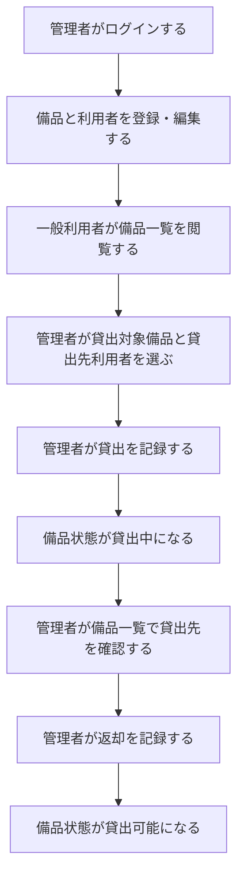
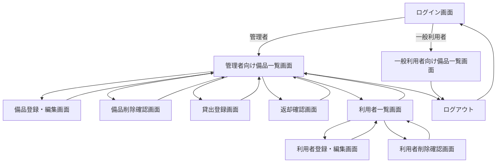
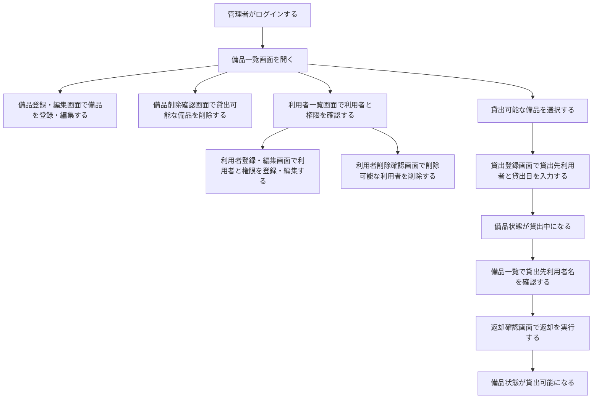
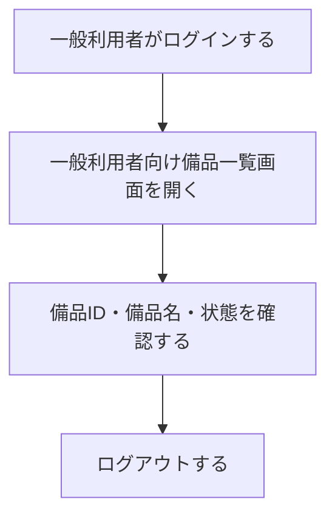
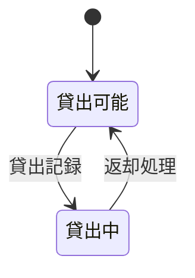

# 備品管理・貸出管理アプリ 要件定義書

## 1. 目的・前提

### 1.1 システムの目的

| RQ-ID | 要件 | 対応業務課題ID | この要件が無いと何が困るか |
|---|---|---|---|
| RQ-BZ-EQUIPMENT-LOAN-MANAGEMENT | 備品の個体、貸出先、貸出状態を管理し、誰が何を借りているかを管理者が即座に確認できるようにする。 | RQ-BK-LOAN-ITEM-LOCATION、RQ-BK-DUPLICATE-USER-ACCOUNT-MANAGEMENT | 貸出中の備品と利用者を確認できず、備品を探す時間と重複貸出のリスクが残る。 |

### 1.2 前提

| RQ-ID | 前提 | 対応業務課題ID | この前提が無いと何が困るか |
|---|---|---|---|
| RQ-EX-NO-EXTERNAL-INTEGRATION | 外部システム、外部DB、外部通知サービスとは連携しない。 | RQ-BK-LOAN-ITEM-LOCATION | 外部仕様や認証方式に依存し、MVPで必要な貸出状況管理の範囲が広がる。 |
| RQ-UI-WEB-GUI | アプリはWebブラウザで操作するGUIとして提供する。 | RQ-BK-LOAN-ITEM-LOCATION | 管理者と一般利用者が備品一覧、貸出、返却を画面上で確認・操作できない。 |
| RQ-OP-INITIAL-ADMIN-ENV | 初回起動時に環境変数のログインIDとパスワードから初期管理者利用者を作成する。 | RQ-BK-DUPLICATE-USER-ACCOUNT-MANAGEMENT | 最初に利用者一覧画面へ入る管理者を用意できず、アプリを使い始められない。 |

### 1.3 用語集

| 用語 | 定義 |
|---|---|
| 備品 | 貸出対象として個体単位で管理する物品。 |
| 利用者 | 貸出先として選択され、かつアプリにログインする人物。利用者名、ログインID、パスワード、権限種別を持つ。 |
| 管理者 | 備品と利用者の管理、貸出、返却を行う権限を持つ利用者。 |
| 一般利用者 | 備品一覧を閲覧し、備品の貸出可能・貸出中状態を確認する利用者。 |
| 貸出可能 | 備品が現在貸し出されておらず、貸出できる状態。 |
| 貸出中 | 備品が特定の利用者に貸し出されている状態。 |

## 2. 業務

### 2.1 対象業務一覧

| RQ-BZ-ID | 対象業務 | 業務範囲 | 担当者 | 対応業務課題ID |
|---|---|---|---|---|
| RQ-BZ-EQUIPMENT-LOAN-MANAGEMENT | 備品貸出管理業務 | 備品登録、利用者登録、利用者権限管理、貸出記録、返却処理、貸出状況確認を対象とする。返却予定日、返却日、延長、棚卸し、故障、紛失、廃棄は対象外とする。 | 管理者、一般利用者 | RQ-BK-LOAN-ITEM-LOCATION、RQ-BK-DUPLICATE-USER-ACCOUNT-MANAGEMENT |

### 2.2 業務フロー

### 2.3 業務課題一覧

| RQ-BK-ID | 業務課題 | 現状の問題 | 業務影響 | 解決状態 |
|---|---|---|---|---|
| RQ-BK-LOAN-ITEM-LOCATION | 誰が何を借りているか分からない。 | 備品の貸出状況が一元管理されず、貸出中の備品、貸出先の利用者、現在状態をすぐ確認できない。 | 備品を探す時間が発生し、返却漏れや重複貸出が起きる。 | 管理者が備品一覧で貸出中の備品と貸出先利用者を確認でき、一般利用者は全備品の状態を閲覧できる。 |
| RQ-BK-DUPLICATE-USER-ACCOUNT-MANAGEMENT | 利用者とアカウントを別々に管理することで、同じ人物の情報を二重管理してしまう。 | 貸出先としての利用者とログイン用アカウントが別データになると、同じ人物を二重登録する必要がある。 | 利用者名、ログイン情報、権限の管理箇所が分かれ、登録漏れや更新漏れが起きる。 | 利用者データにログインID、パスワード、権限種別を持たせ、利用者一覧画面ひとつで貸出先とログイン権限を管理できる。 |

### 2.4 業務課題・KPI

| RQ-ID | KPI | 対応業務課題ID | このKPIが無いと何が困るか |
|---|---|---|---|
| RQ-NF-LOAN-STATUS-CHECK-1MIN | 貸出中の備品と利用者を確認する時間を、5分以内から1分以内に短縮する。 | RQ-BK-LOAN-ITEM-LOCATION | システム化による業務効果を確認できない。 |
| RQ-NF-USER-REGISTRATION-ONCE | 同一人物の登録作業を、利用者登録とアカウント登録の2回から、利用者登録の1回に削減する。 | RQ-BK-DUPLICATE-USER-ACCOUNT-MANAGEMENT | 利用者とログイン情報の一体化による業務効果を確認できない。 |

### 2.5 解決すべき課題と対応方針

| RQ-BK-ID | 対応方針 |
|---|---|
| RQ-BK-LOAN-ITEM-LOCATION | 備品を個体単位で登録し、貸出時に利用者名と貸出日を記録する。返却時は返却済みにするだけとし、備品状態を貸出可能へ戻す。管理者だけが更新操作を行い、一般利用者は備品一覧の閲覧だけを行う。 |
| RQ-BK-DUPLICATE-USER-ACCOUNT-MANAGEMENT | 利用者とアカウントを一体化し、利用者名、ログインID、パスワード、権限種別を利用者データとして管理する。利用者一覧画面で利用者を確認し、利用者登録・編集画面で登録・編集・権限管理を行い、利用者削除確認画面で削除を行う。 |

### 2.6 システム化による見込み経営効果

| RQ-ID | 効果区分 | 見込み効果 | 対応業務課題ID | この効果定義が無いと何が困るか |
|---|---|---|---|---|
| RQ-NF-LOAN-SEARCH-SOFT-SAVING | Soft Saving | 貸出中の備品と利用者を探す確認時間を短縮し、管理者の問い合わせ対応時間を減らす。 | RQ-BK-LOAN-ITEM-LOCATION | 業務時間削減の効果を要件上で説明できない。 |
| RQ-NF-DUPLICATE-LOAN-COST-AVOIDANCE | Cost Avoidance | 貸出中状態を一覧で確認できるようにし、同じ備品を重複して貸し出す運用ミスを避ける。 | RQ-BK-LOAN-ITEM-LOCATION | 貸出状態管理による損失回避の効果を説明できない。 |
| RQ-NF-USER-ACCOUNT-MERGE-SOFT-SAVING | Soft Saving | 利用者とログイン情報を一体化し、同じ人物を二重登録する手間を減らす。 | RQ-BK-DUPLICATE-USER-ACCOUNT-MANAGEMENT | 利用者管理の簡素化による業務効果を説明できない。 |

## 3. 機能要件

### 3.1 機能一覧

| RQ-ID | カテゴリ | 機能名 | 対応業務課題ID | この機能が無いと何が困るか |
|---|---|---|---|---|
| RQ-FT-LOGIN | 共通 | ログイン | RQ-BK-DUPLICATE-USER-ACCOUNT-MANAGEMENT | 管理者と一般利用者を区別できず、更新操作を管理者に限定できない。 |
| RQ-FT-LOGOUT | 共通 | ログアウト | RQ-BK-LOAN-ITEM-LOCATION、RQ-BK-DUPLICATE-USER-ACCOUNT-MANAGEMENT | 管理者権限の画面を明示的に終了できない。 |
| RQ-FT-AUTO-LOGOUT | 共通 | 未操作60分の自動ログアウト | RQ-BK-LOAN-ITEM-LOCATION、RQ-BK-DUPLICATE-USER-ACCOUNT-MANAGEMENT | 管理者画面の放置により第三者が更新操作できるリスクが残る。 |
| RQ-FT-MANAGE-EQUIPMENT | マスタ管理 | 備品登録・編集・削除 | RQ-BK-LOAN-ITEM-LOCATION | 貸出対象の備品をアプリに登録・修正できない。 |
| RQ-FT-MANAGE-BORROWER | マスタ管理 | 利用者登録・編集・削除・権限管理 | RQ-BK-LOAN-ITEM-LOCATION、RQ-BK-DUPLICATE-USER-ACCOUNT-MANAGEMENT | 貸出先を選択できず、管理者と一般利用者のログイン情報と権限を管理できない。 |
| RQ-FT-VIEW-EQUIPMENT-LIST | 業務機能 | 備品一覧閲覧 | RQ-BK-LOAN-ITEM-LOCATION | 備品の存在と貸出可能・貸出中の状態を確認できない。 |
| RQ-FT-LOAN-EQUIPMENT | 業務機能 | 貸出記録 | RQ-BK-LOAN-ITEM-LOCATION | 誰が何を借りているかを記録できない。 |
| RQ-FT-RETURN-EQUIPMENT | 業務機能 | 返却処理 | RQ-BK-LOAN-ITEM-LOCATION | 返却後も備品が貸出中のまま残り、貸出可能状態に戻せない。 |
| RQ-FT-VIEW-LOAN-BORROWER | 業務機能 | 貸出先表示 | RQ-BK-LOAN-ITEM-LOCATION | 管理者が貸出中の備品を誰が借りているか確認できない。 |
| RQ-OP-NO-BUSINESS-OPERATION-LOG | 運用 | 業務上の操作ログは残さない | RQ-BK-LOAN-ITEM-LOCATION | 操作監査を対象に含めると、今回のMVPで必要な現在状態管理の範囲を超える。 |
| RQ-OP-NO-BUSINESS-ALERT | 運用 | 業務上の監視・アラートは持たない | RQ-BK-LOAN-ITEM-LOCATION | 返却予定日を持たない方針と矛盾するアラート条件が発生する。 |
| RQ-EX-NO-EXTERNAL-INTEGRATION | 外部連携 | 外部連携なし | RQ-BK-LOAN-ITEM-LOCATION | 外部仕様に依存し、MVPの実装範囲が広がる。 |

### 3.2 入力データ

| RQ-ID | 入力データ | 入力方法 | 対応業務課題ID | この入力が無いと何が困るか |
|---|---|---|---|---|
| RQ-DT-EQUIPMENT-MANUAL-INPUT | 備品ID、備品名、状態 | 管理者が備品登録・編集画面から入力する。 | RQ-BK-LOAN-ITEM-LOCATION | 貸出対象の備品を識別できない。 |
| RQ-DT-BORROWER-MANUAL-INPUT | 利用者名、ログインID、パスワード、権限種別 | 管理者が利用者登録・編集画面から入力する。 | RQ-BK-LOAN-ITEM-LOCATION、RQ-BK-DUPLICATE-USER-ACCOUNT-MANAGEMENT | 貸出先の選択、ログイン認証、権限判定ができない。 |
| RQ-DT-LOAN-MANUAL-INPUT | 貸出対象備品、貸出先利用者、貸出日 | 管理者が貸出登録画面から入力する。 | RQ-BK-LOAN-ITEM-LOCATION | 貸出中の備品と貸出先を記録できない。 |

### 3.3 出力データ

| RQ-ID | 出力データ | 出力先 | 対応業務課題ID | この出力が無いと何が困るか |
|---|---|---|---|---|
| RQ-DT-EQUIPMENT-LIST-OUTPUT | 備品ID、備品名、状態 | 管理者と一般利用者の備品一覧画面 | RQ-BK-LOAN-ITEM-LOCATION | 備品の現在状態を確認できない。 |
| RQ-DT-LOAN-BORROWER-OUTPUT | 貸出中備品の貸出先利用者名と貸出日 | 管理者の備品一覧画面 | RQ-BK-LOAN-ITEM-LOCATION | 管理者が誰が何を借りているか確認できない。 |
| RQ-DT-BORROWER-LIST-OUTPUT | 利用者名、ログインID、権限種別 | 管理者の利用者一覧画面 | RQ-BK-LOAN-ITEM-LOCATION、RQ-BK-DUPLICATE-USER-ACCOUNT-MANAGEMENT | 貸出先として登録済みの利用者、ログイン可能な利用者、権限を確認できない。 |

### 3.4 外部連携

| RQ-ID | 外部連携 | 対応業務課題ID | この要件が無いと何が困るか |
|---|---|---|---|
| RQ-EX-NO-EXTERNAL-INTEGRATION | 外部システム、外部DB、外部通知サービス、外部認証サービスとは連携しない。 | RQ-BK-LOAN-ITEM-LOCATION | 要件定義の範囲が外部仕様に依存し、MVPが肥大化する。 |

### 3.5 画面仕様

| RQ-ID | 画面名 | 利用者 | 画面仕様 | 対応業務課題ID | この画面が無いと何が困るか |
|---|---|---|---|---|---|
| RQ-UI-LOGIN-SCREEN | ログイン画面 | 管理者、一般利用者 | ログインIDとパスワードを入力し、権限種別に応じて遷移先を分ける。 | RQ-BK-LOAN-ITEM-LOCATION、RQ-BK-DUPLICATE-USER-ACCOUNT-MANAGEMENT | 権限別に利用画面を分けられない。 |
| RQ-UI-ADMIN-EQUIPMENT-LIST-SCREEN | 管理者向け備品一覧画面 | 管理者 | 備品ID、備品名、状態を表示し、貸出中の場合は貸出先利用者名と貸出日を表示する。備品登録・編集画面、備品削除確認画面、貸出登録画面、返却確認画面へ遷移できる。 | RQ-BK-LOAN-ITEM-LOCATION | 管理者が備品の現在状態と貸出先を確認できない。 |
| RQ-UI-EQUIPMENT-FORM-SCREEN | 備品登録・編集画面 | 管理者 | 備品ID、備品名、状態を入力し、備品を登録・編集する。登録または編集後は管理者向け備品一覧画面へ戻る。 | RQ-BK-LOAN-ITEM-LOCATION | 備品一覧画面に入力操作が集中し、備品情報を落ち着いて登録・編集できない。 |
| RQ-UI-EQUIPMENT-DELETE-CONFIRM-SCREEN | 備品削除確認画面 | 管理者 | 貸出可能な備品の備品ID、備品名、状態を確認し、削除を実行する。削除後は管理者向け備品一覧画面へ戻る。貸出中の備品は削除対象にできない。 | RQ-BK-LOAN-ITEM-LOCATION | 削除対象を確認してから備品を削除できない。 |
| RQ-UI-LOAN-FORM-SCREEN | 貸出登録画面 | 管理者 | 貸出可能な備品に対して貸出先利用者と貸出日を入力し、貸出を記録する。貸出記録後は管理者向け備品一覧画面へ戻る。 | RQ-BK-LOAN-ITEM-LOCATION | 貸出先利用者と貸出日を誤りなく入力できない。 |
| RQ-UI-RETURN-CONFIRM-SCREEN | 返却確認画面 | 管理者 | 貸出中の備品、貸出先利用者名、貸出日を確認し、返却処理を実行する。返却処理後は管理者向け備品一覧画面へ戻る。 | RQ-BK-LOAN-ITEM-LOCATION | 返却対象を確認してから返却処理できない。 |
| RQ-UI-BORROWER-LIST-SCREEN | 利用者一覧画面 | 管理者 | 利用者名、ログインID、権限種別を表示する。利用者登録・編集画面と利用者削除確認画面へ遷移できる。パスワードは表示しない。 | RQ-BK-LOAN-ITEM-LOCATION、RQ-BK-DUPLICATE-USER-ACCOUNT-MANAGEMENT | 貸出先の利用者とログイン権限を一覧で確認できない。 |
| RQ-UI-BORROWER-FORM-SCREEN | 利用者登録・編集画面 | 管理者 | 利用者名、ログインID、パスワード、権限種別を入力し、利用者を登録・編集する。パスワードは表示しない。最後の管理者利用者の権限種別は一般利用者へ変更できない。登録または編集後は利用者一覧画面へ戻る。 | RQ-BK-LOAN-ITEM-LOCATION、RQ-BK-DUPLICATE-USER-ACCOUNT-MANAGEMENT | 利用者一覧画面に入力操作と権限変更が集中し、利用者情報を落ち着いて登録・編集できない。 |
| RQ-UI-BORROWER-DELETE-CONFIRM-SCREEN | 利用者削除確認画面 | 管理者 | 削除対象の利用者名、ログインID、権限種別を確認し、削除を実行する。現在貸出中の貸出先、自分自身、最後の管理者利用者は削除対象にできない。削除後は利用者一覧画面へ戻る。 | RQ-BK-LOAN-ITEM-LOCATION、RQ-BK-DUPLICATE-USER-ACCOUNT-MANAGEMENT | 削除対象を確認してから利用者を削除できない。 |
| RQ-UI-GENERAL-EQUIPMENT-LIST-SCREEN | 一般利用者向け備品一覧画面 | 一般利用者 | 全備品の備品ID、備品名、状態を閲覧専用で表示する。更新操作は表示しない。 | RQ-BK-LOAN-ITEM-LOCATION | 一般利用者が備品の存在と状態を確認できない。 |

### 3.6 画面遷移図

### 3.7 ユーザー利用フロー

### 3.8 業務フローとの対応関係

| 業務フロー | 対応機能ID |
|---|---|
| 管理者がログインする | RQ-FT-LOGIN |
| 備品と利用者を登録・編集する | RQ-FT-MANAGE-EQUIPMENT、RQ-FT-MANAGE-BORROWER |
| 一般利用者が備品一覧を閲覧する | RQ-FT-VIEW-EQUIPMENT-LIST |
| 管理者が貸出対象備品と貸出先利用者を選ぶ | RQ-FT-LOAN-EQUIPMENT |
| 管理者が貸出を記録する | RQ-FT-LOAN-EQUIPMENT |
| 備品状態が貸出中になる | RQ-FT-LOAN-EQUIPMENT |
| 管理者が備品一覧で貸出先を確認する | RQ-FT-VIEW-LOAN-BORROWER |
| 管理者が返却を記録する | RQ-FT-RETURN-EQUIPMENT |
| 備品状態が貸出可能になる | RQ-FT-RETURN-EQUIPMENT |

### 3.9 ログ

| RQ-ID | ログ要件 | 対応業務課題ID | この要件が無いと何が困るか |
|---|---|---|---|
| RQ-OP-NO-BUSINESS-OPERATION-LOG | 貸出・返却・備品編集・利用者編集について、業務上の操作ログは必要ないため、操作ログの内容と保存期間の記述は行わない。 | RQ-BK-LOAN-ITEM-LOCATION | 操作監査を対象に含めると、現在の貸出状況を把握するMVPから範囲が広がる。 |

### 3.10 監視・アラート

| RQ-ID | 監視・アラート要件 | 対応業務課題ID | この要件が無いと何が困るか |
|---|---|---|---|
| RQ-OP-NO-BUSINESS-ALERT | 業務上の監視・アラートは必要ないため、監視・アラートの内容と対応方法の記述は行わない。 | RQ-BK-LOAN-ITEM-LOCATION | 返却予定日を持たないMVPでアラート条件を作ると、要件に矛盾が生じる。 |

## 4. データ

### 4.1 業務エンティティ一覧

| RQ-ID | カテゴリ | 業務エンティティ名 | 対応業務課題ID | この業務エンティティが無いと何が困るか |
|---|---|---|---|---|
| RQ-DT-EQUIPMENT-ENTITY | マスタ | 備品 | RQ-BK-LOAN-ITEM-LOCATION | 貸出対象を個体単位で識別できない。 |
| RQ-DT-BORROWER-ENTITY | マスタ | 利用者 | RQ-BK-LOAN-ITEM-LOCATION、RQ-BK-DUPLICATE-USER-ACCOUNT-MANAGEMENT | 貸出先の選択、ログイン認証、権限判定を一体で扱えない。 |
| RQ-DT-LOAN-STATE-ENTITY | 業務データ | 現在の貸出状態 | RQ-BK-LOAN-ITEM-LOCATION | 備品が貸出可能か貸出中か、貸出中なら誰が借りているか確認できない。 |

### 4.2 エンティティ定義

| RQ-ID | エンティティ名 | 項目 | 対応業務課題ID | この定義が無いと何が困るか |
|---|---|---|---|---|
| RQ-DT-EQUIPMENT-FIELDS | 備品 | 備品ID、備品名、状態 | RQ-BK-LOAN-ITEM-LOCATION | 備品を識別し、貸出可能・貸出中を判断できない。 |
| RQ-DT-BORROWER-FIELDS | 利用者 | 利用者名、ログインID、パスワードハッシュ、権限種別 | RQ-BK-LOAN-ITEM-LOCATION、RQ-BK-DUPLICATE-USER-ACCOUNT-MANAGEMENT | 貸出先の表記、ログイン認証、権限判定を一体で扱えない。 |
| RQ-DT-LOAN-STATE-FIELDS | 現在の貸出状態 | 備品、利用者、貸出日 | RQ-BK-LOAN-ITEM-LOCATION | 貸出中の備品、貸出先、貸出開始日を確認できない。 |

### 4.3 内部データ・外部データ区分

| RQ-ID | データ区分 | 対象データ | 対応業務課題ID | この区分が無いと何が困るか |
|---|---|---|---|---|
| RQ-DT-INTERNAL-APP-DATA | 内部データ | 備品、利用者、現在の貸出状態 | RQ-BK-LOAN-ITEM-LOCATION、RQ-BK-DUPLICATE-USER-ACCOUNT-MANAGEMENT | データの管理責任がアプリ内にあることを明確にできない。 |
| RQ-DT-NO-EXTERNAL-DATA | 外部データなし | 外部システムから取得するデータは扱わない。 | RQ-BK-LOAN-ITEM-LOCATION | 外部連携なしの前提がデータ要件で不明確になる。 |

### 4.4 データ保持期間

| RQ-ID | 対象データ | 保持期間 | 対応業務課題ID | この保持期間が無いと何が困るか |
|---|---|---|---|---|
| RQ-DT-CURRENT-DATA-RETENTION | 備品、利用者、現在の貸出状態 | 管理者が削除するまで保持する。 | RQ-BK-LOAN-ITEM-LOCATION、RQ-BK-DUPLICATE-USER-ACCOUNT-MANAGEMENT | 現在の貸出状況と利用者権限を継続管理できない。 |

### 4.5 外部DB接続先と接続方法

| RQ-ID | 外部DB接続先 | 接続方法 | 対応業務課題ID | この要件が無いと何が困るか |
|---|---|---|---|---|
| RQ-DT-NO-EXTERNAL-DB | 外部DB接続先なし | 外部DBには接続しない。 | RQ-BK-LOAN-ITEM-LOCATION | 外部DB接続が必要かどうかが不明確になる。 |

### 4.6 DB必要性

| RQ-ID | DB必要性 | 理由 | 対応業務課題ID | この要件が無いと何が困るか |
|---|---|---|---|---|
| RQ-DT-APP-DATABASE-REQUIRED | アプリ内DBが必要 | 備品、利用者、現在の貸出状態を画面終了後も保持する必要があるため。 | RQ-BK-LOAN-ITEM-LOCATION、RQ-BK-DUPLICATE-USER-ACCOUNT-MANAGEMENT | 画面を閉じると貸出状態と利用者権限が消え、誰が何を借りているか管理できない。 |

### 4.7 状態遷移

| RQ-ID | 対象 | 状態遷移 | 対応業務課題ID | この状態遷移が無いと何が困るか |
|---|---|---|---|---|
| RQ-DT-EQUIPMENT-STATE-TRANSITION | 備品 | 貸出可能から貸出中、貸出中から貸出可能へ遷移する。 | RQ-BK-LOAN-ITEM-LOCATION | 貸出・返却による備品状態の変化を定義できない。 |

### 4.8 CRUDテーブル

| エンティティ名 | Create | Read（一覧） | Read（詳細） | Update | Delete | 備考 |
|---|---|---|---|---|---|---|
| 備品 | ○ | ○ | × | ○ | △ | 状態が貸出可能の備品だけ削除できる。 |
| 利用者 | ○ | ○ | × | ○ | △ | 現在貸出中の貸出先、自分自身、最後の管理者利用者は削除できない。最後の管理者利用者の権限種別は一般利用者へ変更できない。 |
| 現在の貸出状態 | ○ | ○ | × | ○ | × | 貸出で作成し、返却で状態を更新する。削除操作は提供しない。 |

## 5. 非機能要件

### 5.1 非機能要件一覧

| RQ-ID | カテゴリ | 非機能要件名 | 対応業務課題ID | この非機能要件が無いと何が困るか |
|---|---|---|---|---|
| RQ-NF-USERS-ADMIN-3-GENERAL-30 | 利用人数 | 管理者1〜3人、一般利用者30人程度、同時利用5人程度を対象にする。 | RQ-BK-LOAN-ITEM-LOCATION | 性能や利用規模の前提が曖昧になり、設計判断がぶれる。 |
| RQ-NF-RESPONSE-TIME-3S | 性能 | 通常操作は3秒以内に画面表示・更新が完了する。 | RQ-BK-LOAN-ITEM-LOCATION | 貸出状況を確認する操作が遅くなり、業務時間短縮の効果が弱くなる。 |
| RQ-NF-PASSWORD-HASH-STORAGE | セキュリティ | 利用者のパスワードはハッシュ化して保存し、画面には表示しない。 | RQ-BK-DUPLICATE-USER-ACCOUNT-MANAGEMENT | 認証情報が漏えいした場合のリスクが高くなる。 |
| RQ-NF-ROLE-BASED-AUTHORIZATION | セキュリティ | 管理者は備品と利用者の管理、貸出、返却を行い、一般利用者は備品一覧の閲覧だけを行う。 | RQ-BK-LOAN-ITEM-LOCATION、RQ-BK-DUPLICATE-USER-ACCOUNT-MANAGEMENT | 一般利用者が貸出・返却を操作し、記録ミスを起こす。 |
| RQ-NF-SESSION-AUTO-LOGOUT-60MIN | セキュリティ | ログアウトでき、未操作60分で自動ログアウトする。 | RQ-BK-LOAN-ITEM-LOCATION、RQ-BK-DUPLICATE-USER-ACCOUNT-MANAGEMENT | 管理者画面の放置により第三者が更新操作できるリスクが残る。 |

## 6. テスト用利用シナリオ

| RQ-ID | テスト目的 | 前提条件 | テスト手順 | 期待される結果 | 対応業務課題ID |
|---|---|---|---|---|---|
| RQ-TS-VERIFY-ADMIN-LOGIN | 管理者がログインできることを確認する。 | 初期管理者利用者が作成済みである。 | ログイン画面で管理者利用者のログインIDとパスワードを入力する。 | 管理者向け備品一覧画面に遷移する。 | RQ-BK-DUPLICATE-USER-ACCOUNT-MANAGEMENT |
| RQ-TS-VERIFY-GENERAL-LOGIN | 一般利用者がログインできることを確認する。 | 一般利用者が登録済みである。 | ログイン画面で一般利用者のログインIDとパスワードを入力する。 | 一般利用者向け備品一覧画面に遷移する。 | RQ-BK-DUPLICATE-USER-ACCOUNT-MANAGEMENT |
| RQ-TS-VERIFY-INITIAL-ADMIN-CREATION | 初回起動時に初期管理者利用者が作成されることを確認する。 | 環境変数に初期管理者のログインIDとパスワードが設定済みで、アプリ内DBに利用者が存在しない。 | アプリを初回起動し、環境変数のログインIDとパスワードでログインする。 | 初期管理者利用者が作成され、管理者向け備品一覧画面に遷移する。 | RQ-BK-DUPLICATE-USER-ACCOUNT-MANAGEMENT |
| RQ-TS-VERIFY-EQUIPMENT-MANAGEMENT | 管理者が備品を登録・編集・削除できることを確認する。 | 管理者でログイン済みである。 | 管理者向け備品一覧画面から備品登録・編集画面へ遷移し、備品を登録し、備品名を編集する。管理者向け備品一覧画面から備品削除確認画面へ遷移し、貸出可能状態の備品を削除する。 | 備品が登録・編集・削除される。貸出中の備品は削除できない。 | RQ-BK-LOAN-ITEM-LOCATION |
| RQ-TS-VERIFY-BORROWER-MANAGEMENT | 管理者が利用者を登録・編集・削除・権限管理できることを確認する。 | 管理者でログイン済みである。 | 利用者一覧画面から利用者登録・編集画面へ遷移し、利用者名、ログインID、パスワード、権限種別を登録し、利用者名と権限種別を編集する。利用者一覧画面から利用者削除確認画面へ遷移し、削除可能な利用者を削除する。 | 利用者が登録・編集・削除される。現在貸出中の貸出先、自分自身、最後の管理者利用者は削除できず、最後の管理者利用者の権限種別は一般利用者へ変更できない。 | RQ-BK-LOAN-ITEM-LOCATION、RQ-BK-DUPLICATE-USER-ACCOUNT-MANAGEMENT |
| RQ-TS-VERIFY-LOAN-EQUIPMENT | 管理者が貸出を記録できることを確認する。 | 管理者でログイン済みで、貸出可能な備品と利用者が登録済みである。 | 管理者向け備品一覧画面で貸出可能な備品を選び、貸出登録画面で利用者と貸出日を入力して貸出を実行する。 | 備品状態が貸出中になり、管理者向け備品一覧に貸出先利用者名と貸出日が表示される。 | RQ-BK-LOAN-ITEM-LOCATION |
| RQ-TS-VERIFY-RETURN-EQUIPMENT | 管理者が返却処理できることを確認する。 | 管理者でログイン済みで、貸出中の備品が存在する。 | 管理者向け備品一覧画面で貸出中の備品を選び、返却確認画面で返却対象を確認して返却を実行する。 | 備品状態が貸出可能になり、貸出先利用者名と貸出日は表示されなくなる。 | RQ-BK-LOAN-ITEM-LOCATION |
| RQ-TS-VERIFY-GENERAL-EQUIPMENT-VIEW | 一般利用者が全備品の状態を閲覧でき、更新操作できないことを確認する。 | 一般利用者でログイン済みで、貸出可能と貸出中の備品が存在する。 | 一般利用者向け備品一覧画面を開く。 | 全備品の備品ID、備品名、状態が表示され、登録・編集・削除・貸出・返却の操作は表示されない。 | RQ-BK-LOAN-ITEM-LOCATION |
| RQ-TS-VERIFY-LOGOUT | ログアウトできることを確認する。 | 任意の利用者でログイン済みである。 | 画面上でログアウトを実行する。 | セッションが終了し、ログイン画面へ戻る。ログインが必要な画面を再表示するには再ログインが必要になる。 | RQ-BK-LOAN-ITEM-LOCATION、RQ-BK-DUPLICATE-USER-ACCOUNT-MANAGEMENT |
| RQ-TS-VERIFY-AUTO-LOGOUT | 未操作60分で自動ログアウトすることを確認する。 | 任意の利用者でログイン済みである。 | ログイン後に60分間操作しない。 | セッションが終了し、再操作時にログイン画面へ戻る。 | RQ-BK-LOAN-ITEM-LOCATION、RQ-BK-DUPLICATE-USER-ACCOUNT-MANAGEMENT |

## 7. 業務課題と要件の対応表

| RQ-BK-ID | 対応要件ID |
|---|---|
| RQ-BK-LOAN-ITEM-LOCATION | RQ-BZ-EQUIPMENT-LOAN-MANAGEMENT、RQ-EX-NO-EXTERNAL-INTEGRATION、RQ-UI-WEB-GUI、RQ-NF-LOAN-STATUS-CHECK-1MIN、RQ-NF-LOAN-SEARCH-SOFT-SAVING、RQ-NF-DUPLICATE-LOAN-COST-AVOIDANCE、RQ-FT-LOGOUT、RQ-FT-AUTO-LOGOUT、RQ-FT-MANAGE-EQUIPMENT、RQ-FT-MANAGE-BORROWER、RQ-FT-VIEW-EQUIPMENT-LIST、RQ-FT-LOAN-EQUIPMENT、RQ-FT-RETURN-EQUIPMENT、RQ-FT-VIEW-LOAN-BORROWER、RQ-OP-NO-BUSINESS-OPERATION-LOG、RQ-OP-NO-BUSINESS-ALERT、RQ-DT-EQUIPMENT-MANUAL-INPUT、RQ-DT-BORROWER-MANUAL-INPUT、RQ-DT-LOAN-MANUAL-INPUT、RQ-DT-EQUIPMENT-LIST-OUTPUT、RQ-DT-LOAN-BORROWER-OUTPUT、RQ-DT-BORROWER-LIST-OUTPUT、RQ-UI-LOGIN-SCREEN、RQ-UI-ADMIN-EQUIPMENT-LIST-SCREEN、RQ-UI-EQUIPMENT-FORM-SCREEN、RQ-UI-EQUIPMENT-DELETE-CONFIRM-SCREEN、RQ-UI-LOAN-FORM-SCREEN、RQ-UI-RETURN-CONFIRM-SCREEN、RQ-UI-BORROWER-LIST-SCREEN、RQ-UI-BORROWER-FORM-SCREEN、RQ-UI-BORROWER-DELETE-CONFIRM-SCREEN、RQ-UI-GENERAL-EQUIPMENT-LIST-SCREEN、RQ-DT-EQUIPMENT-ENTITY、RQ-DT-BORROWER-ENTITY、RQ-DT-LOAN-STATE-ENTITY、RQ-DT-EQUIPMENT-FIELDS、RQ-DT-BORROWER-FIELDS、RQ-DT-LOAN-STATE-FIELDS、RQ-DT-INTERNAL-APP-DATA、RQ-DT-NO-EXTERNAL-DATA、RQ-DT-CURRENT-DATA-RETENTION、RQ-DT-NO-EXTERNAL-DB、RQ-DT-APP-DATABASE-REQUIRED、RQ-DT-EQUIPMENT-STATE-TRANSITION、RQ-NF-USERS-ADMIN-3-GENERAL-30、RQ-NF-RESPONSE-TIME-3S、RQ-NF-ROLE-BASED-AUTHORIZATION、RQ-NF-SESSION-AUTO-LOGOUT-60MIN、RQ-TS-VERIFY-EQUIPMENT-MANAGEMENT、RQ-TS-VERIFY-BORROWER-MANAGEMENT、RQ-TS-VERIFY-LOAN-EQUIPMENT、RQ-TS-VERIFY-RETURN-EQUIPMENT、RQ-TS-VERIFY-GENERAL-EQUIPMENT-VIEW、RQ-TS-VERIFY-LOGOUT、RQ-TS-VERIFY-AUTO-LOGOUT |
| RQ-BK-DUPLICATE-USER-ACCOUNT-MANAGEMENT | RQ-BZ-EQUIPMENT-LOAN-MANAGEMENT、RQ-OP-INITIAL-ADMIN-ENV、RQ-NF-USER-REGISTRATION-ONCE、RQ-NF-USER-ACCOUNT-MERGE-SOFT-SAVING、RQ-FT-LOGIN、RQ-FT-LOGOUT、RQ-FT-AUTO-LOGOUT、RQ-FT-MANAGE-BORROWER、RQ-DT-BORROWER-MANUAL-INPUT、RQ-DT-BORROWER-LIST-OUTPUT、RQ-UI-LOGIN-SCREEN、RQ-UI-BORROWER-LIST-SCREEN、RQ-UI-BORROWER-FORM-SCREEN、RQ-UI-BORROWER-DELETE-CONFIRM-SCREEN、RQ-DT-BORROWER-ENTITY、RQ-DT-BORROWER-FIELDS、RQ-DT-INTERNAL-APP-DATA、RQ-DT-CURRENT-DATA-RETENTION、RQ-DT-APP-DATABASE-REQUIRED、RQ-NF-PASSWORD-HASH-STORAGE、RQ-NF-ROLE-BASED-AUTHORIZATION、RQ-NF-SESSION-AUTO-LOGOUT-60MIN、RQ-TS-VERIFY-ADMIN-LOGIN、RQ-TS-VERIFY-GENERAL-LOGIN、RQ-TS-VERIFY-INITIAL-ADMIN-CREATION、RQ-TS-VERIFY-BORROWER-MANAGEMENT、RQ-TS-VERIFY-LOGOUT、RQ-TS-VERIFY-AUTO-LOGOUT |

## 8. MVPから削除した要件

| 削除した要件 | 削除理由 |
|---|---|
| 返却予定日 | 現在の貸出先把握に絞るため不要。ユーザー回答で不要と確定済み。 |
| 返却日 | 返却済みにするだけで現在状態は正せるため不要。 |
| 延長履歴 | 返却予定日を持たないため不要。 |
| 貸出申請・承認 | 管理者だけが貸出・返却を記録するため不要。 |
| 貸出中一覧の独立画面 | 管理者向け備品一覧画面で貸出先を表示し、返却は返却確認画面で行うため不要。 |
| 備品詳細画面 | 備品の確認は一覧で行い、登録・編集は備品登録・編集画面で行うため不要。 |
| 利用者詳細画面 | 利用者名、ログインID、権限種別は一覧上で確認でき、パスワードは表示しないため不要。 |
| アカウント一覧の独立画面 | 利用者一覧、利用者登録・編集、利用者削除確認の各画面でログインID、パスワード、権限種別も管理するため不要。 |
| アカウントエンティティ | 利用者エンティティにログインID、パスワード、権限種別を持たせるため不要。 |
| 検索機能 | 小規模MVPでは一覧閲覧で業務課題を満たすため不要。 |
| 業務操作ログ | 現在状態の管理に絞り、操作監査を対象外とするため不要。 |
| 業務監視・アラート | 返却予定日を持たず、通知条件がないため不要。 |
| 棚卸し、故障、紛失、廃棄 | 誰が何を借りているかの現在状態把握から外れるため不要。 |

## 9. 要件網羅性チェック

| チェック項目 | 結果 |
|---|---|
| 業務エンティティを完全に列挙できているか | 備品、利用者、現在の貸出状態を列挙済み。 |
| 各エンティティに対して定義した表を作成しているか | エンティティ定義とCRUDテーブルを作成済み。 |
| マスタ該当エンティティに管理機能が含まれているか | 備品、利用者に管理機能を定義済み。 |
| 業務機能、マスタ管理、共通、運用、外部連携を網羅しているか | 機能一覧に各カテゴリを定義済み。 |
| 各エンティティの状態遷移が定義されているか | 備品の貸出可能・貸出中の状態遷移を定義済み。 |
| 機能と画面・ユーザーフローの対応が検証されているか | 画面仕様、画面遷移図、利用フロー、業務フロー対応表を定義済み。管理者向け備品一覧画面と利用者一覧画面は確認と遷移を担い、登録・編集・削除・貸出・返却は専用画面で行う。 |
| 削除可能な要件を列挙し、削除しても業務が成立する要件を削除しているか | MVPから削除した要件として列挙済み。 |
| 残った要件がMVPに必要最低限であることを確認しているか | 現在の貸出先把握に必要な要件のみ残している。 |
| 全ての要件項目にRQ-* IDが付与されているか | 付与済み。 |
| 全てのRQ-BK-*に対して対応要件が最低1件あるか | RQ-BK-LOAN-ITEM-LOCATION、RQ-BK-DUPLICATE-USER-ACCOUNT-MANAGEMENTに対応要件を定義済み。 |
| 全ての非RQ-BK要件に対して対応RQ-BK-*が最低1件あるか | 全非RQ-BK要件をRQ-BK-LOAN-ITEM-LOCATIONまたはRQ-BK-DUPLICATE-USER-ACCOUNT-MANAGEMENTに対応付け済み。 |
| RQ-BK-*に紐づかない要件が存在しないか | 存在しない。 |

## 10. レビュー結果

| 観点 | 結果 |
|---|---|
| 内容に矛盾がないか | 外部連携なし、返却予定日なし、返却日なし、管理者のみ更新、一般利用者は閲覧のみ、利用者とアカウントの一体化、備品一覧と利用者一覧は確認と遷移に絞る方針で整合している。 |
| 冗長な記述がないか | 詳細画面、貸出中一覧、検索、履歴、アラート、独立したアカウント一覧画面、アカウントエンティティなどMVP外の要件は削除済み。 |
| 網羅性チェックとドキュメント作成ルールを満たしているか | 必須章立て、ID付与、mermaid図、CRUD、状態遷移、対応表を作成済み。仕様外の実装例や計画記述は含めていない。 |
| 外部連携整合確認 | 外部連携なしのため、外部仕様調査は不要。 |
| 業務課題と要件の対応が双方向に成立しているか | 全要件をRQ-BK-LOAN-ITEM-LOCATIONまたはRQ-BK-DUPLICATE-USER-ACCOUNT-MANAGEMENTに対応付け、対応表で確認済み。 |
