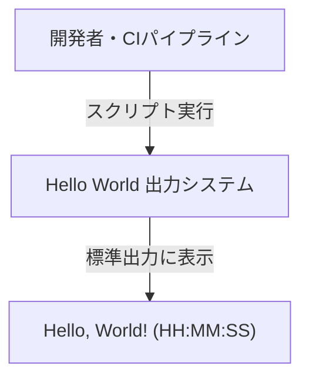
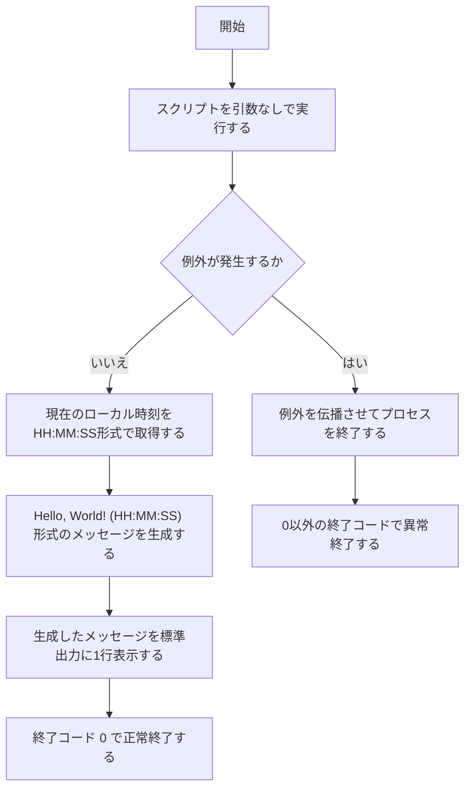

# Hello World 出力システム 変更要件定義書

## 変更概要

| 項目 | 内容 |
|---|---|
| 変更ビジョン | Hello Worldの出力に現在時刻を追加する |
| 対応業務課題 | `RQ-BK-EXECUTION-TIME-UNIDENTIFIABLE` |
| 既存要件定義書 | `docs/requirements.md` |

---

## 1. 目的・前提

### システムの目的

変更なし。既存要件定義書 `docs/requirements.md` セクション1 を参照。

### 用語集

既存の用語定義は変更なし。以下の用語を追加する。

| 用語 | 定義 | 区分 |
|---|---|---|
| 実行時刻 | スクリプト実行開始時点のローカル時刻（HH:MM:SS形式、ミリ秒は含まない） | [追加] |

### インターフェース種別

変更なし。既存要件定義書 `docs/requirements.md` セクション1 を参照。

---

## 2. 業務

### 対象業務一覧

| RQ-BZ-ID | 業務名 | 概要 | 区分 |
|---|---|---|---|
| `RQ-BZ-OUTPUT-VERIFICATION` | 出力動作検証 | 実行環境において標準出力が正常に動作するかを検証する | 変更なし |

内容は変更なし。既存要件定義書 `docs/requirements.md` セクション2 を参照。

### 業務フロー

[削除] 旧業務フロー（固定文字列出力）：既存要件定義書 `docs/requirements.md` セクション2 を参照。

[追加] 変更後の業務フロー（時刻付き出力）：

### 業務の範囲・担当者

変更なし。既存要件定義書 `docs/requirements.md` セクション2 を参照。

### システム化による見込み効果

変更なし。既存要件定義書 `docs/requirements.md` セクション2 を参照。

### 2-1. 業務課題一覧

既存業務課題 `RQ-BK-ENV-VERIFICATION-UNGOVERNED` は変更なし。既存要件定義書 `docs/requirements.md` セクション2-1 を参照。

| RQ-BK-ID | 業務課題 | 現状の問題 | 業務影響 | 解決状態 | 区分 |
|---|---|---|---|---|---|
| `RQ-BK-EXECUTION-TIME-UNIDENTIFIABLE` | 実行タイミング特定不能 | 出力内容に実行時刻が含まれないため、ログやCIパイプラインで実行タイミングを特定できない | 複数回実行した際にどの出力がいつのものか判別できず、障害調査や実行確認の効率が低下する | 出力に実行時刻を含めることで、実行タイミングが一意に特定できる | [追加] |

---

## 3. 機能要件

### 入力データ

変更なし。既存要件定義書 `docs/requirements.md` セクション3 を参照。

### 出力データ

| 区分 | 仕様 |
|---|---|
| [削除] 旧仕様 | 標準出力に固定文字列 "Hello, World!" を1行出力する |
| [追加] 新仕様 | 標準出力に "Hello, World! (HH:MM:SS)" 形式の文字列を1行出力する。HH:MM:SSはスクリプト実行開始時点のローカル時刻を秒単位で表した値 |

### 外部連携

変更なし。既存要件定義書 `docs/requirements.md` セクション3 を参照。

### CUI引数仕様

変更なし。既存要件定義書 `docs/requirements.md` セクション3 を参照。

### ユーザー利用フロー

[削除] 旧ユーザー利用フロー：既存要件定義書 `docs/requirements.md` セクション3 を参照。

[追加] 変更後のユーザー利用フロー：

### ログ

変更なし。既存要件定義書 `docs/requirements.md` セクション3 を参照。

### 監視・アラート

変更なし。既存要件定義書 `docs/requirements.md` セクション3 を参照。

### 機能一覧

| RQ-ID | カテゴリ | 機能名 | 対応業務課題ID（RQ-BK-*） | この機能が無いと何が困るか | 区分 |
|---|---|---|---|---|---|
| `RQ-FT-GET-HELLO-MESSAGE` (deprecated) | 業務機能 | 表示文字列取得 | `RQ-BK-EXECUTION-TIME-UNIDENTIFIABLE` | - | [削除] |
| `RQ-FT-PRINT-HELLO-WORLD` (deprecated) | 業務機能 | Hello, World! 標準出力 | `RQ-BK-EXECUTION-TIME-UNIDENTIFIABLE` | - | [削除] |
| `RQ-FT-GET-CURRENT-TIME` | 業務機能 | 実行時刻取得 | `RQ-BK-EXECUTION-TIME-UNIDENTIFIABLE` | 実行時刻を取得できず、出力に実行タイミングを含められない | [追加] |
| `RQ-FT-BUILD-TIMESTAMPED-MESSAGE` | 業務機能 | 時刻付きメッセージ生成 | `RQ-BK-ENV-VERIFICATION-UNGOVERNED`, `RQ-BK-EXECUTION-TIME-UNIDENTIFIABLE` | 出力する文字列を生成できず検証が行えない | [追加] |
| `RQ-FT-PRINT-TIMESTAMPED-OUTPUT` | 業務機能 | 時刻付きメッセージ標準出力 | `RQ-BK-ENV-VERIFICATION-UNGOVERNED`, `RQ-BK-EXECUTION-TIME-UNIDENTIFIABLE` | 環境の動作検証ができず実行環境の正常性を確認する共通手段がなくなる | [追加] |

---

## 4. データ

変更なし。既存要件定義書 `docs/requirements.md` セクション4 を参照。

### 4-1. CRUDテーブル

業務エンティティが存在しないため対象外。変更なし。既存要件定義書 `docs/requirements.md` セクション4-1 を参照。

---

## 5. 非機能要件

変更なし。既存要件定義書 `docs/requirements.md` セクション5 を参照。

---

## 6. テスト用利用シナリオ

| RQ-TS-ID | テスト目的 | 前提条件 | テスト手順 | 期待される結果 | 対応業務課題ID（RQ-BK-*） | 区分 |
|---|---|---|---|---|---|---|
| `RQ-TS-VERIFY-HELLO-WORLD-OUTPUT` (deprecated) | 正常実行で "Hello, World!" が標準出力に表示されることを確認する | 実行環境にスクリプトが配置されている | スクリプトを引数なしで実行する | "Hello, World!" が1行表示され終了コード 0 で終了する | `RQ-BK-EXECUTION-TIME-UNIDENTIFIABLE` | [削除] |
| `RQ-TS-VERIFY-TIMESTAMPED-OUTPUT` | 正常実行で "Hello, World! (HH:MM:SS)" 形式のメッセージが標準出力に表示されることを確認する | 実行環境にスクリプトが配置されている | スクリプトを引数なしで実行する | "Hello, World! (HH:MM:SS)" 形式（HH:MM:SSは実行時のローカル時刻）の文字列が1行表示され、終了コード 0 で終了する | `RQ-BK-ENV-VERIFICATION-UNGOVERNED`, `RQ-BK-EXECUTION-TIME-UNIDENTIFIABLE` | [追加] |

---

## 7. 業務課題と要件の対応表（変更後）

| RQ-BK-ID | 業務課題 | 対応要件ID |
|---|---|---|
| `RQ-BK-ENV-VERIFICATION-UNGOVERNED` | 実行環境検証の属人化 | `RQ-FT-BUILD-TIMESTAMPED-MESSAGE`, `RQ-FT-PRINT-TIMESTAMPED-OUTPUT`, `RQ-TS-VERIFY-TIMESTAMPED-OUTPUT` |
| `RQ-BK-EXECUTION-TIME-UNIDENTIFIABLE` | 実行タイミング特定不能 | `RQ-FT-GET-CURRENT-TIME`, `RQ-FT-BUILD-TIMESTAMPED-MESSAGE`, `RQ-FT-PRINT-TIMESTAMPED-OUTPUT`, `RQ-TS-VERIFY-TIMESTAMPED-OUTPUT` |
