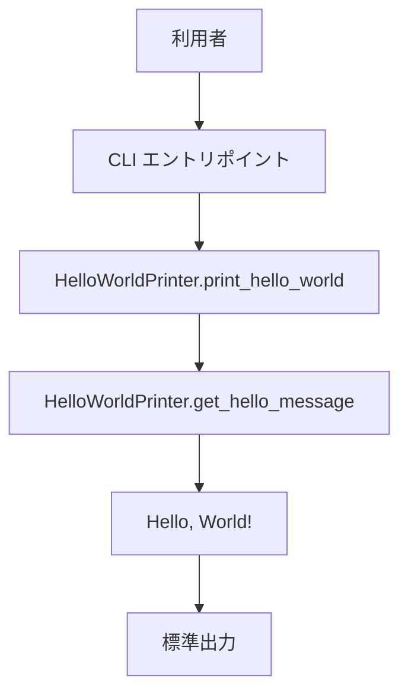
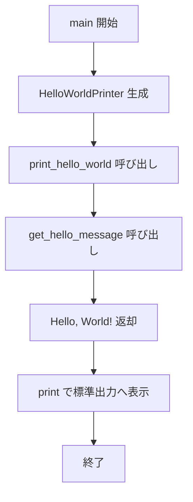
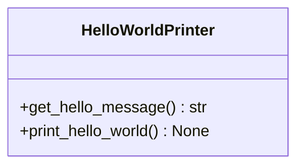
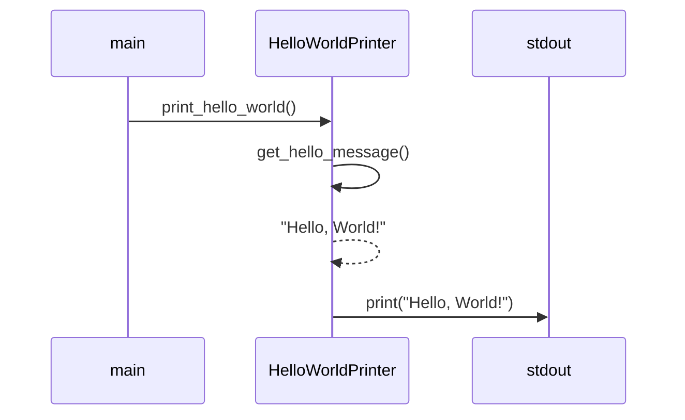

# 詳細設計書

## 1. 言語・フレームワーク

| DS-ID | 項目 | 選定結果 | 選定理由 | 対応要件ID |
|---|---|---|---|---|
| `DS-MD-HELLO-MODULE-FT-PRINT-HELLO-WORLD` | 言語 | Python 3.x | 最小構成での CUI 実行と可読性を両立できるため | `RQ-FT-PRINT-HELLO-WORLD` |
| `DS-MD-HELLO-MODULE-FT-PRINT-HELLO-WORLD` | フレームワーク | なし | 固定文字列出力のみで外部ライブラリが不要なため | `RQ-FT-PRINT-HELLO-WORLD` |

---

## 2. システム構成

### 2-1. コンポーネント一覧

| DS-ID | コンポーネント名 | 役割 | 対応要件ID |
|---|---|---|---|
| `DS-MD-HELLO-MODULE-FT-PRINT-HELLO-WORLD` | hello モジュール | 出力処理全体を保持する実行エントリポイント | `RQ-FT-PRINT-HELLO-WORLD` |
| `DS-CL-HELLO-WORLD-PRINTER-FT-PRINT-HELLO-WORLD` | HelloWorldPrinter クラス | 文字列取得と表示処理の責務を持つクラス | `RQ-FT-PRINT-HELLO-WORLD` |

### 2-2. システム全体構成図



### 2-3. コンポーネント間インターフェースとデータフロー

| DS-ID | 送信元 | 送信先 | データ | 対応要件ID |
|---|---|---|---|---|
| `DS-IF-CLI-ENTRY-FT-PRINT-HELLO-WORLD` | CLI エントリ | print_hello_world | メソッド呼び出し | `RQ-FT-PRINT-HELLO-WORLD` |
| `DS-IF-GET-MESSAGE-FT-GET-HELLO-MESSAGE` | print_hello_world | get_hello_message | 文字列取得要求 | `RQ-FT-GET-HELLO-MESSAGE` |
| `DS-IF-PRINT-OUTPUT-FT-PRINT-HELLO-WORLD` | print_hello_world | 標準出力 | "Hello, World!" 文字列 | `RQ-FT-PRINT-HELLO-WORLD` |

---

## 3. データベース設計

DB は不要。固定文字列をメモリ上で扱うのみで永続化しない。

テーブル設計: 該当なし。

---

## 4. アーキテクチャ設計

### 4-1. 外部設計

#### CUI 仕様

| DS-ID | コマンド | 引数 | 動作 | 対応要件ID |
|---|---|---|---|---|
| `DS-IF-CLI-ENTRY-FT-PRINT-HELLO-WORLD` | Python スクリプト実行 | なし | HelloWorldPrinter を生成して print_hello_world を呼び出す | `RQ-FT-PRINT-HELLO-WORLD` |

#### テスト実行インターフェース

| DS-ID | 目的 | 実行方法 | 対応要件ID |
|---|---|---|---|
| `DS-IF-CLI-TEST-TS-VERIFY-HELLO-WORLD-OUTPUT` | 正常出力を確認する | スクリプトを引数なしで実行し stdout を検証する | `RQ-TS-VERIFY-HELLO-WORLD-OUTPUT` |

### 4-2. 内部設計

#### 処理フロー図



---

## 5. クラス設計

### 5-1. クラス一覧

| DS-ID | クラス名 | 役割 | 対応要件ID |
|---|---|---|---|
| `DS-CL-HELLO-WORLD-PRINTER-FT-PRINT-HELLO-WORLD` | HelloWorldPrinter | 表示文字列の取得と標準出力表示 | `RQ-FT-PRINT-HELLO-WORLD` |

### 5-2. クラス図



---

## 6. 関数設計

### 6-1. 関数一覧

| DS-ID | 関数名 | 所属クラス | 責務 | 対応要件ID |
|---|---|---|---|---|
| `DS-FN-GET-HELLO-MESSAGE-FT-GET-HELLO-MESSAGE` | get_hello_message | HelloWorldPrinter | 固定文字列 "Hello, World!" を返す | `RQ-FT-GET-HELLO-MESSAGE` |
| `DS-FN-PRINT-HELLO-WORLD-FT-PRINT-HELLO-WORLD` | print_hello_world | HelloWorldPrinter | get_hello_message の結果を標準出力へ表示する | `RQ-FT-PRINT-HELLO-WORLD` |

### 6-2. シーケンス図



---

## 7. エラーハンドリング設計

例外は伝播させて実行失敗として終了する。明示的な try/except は設けない。

---

## 8. コード設計

### 8-1. ディレクトリ構成

```
src/
  hello.py
docs/
  requirements.md
  detail_design.md
```

### 8-2. ファイル一覧

| DS-ID | ファイル名 | 役割 | 対応要件ID |
|---|---|---|---|
| `DS-MD-HELLO-MODULE-FT-PRINT-HELLO-WORLD` | src/hello.py | CUI 実行エントリポイントと出力処理 | `RQ-FT-PRINT-HELLO-WORLD` |

---

## 9. RQ-DS 対応表

| DS-ID | 対応要件ID |
|---|---|
| `DS-MD-HELLO-MODULE-FT-PRINT-HELLO-WORLD` | `RQ-FT-PRINT-HELLO-WORLD` |
| `DS-CL-HELLO-WORLD-PRINTER-FT-PRINT-HELLO-WORLD` | `RQ-FT-PRINT-HELLO-WORLD` |
| `DS-FN-GET-HELLO-MESSAGE-FT-GET-HELLO-MESSAGE` | `RQ-FT-GET-HELLO-MESSAGE` |
| `DS-FN-PRINT-HELLO-WORLD-FT-PRINT-HELLO-WORLD` | `RQ-FT-PRINT-HELLO-WORLD` |
| `DS-IF-CLI-ENTRY-FT-PRINT-HELLO-WORLD` | `RQ-FT-PRINT-HELLO-WORLD` |
| `DS-IF-GET-MESSAGE-FT-GET-HELLO-MESSAGE` | `RQ-FT-GET-HELLO-MESSAGE` |
| `DS-IF-PRINT-OUTPUT-FT-PRINT-HELLO-WORLD` | `RQ-FT-PRINT-HELLO-WORLD` |
| `DS-IF-CLI-TEST-TS-VERIFY-HELLO-WORLD-OUTPUT` | `RQ-TS-VERIFY-HELLO-WORLD-OUTPUT` |
