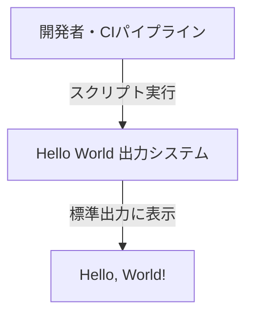
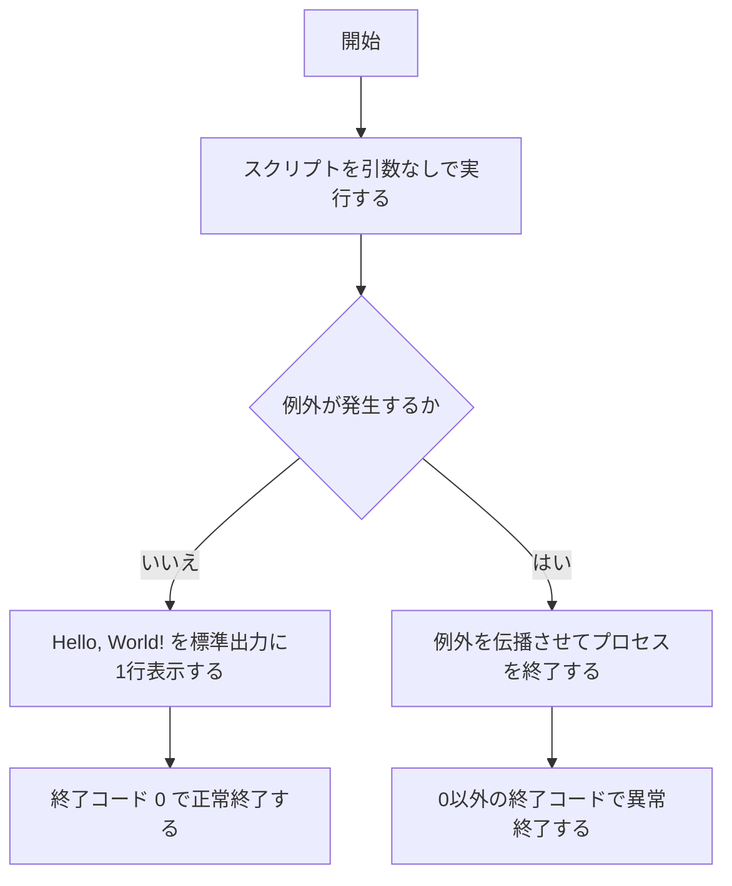

# Hello World 出力システム 要件定義書

## 1. 目的・前提

### システムの目的

固定文字列 "Hello, World!" を標準出力に表示することで、実行環境の基本的な動作を検証する最小構成のシステム。

### 用語集

| 用語 | 定義 |
|---|---|
| 標準出力 | OS が提供するプロセスの出力先ストリーム（stdout） |
| CIパイプライン | スクリプトを自動実行する継続的インテグレーション環境 |
| 実行環境 | スクリプトを動作させる OS・ランタイム環境 |

### インターフェース種別

CUI（コマンドライン）のみ。対話なし。

---

## 2. 業務

### 対象業務一覧

| RQ-BZ-ID | 業務名 | 概要 |
|---|---|---|
| `RQ-BZ-OUTPUT-VERIFICATION` | 出力動作検証 | 実行環境において標準出力が正常に動作するかを検証する |

### 業務フロー

### 業務の範囲・担当者

| 項目 | 内容 |
|---|---|
| 範囲 | スクリプト実行から標準出力表示まで |
| 担当者 | 開発者・CIパイプライン |

### システム化による見込み効果

| 効果区分 | 内容 |
|---|---|
| Soft Saving | 実行環境の検証方法が標準化され、属人的な確認手順が不要になる |

### 2-1. 業務課題一覧

| RQ-BK-ID | 業務課題 | 現状の問題 | 業務影響 | 解決状態 |
|---|---|---|---|---|
| `RQ-BK-ENV-VERIFICATION-UNGOVERNED` | 実行環境検証の属人化 | 出力動作を確認する共通手段がなく検証が属人化している | 環境ごとに独自の確認方法が必要となり統一されない | 共通スクリプトで統一的に確認できる |

---

## 3. 機能要件

### 入力データ

なし（引数・設定ファイル・標準入力は受け付けない）

### 出力データ

標準出力に固定文字列 "Hello, World!" を1行出力する。

### 外部連携

なし

### CUI引数仕様

| 項目 | 仕様 |
|---|---|
| 実行方法 | スクリプトを引数なしで実行する |
| 引数 | なし |
| 終了コード（正常） | 0 |
| 終了コード（例外発生時） | 0 以外（OS デフォルトの例外終了コード） |

### ユーザー利用フロー

### ログ

ログは必要ないため、ログの内容と保存期間の記述は行わない。

### 監視・アラート

監視・アラートは必要ないため、監視・アラートの内容と対応方法の記述は行わない。

### 機能一覧

| RQ-ID | カテゴリ | 機能名 | 対応業務課題ID（RQ-BK-*） | この機能が無いと何が困るか |
|---|---|---|---|---|
| `RQ-FT-GET-HELLO-MESSAGE` | 業務機能 | 表示文字列取得 | `RQ-BK-ENV-VERIFICATION-UNGOVERNED` | 出力する文字列を生成できず検証が行えない |
| `RQ-FT-PRINT-HELLO-WORLD` | 業務機能 | Hello, World! 標準出力 | `RQ-BK-ENV-VERIFICATION-UNGOVERNED` | 環境の動作検証ができず実行環境の正常性を確認する共通手段がなくなる |

---

## 4. データ

業務エンティティは存在しない。固定文字列を出力するのみでデータを保持・管理しない。

### 4-1. CRUDテーブル

業務エンティティが存在しないため対象外。

---

## 5. 非機能要件

特になし（最小構成）。

---

## 6. テスト用利用シナリオ

| RQ-TS-ID | テスト目的 | 前提条件 | テスト手順 | 期待される結果 | 対応業務課題ID（RQ-BK-*） |
|---|---|---|---|---|---|
| `RQ-TS-VERIFY-HELLO-WORLD-OUTPUT` | 正常実行で "Hello, World!" が標準出力に表示されることを確認する | 実行環境にスクリプトが配置されている | スクリプトを引数なしで実行する | "Hello, World!" が1行表示され終了コード 0 で終了する | `RQ-BK-ENV-VERIFICATION-UNGOVERNED` |

---

## 7. 業務課題と要件の対応表

| RQ-BK-ID | 業務課題 | 対応要件ID |
|---|---|---|
| `RQ-BK-ENV-VERIFICATION-UNGOVERNED` | 実行環境検証の属人化 | `RQ-FT-GET-HELLO-MESSAGE`, `RQ-FT-PRINT-HELLO-WORLD`, `RQ-TS-VERIFY-HELLO-WORLD-OUTPUT` |
