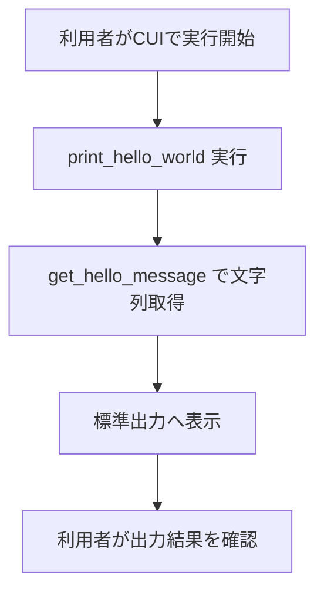
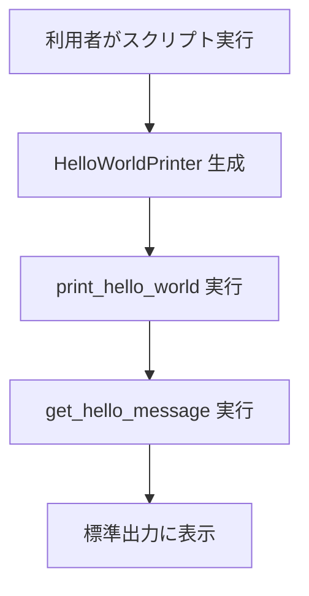

# 要件定義書

## 1. 目的・前提

### 1-1. システムの目的

| RQ-ID | 項目 | 内容 |
|---|---|---|
| RQ-BK-MINIMUM-GREETING-OUTPUT | システムの目的 | 最小機能の実装検証として、固定メッセージ出力機能を確実に実行できることを確認する。 |

### 1-2. 用語集

| RQ-ID | 用語 | 定義 |
|---|---|---|
| RQ-DT-HELLO-MESSAGE-CONSTANT | Helloメッセージ | 文字列「Hello, World!」を指す固定文字列。 |
| RQ-UI-CLI-EXECUTION | CLI実行 | Pythonスクリプトを直接実行して標準出力を確認する操作。 |

### 1-3. GUI か CUI か

| RQ-ID | 種別 | 内容 |
|---|---|---|
| RQ-UI-CLI-EXECUTION | UI種別 | CUI とする。 |

## 2. 業務

### 2-1. 対象業務一覧

| RQ-ID | 対象業務 | 内容 |
|---|---|---|
| RQ-BZ-HELLO-OUTPUT-VALIDATION | Hello出力確認業務 | 固定文字列出力の実行可否を確認する業務。 |

### 2-2. 業務フロー（mermaid）

### 2-3. 業務の範囲・担当者

| RQ-ID | 範囲 | 担当者 |
|---|---|---|
| RQ-BZ-HELLO-OUTPUT-VALIDATION | ローカル実行時の出力確認のみ | 開発者 |

### 2-4. 業務課題・KPI

| RQ-ID | 業務課題 | KPI |
|---|---|---|
| RQ-BK-MINIMUM-GREETING-OUTPUT | 出力処理の最小構成でも処理追跡ができることを確認したい | 実行1回あたり成功率100%、期待文字列一致率100% |

### 2-5. 解決すべき課題と対応方針

| RQ-ID | 解決課題 | 対応方針 |
|---|---|---|
| RQ-BK-MINIMUM-GREETING-OUTPUT | 固定文字列出力処理を関数呼び出し単位で追跡できない | メッセージ取得関数と表示関数を分離し、呼び出し関係を明確化する。 |

### 2-6. システム化による見込み経営効果

| RQ-ID | 効果区分 | 内容 |
|---|---|---|
| RQ-BK-MINIMUM-GREETING-OUTPUT | Cost Avoidance | 不具合切り分け時間の削減により、調査工数の増大を抑制する。 |

### 2-7. 業務課題と機能の整合

| RQ-BK-ID | 対応機能ID | 確認結果 |
|---|---|---|
| RQ-BK-MINIMUM-GREETING-OUTPUT | RQ-FT-GET-HELLO-MESSAGE, RQ-FT-PRINT-HELLO-WORLD | 業務課題に紐づかない機能は存在しない。 |

### 2-1. 業務課題一覧（必須）

| RQ-BK-ID | 業務課題 | 現状の問題 | 業務影響 | 解決状態 |
|---|---|---|---|---|
| RQ-BK-MINIMUM-GREETING-OUTPUT | 最小出力処理の追跡性不足 | 出力文字列の生成元と表示処理の責務が曖昧 | 修正時に影響範囲判断を誤る | メッセージ取得と表示を分離し、追跡可能となる |

## 3. 機能要件

### 3-1. 入力データ（人手入力 / 外部連携）

| RQ-ID | 種別 | 内容 |
|---|---|---|
| RQ-UI-CLI-EXECUTION | 人手入力 | CUIでスクリプトを実行する。 |
| RQ-EX-NO-EXTERNAL-INTEGRATION | 外部連携 | 外部連携は行わない。 |

### 3-2. 出力データ

| RQ-ID | 出力項目 | 内容 |
|---|---|---|
| RQ-FT-PRINT-HELLO-WORLD | 標準出力 | 文字列「Hello, World!」を1回表示する。 |

### 3-3. 外部連携

| RQ-ID | 項目 | 内容 |
|---|---|---|
| RQ-EX-NO-EXTERNAL-INTEGRATION | 外部連携要件 | 外部システムとの接続は不要とする。 |

### 3-4. CUI の場合：全引数の仕様

| RQ-ID | 引数名 | 必須 | 内容 |
|---|---|---|---|
| RQ-UI-CLI-EXECUTION | なし | - | 引数は受け付けない。 |

### 3-5. 全機能のユーザー利用フロー（mermaid）

### 3-6. 業務フローとの対応関係

| RQ-ID | 業務フロー工程 | 対応機能 |
|---|---|---|
| RQ-FT-GET-HELLO-MESSAGE | 文字列取得 | get_hello_message |
| RQ-FT-PRINT-HELLO-WORLD | 表示処理 | print_hello_world |

### 3-7. ログ要件

| RQ-ID | 判定 | 内容 |
|---|---|---|
| RQ-OP-NO-APPLICATION-LOG | ログ要件 | ログは必要ないため、ログの内容と保存期間の記述は行わない。 |

### 3-8. 監視・アラート要件

| RQ-ID | 判定 | 内容 |
|---|---|---|
| RQ-OP-NO-MONITORING-ALERT | 監視・アラート要件 | 監視・アラートは必要ないため、監視・アラートの内容と対応方法の記述は行わない。 |

### 3-9. 機能一覧

| RQ-ID | カテゴリ | 機能名 | 対応業務課題ID（RQ-BK-*） | この機能が無いと何が困るか |
|---|---|---|---|---|
| RQ-FT-GET-HELLO-MESSAGE | 機能 | 表示文字列取得機能 | RQ-BK-MINIMUM-GREETING-OUTPUT | 表示文字列の責務分離ができず、追跡できない。 |
| RQ-FT-PRINT-HELLO-WORLD | 機能 | Hello表示機能 | RQ-BK-MINIMUM-GREETING-OUTPUT | 利用者が期待する出力を確認できない。 |
| RQ-UI-CLI-EXECUTION | 画面 | CUI実行機能 | RQ-BK-MINIMUM-GREETING-OUTPUT | 機能実行手段がなく、検証できない。 |

## 4. データ

### 4-1. 内部データ / 外部データの区別

| RQ-ID | データ名 | 区分 | 内容 |
|---|---|---|---|
| RQ-DT-HELLO-MESSAGE-CONSTANT | Helloメッセージ定数 | 内部データ | 「Hello, World!」固定文字列。 |

### 4-2. データ保持期間

| RQ-ID | データ名 | 保持期間 |
|---|---|---|
| RQ-DT-HELLO-MESSAGE-CONSTANT | Helloメッセージ定数 | 実行時メモリ上のみ。永続化しない。 |

### 4-3. 外部DB接続先と接続方法

| RQ-ID | 接続先 | 接続方法 |
|---|---|---|
| RQ-DT-NO-EXTERNAL-DB | なし | 外部DB接続は行わない。 |

### 4-4. DB の必要性の有無と理由

| RQ-ID | 判定 | 理由 |
|---|---|---|
| RQ-DT-DB-NOT-REQUIRED | 不要 | 固定文字列出力のみで永続データを扱わないため。 |

### 4-5. 業務エンティティ一覧

| RQ-ID | カテゴリ | 業務エンティティ名 | 対応業務課題ID（RQ-BK-*） | この業務エンティティが無いと何が困るか |
|---|---|---|---|---|
| RQ-DT-HELLO-MESSAGE-CONSTANT | データ | GreetingMessage | RQ-BK-MINIMUM-GREETING-OUTPUT | 出力内容の基準値を定義できない。 |

### 4-1. CRUDテーブル（必須）

| エンティティ名 | Create | Read（一覧） | Read（詳細） | Update | Delete | 備考 |
|---|---|---|---|---|---|---|
| GreetingMessage | × | × | ○ | × | × | 固定文字列を参照するのみ |

## 5. 非機能要件

### 5-1. 性能

| RQ-ID | 項目 | 要件 |
|---|---|---|
| RQ-NF-RESPONSE-TIME-UNDER-1S | 応答時間 | ローカル実行時に1秒以内で標準出力を完了する。 |

### 5-2. 利用人数

| RQ-ID | 項目 | 要件 |
|---|---|---|
| RQ-NF-SINGLE-USER-EXECUTION | 同時利用人数 | 同時利用1名を対象とする。 |

### 5-3. セキュリティ要件

| RQ-ID | 項目 | 要件 |
|---|---|---|
| RQ-NF-NO-SECRET-OUTPUT | 出力制御 | 機密情報を扱わず、固定文字列のみを出力する。 |

### 5-4. 非機能要件一覧

| RQ-ID | カテゴリ | 非機能要件名 | 対応業務課題ID（RQ-BK-*） | この非機能要件が無いと何が困るか |
|---|---|---|---|---|
| RQ-NF-RESPONSE-TIME-UNDER-1S | 性能 | 1秒以内出力 | RQ-BK-MINIMUM-GREETING-OUTPUT | 最小機能検証の効率が落ちる。 |
| RQ-NF-SINGLE-USER-EXECUTION | 利用人数 | 単一利用者前提 | RQ-BK-MINIMUM-GREETING-OUTPUT | 想定外負荷条件で評価がぶれる。 |
| RQ-NF-NO-SECRET-OUTPUT | セキュリティ | 固定文字列のみ出力 | RQ-BK-MINIMUM-GREETING-OUTPUT | 出力内容の安全性を保証できない。 |

## 6. テスト用利用シナリオ

| RQ-TS-ID | テスト目的 | 前提条件 | テスト手順 | 期待される結果 | 対応業務課題ID（RQ-BK-*） |
|---|---|---|---|---|---|
| RQ-TS-EXECUTE-HELLO-PRINT | CUI実行で表示処理全体を確認する | Python実行環境がある | スクリプトを実行する | 「Hello, World!」が1回表示される | RQ-BK-MINIMUM-GREETING-OUTPUT |
| RQ-TS-VERIFY-MESSAGE-RESOLUTION | 文字列取得関数の利用を確認する | クラスとメソッドが定義されている | print_hello_world を実行する | get_hello_message の戻り値が表示される | RQ-BK-MINIMUM-GREETING-OUTPUT |
