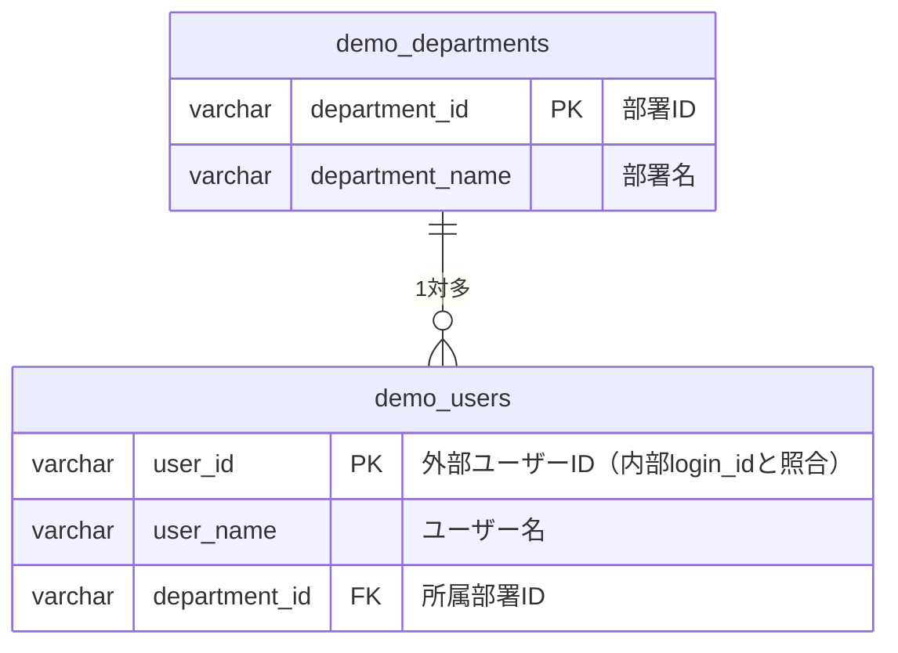

# 外部連携調査レポート — Neon PostgreSQL 部署マスタDB

作成日: 2026-05-06

---

## 1. システム概要

| 項目 | 内容 |
|---|---|
| システム名 | Neon Serverless PostgreSQL（部署マスタDB） |
| 役割 | 組織の部署マスタと外部ユーザー情報を管理する外部PostgreSQLデータベース |
| 接続APIの種類 | PostgreSQL 直接接続（DB系） |
| 公式ドキュメントURL | https://neon.tech/docs/guides/sqlalchemy |
| DBエンジン | PostgreSQL 17.8 |
| ホスト種別 | Neon 接続プーラー（PgBouncer）経由 |
| リージョン | ap-southeast-1（AWS） |

---

## 2. 認証・接続情報

| 項目 | 内容 |
|---|---|
| 認証方式 | ユーザー名 + パスワード（PostgreSQL 標準認証） |
| SSL | `sslmode=require`（必須） |
| チャネルバインディング | `channel_binding=require`（必須） |
| 接続エンドポイント | PgBouncer 接続プーラー経由 |
| 接続プール設定 | アプリ側プーリング無効（`NullPool`）を必須とする。PgBouncer との二重プーリング回避のため |

### 必要な環境変数

| 変数名 | 用途 |
|---|---|
| `EXTERNAL_DB_URL` | Neon PostgreSQL への接続文字列（postgresql://ユーザー名:パスワード@ホスト/DB名?sslmode=require&channel_binding=require） |

---

## 3. オペレーション一覧

| オペレーション名 | テーブル | 操作 | 主要条件 | レスポンス概要 |
|---|---|---|---|---|
| ログインIDによる部署名取得 | `demo_users` JOIN `demo_departments` | SELECT | `demo_users.user_id = :login_id` | department_name（一致なしは None） |

---

## 4. 連携先データ構造

### テーブル設計

#### demo_departments

| カラム名 | 型 | 制約 | 説明 |
|---|---|---|---|
| department_id | VARCHAR | NOT NULL、PK | 部署ID（例: D001） |
| department_name | VARCHAR | NOT NULL | 部署名（例: 営業部） |

**サンプルデータ（実測）:**
- D001 / 営業部
- D002 / 開発部
- D003 / 人事部
- D004 / 経理部
- D005 / 情報システム部

#### demo_users

| カラム名 | 型 | 制約 | 説明 |
|---|---|---|---|
| user_id | VARCHAR | NOT NULL、PK | 外部ユーザーID（内部 login_id と照合するキー） |
| user_name | VARCHAR | NOT NULL | ユーザー名 |
| department_id | VARCHAR | NOT NULL | 所属部署ID（FK→demo_departments.department_id） |

**サンプルデータ（実測）:**
- U001 / テストユーザー01 / D001（営業部）
- U002 / テストユーザー02 / D002（開発部）
- U003 / テストユーザー03 / D003（人事部）

### リレーション図

### 部署取得ロジック

内部アプリの利用者（`login_id`）に対して以下の順で部署名を取得する。

1. `demo_users.user_id = 内部利用者のlogin_id` で `demo_users` を検索する
2. 該当レコードの `department_id` を取得する
3. `demo_departments.department_id = 上記department_id` で `demo_departments` を検索し、`department_name` を取得する
4. 一致するレコードが存在しない場合は `None` を返す（画面では「不明」と表示する）

---

## 5. 制限事項

| 制限項目 | 内容 |
|---|---|
| アクセス種別 | SELECT のみ。INSERT/UPDATE/DELETE は禁止 |
| Neon オートサスペンド | 無操作5分後にDB停止。初回接続時に最大数秒の遅延が発生する可能性がある |
| PgBouncer 制約 | `PREPARE` 文・`LISTEN/NOTIFY` 等は利用不可。`NullPool` でアプリ側プーリングを無効化すること |
| 接続タイムアウト | アプリ側で 5 秒を上限として設定すること（RQ-NF-EXTERNAL-DB-TIMEOUT） |
| max_connections | 901（同時接続20人の想定に対して十分） |
| channel_binding | psycopg2（libpqベース）でのみ正常動作。asyncpg では channel_binding が無視される |

---

## 6. モック実装の説明

### モック方式: B（固定レスポンスファイル方式 — `RQ-EX-USE-FIXED-RESPONSE-MOCK`）

**選定理由:** 
- 外部DBへの操作は SELECT のみ（状態変更なし）
- レスポンスパターンが少ない（部署一覧・ログインIDによる部署名取得の2種のみ）
- 固定データで全テストシナリオをカバーできる

**モック構成:**

`external/neon-department-db/mock/` 配下に以下を配置する。

- `departments.json`: `demo_departments` テーブルの固定レスポンスデータ
- `users.json`: `demo_users` テーブルの固定レスポンスデータ
- `mock_department_client.py`: テスト時に `department_client.py` の代替として使用する固定レスポンス返却クラス。`departments.json` と `users.json` を読み込み、ログインIDによる部署名取得メソッドを提供する

**使い方（手順）:**

1. pytest 実行時に `MOCK_EXTERNAL_DB=true` 環境変数を設定する
2. `get_external_db()` が `MockExternalDbClient` を返すよう FastAPI Depends の差し替えを行う
3. `departments.json` に部署マスタのテストデータを記述し、全テストシナリオを網羅する
4. 実DB接続テスト（real モード）は `MOCK_EXTERNAL_DB=false` にして手動実行する

---

## 7. 既存ライブラリ選定結果

### 比較表（7項目評価）

| 評価項目 | SQLAlchemy 2.0 + psycopg2-binary | SQLAlchemy 2.0 + asyncpg | psycopg2-binary 単体 |
|---|---|---|---|
| メンテナンス状況 | アクティブ（psycopg2 継続保守） | アクティブ（MagicStack） | 同左 |
| スター数・DL数 | psycopg2: 月間 DL 2.1億超（PyPI最多クラス） | asyncpg: GitHub 6,800+、月間 DL 数千万 | 同左 |
| ライセンス | LGPL v3（商用利用可） | Apache 2.0 | LGPL v3 |
| PgBouncer対応 | 問題なし（NullPool 指定） | 要 statement_cache_size=0 設定（パフォーマンス劣化） | 問題なし |
| sslmode / channel_binding 対応 | 完全対応（libpq ベース、URL文字列直接渡し可） | channel_binding が無視される、sslmode もURL非対応 | 完全対応 |
| SQLAlchemy 統一方針との整合 | 完全整合（既存エンジンに外部DB用エンジンを追加） | 整合（ただし async 混在管理が増える） | 不整合（SQLAlchemy を迂回） |
| テスタビリティ | 高（create_engine を差し替えるだけ） | 中（async コンテキスト設定が追加で必要） | 低（DI なしで接続オブジェクト直接差し替えが必要） |

### 採用決定

| 候補 | 採用可否 | 理由 |
|---|---|---|
| **SQLAlchemy 2.0 + psycopg2-binary** | **採用** | channel_binding=require に唯一完全対応。SQLAlchemy 統一方針・テスタビリティを満たす |
| SQLAlchemy 2.0 + asyncpg | 不採用 | channel_binding が無視される。PgBouncer 対応に追加設定が必要でパフォーマンス劣化 |
| psycopg2-binary 単体 | 不採用 | SQLAlchemy 統一方針と不整合。テスト時のモック差し替えコスト増大 |

### リスク評価

| リスク種別 | 内容 | 対策 |
|---|---|---|
| 運用 | Neon スケールゼロ復帰時のコールドスタート遅延 | `pool_pre_ping=True` を外部DB エンジンに設定する |
| 法務 | psycopg2 は LGPL v3 | 動的リンク・改変なしの通常利用のため商用利用に問題なし |
| 保守 | psycopg2 の新機能開発は psycopg3 に移行中 | 現時点では移行不要。将来的に psycopg[binary]（psycopg3）への移行を検討する |

---

## 8. E2E 二モード運用方針

| モード | 環境変数 | 対象 |
|---|---|---|
| mock モード | `MOCK_EXTERNAL_DB=true` | 実装時・CI 時の必須ゴール。全 E2E シナリオをモックで実行する |
| real モード | `MOCK_EXTERNAL_DB=false` | 手動実行のみ。実 Neon DB へ接続して動作確認する |

- モード切替は `docker compose` プロファイルと pytest コマンドライン引数の両方で提供する
- シンボリックリンク: `e2e/external/neon-department-db/mock/` → `external/neon-department-db/mock/` とし、Git 管理下に置く
- テスト環境作成スクリプト: `external/neon-department-db/e2e/setup.sh`（bash 実装）
