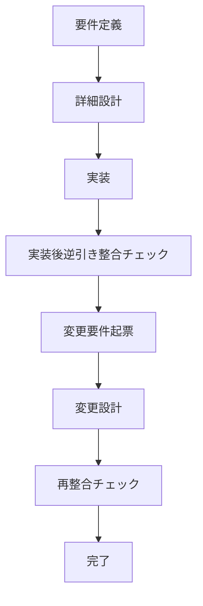

# isdd 変更点整理資料

## 1. 本資料の目的
本資料は、5つの論点について決定済みの変更点を明確化し、実運用に反映するための記述を整理したものである。

---

## 2. 論点1 ヒアリング時の説明の平易化

### 2.1 変更内容
ヒアリングでは専門用語中心の説明をやめ、ユーザーの業務文脈で理解できる表現を前提とする。

ただし、業務語は一般語と異なる意味を持つことがあるため、用語の意味をエージェント側で推定して確定してはならない。業務語は必ずユーザーに確認して定義する。

### 2.2 具体的な運用変更
1. 質問文は業務文脈の平易な言葉で提示する。
2. ユーザーが使った業務語は、次の質問へ進む前に必ず意味確認を行う。
3. 画面要件ヒアリングでは、各画面ごとに次の5項目を必須確認とする。
   - 画面の目的
   - 主要要素（ボタン、一覧、入力欄など）
   - 入力項目
   - 表示項目
   - エラー時の見え方
4. 5項目が埋まっていない画面は未確定として扱い、要件定義の完了判定を行わない。

### 2.3 反映対象
- skills/isdd-requirements/SKILL.md
- skills/isdd-change-req/SKILL.md
- skills/isdd-reverse-engineering/SKILL.md
- skills/isdd-common/references/hearing-complexity-rules.md
- skills/isdd-common/references/requirements-chapters.md

---

## 3. 論点2 用語集を意味のあるものにする

### 3.1 変更内容
用語集は「用語の存在確認」ではなく「業務上の意味を固定する仕組み」として運用する。

新しいドメイン用語が出た場合、意味が確定するまで要件ヒアリングを進めない。これにより、語義が曖昧なまま機能要件や設計要件が増えることを防止する。

### 3.2 具体的な運用変更
1. 用語集は次の固定項目で記載する。

| 用語 | 業務上の意味 | 本案件での使用範囲 | 同義語/類義語 |
|---|---|---|---|

2. 用語確認ゲートを追加する。
   - 新出用語が発生
   - 意味確認を実施
   - 用語集へ反映
   - 反映完了後にのみ次の要件質問へ進行
3. 要件本文に記載する用語は、用語集の定義と一致しなければならない。

### 3.3 反映対象
- skills/isdd-common/references/requirements-chapters.md
- skills/isdd-requirements/SKILL.md
- skills/isdd-change-req/SKILL.md
- skills/isdd-reverse-engineering/SKILL.md

---

## 4. 論点3 設計工程から要件へのフィードバック方式

### 4.1 検討前提
本論点の中心は、設計で未マッピングになった要件を要件工程へどう戻すかである。

目的は次の2点である。
1. 設計不要な要件IDが固定化される状態を防止する。
2. 設計で判明した事実を要件へ確実に反映する。

### 4.2 RQカテゴリ全種別とフィードバック時の扱い

| RQカテゴリ | 意味 | フィードバック時の基本扱い |
|---|---|---|
| RQ-BZ | 対象業務 | 変更の背景として参照。直接再採番しない。 |
| RQ-BK | 業務課題 | 要件再編時の根拠として必ず更新確認する。 |
| RQ-FT | 機能要件 | 未マッピング時は分割・統合・削除を優先検討する。 |
| RQ-UI | 画面要件 | 画面要素不足か機能粒度不整合かを切り分ける。 |
| RQ-EX | 外部連携要件 | 接続制約または責務境界の再定義を行う。 |
| RQ-DT | データ要件 | データ責務と保持要件の再定義を行う。 |
| RQ-NF | 非機能要件 | 実装責務か運用責務かを再判定する。 |
| RQ-TS | テストシナリオ要件 | 要件起点か設計起点かを判定して再配置する。 |
| RQ-OP | 運用要件 | 実装対象と運用前提を分離して再定義する。 |

### 4.3 DSカテゴリ全種別と未マッピング判定観点

| DSカテゴリ | 意味 | 未マッピング判定の主観点 |
|---|---|---|
| DS-MD | モジュール | 責務がモジュールに存在するか |
| DS-IF | インターフェース/API | 入出力契約が存在するか |
| DS-CL | クラス | クラス責務として成立するか |
| DS-FN | 関数/メソッド | 処理単位として成立するか |
| DS-SC | スキーマ/データモデル | データ構造として必要か |
| DS-BT | バッチ | 定期/非同期処理として必要か |
| DS-EV | イベント | イベント駆動として必要か |

### 4.4 設計工程から要件へ戻す複数方式

#### 方式A 手動起票方式
設計者が未マッピング要件を確認し、変更要件を手動起票する。

流れ:
1. 設計工程で未マッピング要件を抽出
2. 変更要件ドキュメントを作成
3. 要件再編を実施
4. 設計を再実施

利点:
- 導入コストが最小。

懸念:
- 起票漏れと運用差が発生しやすい。

#### 方式B チェッカー連動半自動方式
整合チェッカーの出力を起点に、変更要件の起票テンプレートを自動生成する。

流れ:
1. チェッカーが未マッピング要件を検出
2. 自動生成された起票テンプレートを作成
3. 担当者が再編方針を確定
4. 変更要件を確定して設計へ戻す

利点:
- 起票漏れを抑止しやすい。

懸念:
- テンプレートの品質設計が必要。

#### 方式C 強制ゲート方式
未マッピング要件が残っている場合、設計完了を認めず、必ず要件工程へ戻す。

流れ:
1. 設計完了前に未マッピング判定
2. 残件ありの場合は完了不可
3. 変更要件工程で再編
4. 再設計後に完了判定

利点:
- 取りこぼしを最小化できる。

懸念:
- 納期圧力時に運用負荷が高い。

#### 方式D 強制ゲートと半自動起票の併用方式
方式Bと方式Cを併用し、起票漏れ抑止と完了強制を同時に実施する。

流れ:
1. 未マッピング検出
2. 起票テンプレート自動生成
3. 変更要件へ反映
4. 再設計
5. 未マッピングゼロで完了

利点:
- 運用品質と実行確実性を両立できる。

懸念:
- 初期導入時の整備範囲が広い。

### 4.5 採用する方向
フィードバック前提方式を採用し、方式Dを基準運用とする。

この方式では、設計工程で未マッピング要件が検出された場合、必ず変更要件工程へ戻し、削除・統合・分割・責務再配置のいずれかで再定義してから設計を再実施する。

### 4.6 反映対象
- skills/isdd-design/SKILL.md
- skills/isdd-change-design/SKILL.md
- skills/isdd-change-req/SKILL.md
- skills/isdd-requirements/SKILL.md
- skills/isdd-common/scripts/rq_ds_link_checker.py
- README.md の完了ゲート記述

---

## 5. 論点4 実装後の逆引き整合

### 5.1 変更前の状態
現状のフローは、要件定義、詳細設計、実装までは定義されているが、実装後に仕様整合を強制する標準工程が不足している。

現状で起きる問題:
1. 実装中に判明した仕様差分が要件書へ戻らない。
2. 実装中に判明した構造差分が設計書へ戻らない。
3. トレーサブルコメントは付くが、要件と設計の正本更新が遅れる。

### 5.2 変更後の状態
実装完了の直後に、実装後逆引き整合チェックを必須工程として追加する。

この工程を担う専用スキルを新設し、既存の逆引きスキルと責務分離する。

### 5.3 スキルごとの変更前後

#### isdd-reverse-engineering
変更前:
- 既存プロジェクトを初回でisdd化する機能が中心。

変更後:
- 初回導入時の逆引き専用に責務を限定する。
- 実装後整合チェックの責務は持たない。

#### isdd-post-implementation-review（新規）
変更前:
- 存在しない。

変更後:
- 実装後整合チェックを実行する専用スキルとして追加する。
- 入力: 現行コード、要件書、設計書、直近実装差分。
- 出力:
   - 整合レポート
   - 要件への反映提案
   - 設計への反映提案
   - 変更要件起票案

#### isdd-traceable-coding
変更前:
- コメントカバレッジとRQ-DS整合チェックで完了可能。

変更後:
- 完了条件に実装後逆引き整合チェック実行を追加する。
- 実装後整合レポートの参照を必須化する。

#### isdd-design と isdd-change-design
変更前:
- 設計完了後の整合確認は設計時点中心。

変更後:
- 実装後整合で戻された差分の受け入れ口を追加する。
- 変更要件経由での再設計手順を必須化する。

### 5.4 共通部品化する範囲

| 共通部品 | 役割 | 主な利用スキル |
|---|---|---|
| 構造抽出部品 | モジュール、クラス、関数、依存関係の抽出 | reverse-engineering, post-implementation-review |
| RQ-DS突合部品 | 要件IDと設計IDの未対応、重複、不整合の判定 | design系, traceable-coding, post-implementation-review |
| 差分要約部品 | 実装差分の仕様影響点抽出 | post-implementation-review |
| 反映提案生成部品 | 要件書、設計書への反映文章生成 | post-implementation-review, change-req |

### 5.5 実装後逆引き整合の標準手順
1. 実装完了後に専用スキルを起動する。
2. コード構造抽出を実行する。
3. 要件書と設計書を読み、RQ-DS突合を実行する。
4. 実装差分を解析し、仕様への影響点を抽出する。
5. 反映提案を生成し、変更要件へ起票する。
6. 変更要件と変更設計を反映後、再度整合チェックを実行する。
7. 未整合ゼロで完了とする。

### 5.6 入出力定義

入力:
- docs/requirements.md
- docs/detail_design.md
- 対象ソースコード
- 直近変更差分情報

出力:
- 実装後逆引き整合レポート
- 要件反映候補一覧
- 設計反映候補一覧
- 変更要件起票テンプレート

### 5.7 完了ゲート
- 実装後逆引き整合チェックを実行済み
- 未整合項目がゼロ
- 変更が必要な場合、変更要件へ反映済み
- 反映後の再チェック完了

### 5.8 改訂後フロー

### 5.9 反映対象
- README.md
- skills/isdd-reverse-engineering/SKILL.md
- skills/isdd-post-implementation-review/SKILL.md
- skills/isdd-traceable-coding/SKILL.md
- skills/isdd-design/SKILL.md
- skills/isdd-change-design/SKILL.md
- skills/isdd-common/scripts 配下の共通部品

---

## 6. 論点5 外部連携プリチェック強化

### 6.1 変更内容
外部連携のプリチェックは、接続可否確認にとどめず、認証付き実接続とスキーマ確認までを完了条件にする。

### 6.2 具体的な運用変更
1. ヒアリング項目を固定化する。
   - 接続先
   - 認証方式
   - 必要環境変数名
   - 接続元制約（ネットワーク、VPN、IP制限）
2. .envへの設定を必須化する。
   - 機密値そのものは文書に保存しない。
   - 環境変数名のみを記録する。
3. Python venv上で実接続テストを実施し、接続可否を証跡化する。
4. 接続成功時は、取得可能なスキーマ（エンティティ一覧）を記録する。

### 6.3 完了条件
- 接続可否が実接続で確認済み
- 認証方式と環境変数名が記録済み
- 取得可能エンティティ一覧が記録済み
- 機密値の記録なし

### 6.4 反映対象
- skills/isdd-external-precheck/SKILL.md
- precheck_reportフォーマット
- skills/isdd-external-research/SKILL.md（境界条件の明記が必要な場合）

---

## 7. 全体反映マップ

| 領域 | 主な変更先 |
|---|---|
| ヒアリング平易化 | isdd-requirements, isdd-change-req, isdd-reverse-engineering, hearing-complexity-rules |
| 用語統制 | requirements-chapters, isdd-requirements, isdd-change-req, isdd-reverse-engineering |
| 設計不要ID抑止 | isdd-requirements, isdd-change-req, isdd-design, isdd-change-design, README運用記述 |
| 実装後逆引き整合 | README, isdd-traceable-coding, isdd-reverse-engineering, 新規実装後整合スキル |
| 外部連携プリチェック | isdd-external-precheck, precheck_report, external-research境界記述 |

---

## 8. 文書レビュー結果

### 8.1 矛盾確認
- 決定済み論点はすべて「変更内容のみ」の記述に統一し、不要な比較記述を削除した。
- 論点3のみ、再検討要求に従って複数方式を提示し、フィードバック採用を明記した。

### 8.2 冗長性確認
- 方式ラベル表記のうち、不要な記号的記述を削減した。
- 反映対象は各論点末尾に集約し、重複記述を削除した。

### 8.3 要求反映確認
- 「業務語は必ずユーザー確認」の要求を論点1に反映した。
- 論点2の不要章（既存有無説明、採用方針）を削除した。
- 論点3は設計工程から要件へのフィードバック方式に再編し、複数方式を提示した。
- 論点4は変更前後のスキル責務、共通部品、手順、入出力、完了条件まで詳細化した。
- 論点5は変更点説明のみの構成に統一した。
