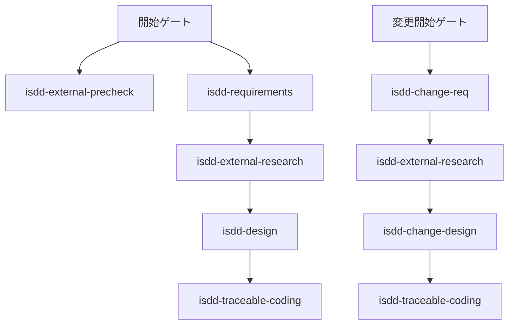
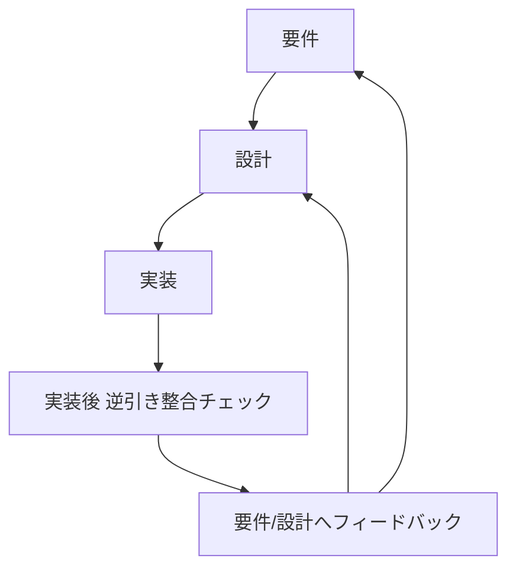

# isdd 変更候補検討資料

## 1. 目的
本資料は、以下の5つの変更候補について、スキル単位での変更方法を複数比較し、メリット・デメリットを整理し、統合方針を明確化するための検討結果をまとめたものである。

1. ヒアリング時の説明の平易化
2. 用語集を意味のあるものにする
3. scriptsでチェックしているIDの整理
4. isddフローの変更（実装後の整合性チェック）
5. 外部連携プリチェックの強化（接続・スキーマ確認）

## 2. 現状整理

### 2.1 現行フロー

### 2.2 現状の論点
- ヒアリングルールでは「MVPという語は直接使わない」方針があるが、実際の案内文では専門用語が混在しやすい。
- 用語の意味確認が「必須ゲート」になっておらず、業務用語が曖昧なまま進行する余地がある。
- `rq_integrity_checker.py` は `RQ-BK` を軸に全カテゴリの関連を検証する実装であり、チェック対象を縮小する場合の方針が未確定。
- 実装後に逆引き検証を必須で回すフローがREADME上で固定化されていない。
- `isdd-external-precheck` は接続テスト記載はあるが、接続方法・認証情報入力・スキーマ取得手順の具体度に揺れがある。

## 3. 変更候補1: ヒアリング時の説明の平易化

### 3.1 変更方法案

| 案 | 変更内容 | 主な変更対象 |
|---|---|---|
| 案A | 専門用語禁止リストを導入し、質問文を平易語で固定する | isdd-requirements, isdd-change-req, isdd-reverse-engineering, isdd-common/references/hearing-complexity-rules.md |
| 案B | 各質問に「業務での言い換え」を必須併記する | 同上 |
| 案C | 画面要件ヒアリングで「画面要素説明」を必須項目化する | isdd-requirements, isdd-change-req, requirements-chapters.md |

### 3.2 メリット・デメリット

| 案 | メリット | デメリット |
|---|---|---|
| 案A | 運用ぶれが最小。レビュー観点が明確。 | 表現の自由度が下がる。 |
| 案B | ユーザー理解が向上し、合意形成が速い。 | 記述量が増え、ヒアリングが長くなりやすい。 |
| 案C | 画面定義の不足を直接防止できる。 | 要件定義初期の負荷が上がる。 |

### 3.3 統合方針
- 採用: 案A + 案C
- 理由: 平易化を強制しつつ、画面定義の抜け漏れを直接抑止できるため。
- 実施要点:
  - 「MVP」「非機能」などの語をそのまま質問に出さず、業務影響ベースの表現へ統一する。
  - 画面要件では、各画面に対して「目的」「主要要素」「入力項目」「表示項目」「エラー時の見え方」を必須確認とする。

## 4. 変更候補2: 用語集を意味のあるものにする

### 4.1 変更方法案

| 案 | 変更内容 | 主な変更対象 |
|---|---|---|
| 案A | 用語集章を追加し、業務用語を定義必須にする | requirements-chapters.md, isdd-requirements, isdd-change-req |
| 案B | 用語検知ゲートを導入し、新出ドメイン語が出たら進行停止して意味確認する | isdd-requirements, isdd-change-req, isdd-reverse-engineering |
| 案C | 用語に「判断境界」を必須化する（何を含む/含まない） | 同上 |

### 4.2 メリット・デメリット

| 案 | メリット | デメリット |
|---|---|---|
| 案A | 文書としての参照性が高い。 | 形式だけ埋まるリスクがある。 |
| 案B | 曖昧語の持ち込みを確実に防げる。 | ヒアリングのテンポが遅くなる。 |
| 案C | 実装時の解釈差異を強く抑制できる。 | 定義負荷が大きく、初期負担が増える。 |

### 4.3 統合方針
- 採用: 案A + 案B
- 理由: 「記録」と「強制確認」の両輪が必要で、どちらか単独では欠けるため。
- 実施要点:
  - 用語集は「用語名」「業務上の意味」「このプロジェクトでの使用範囲」を必須項目とする。
  - 新出ドメイン語を検知した時点で、意味が確定するまで次質問へ進まない。

## 5. 変更候補3: scriptsでチェックしているIDの整理

### 5.1 比較対象
今回の主論点は「RQのうち、`RQ-BK` と `RQ-FT` を中心に検証範囲を絞るか」である。

### 5.2 変更方法案

| 案 | チェック範囲 | 主な変更対象 |
|---|---|---|
| 案A | 現状維持（全カテゴリ） | rq_integrity_checker.py, rq_ds_link_checker.py は現状踏襲 |
| 案B | `RQ-BK` + `RQ-FT` のみ必須、他カテゴリは任意 | 同スクリプト両方 |
| 案C | 二層化: 必須は `RQ-BK` + `RQ-FT`、拡張チェックで全カテゴリ | 同スクリプト両方 + README運用定義 |

### 5.3 メリット・デメリット

| 案 | メリット | デメリット |
|---|---|---|
| 案A | 品質担保が最も強い。設計漏れ検出力が高い。 | 運用負荷が高く、初期導入の障壁になる。 |
| 案B | 実装スピードが上がり、運用が簡単。 | UI・NF・DTの漏れを見逃しやすい。 |
| 案C | 速度と品質の両立が可能。移行しやすい。 | ルール設計が複雑になりやすい。 |

### 5.4 `RQ-BK` + `RQ-FT` に絞る場合の要点
- メリット:
  - 業務課題と機能の主線に集中できる。
  - チェック結果の解釈が簡単になり、改善サイクルが速い。
- デメリット:
  - 画面要件、データ保持、非機能の抜けを検出しづらくなる。
  - 外部連携や運用要件の欠落が後工程で顕在化しやすい。

### 5.5 統合方針
- 採用: 案C
- 理由: 主線の速度を維持しつつ、品質低下を回避できるため。
- 実施要点:
  - チェッカーは「必須チェック」と「拡張チェック」を明示的に分離する。
  - 完了判定は必須チェック合格を最低条件とし、拡張チェックの結果は欠落の種類を明示して扱う。

## 6. 変更候補4: isddフローの変更（実装後の逆引き整合）

### 6.1 変更方法案

| 案 | 変更内容 | 主な変更対象 |
|---|---|---|
| 案A | `isdd-traceable-coding` 完了後に `isdd-reverse-engineering` を必須実行 | README, isdd-traceable-coding, isdd-reverse-engineering |
| 案B | 変更有無に関わらず毎回実行 | 同上 |
| 案C | 初回実装後と変更実装後のみ必須実行 | 同上 + change系スキル |

### 6.2 メリット・デメリット

| 案 | メリット | デメリット |
|---|---|---|
| 案A | 実装差分の仕様乖離を早期発見できる。 | 実行回数が増え、工数が増える。 |
| 案B | 一貫性は最も高い。 | 過剰運用になり、軽微修正でも負荷が重い。 |
| 案C | 効果が高い局面に絞って運用できる。 | 対象判定のルール運用が必要。 |

### 6.3 統合方針
- 採用: 案C
- 理由: 「初回実装後」と「変更実装後」の2局面を必須化すれば、実害の大きい乖離を抑えつつ過剰運用を回避できるため。
- 実施要点:
  - READMEの新規/変更フローに「実装後逆引き整合ステップ」を明記する。
  - `isdd-reverse-engineering` に「実装後検証モード」を追加し、既存ロジック非変更のまま整合確認専用で利用する。

### 6.4 改訂後フロー（統合案）

## 7. 変更候補5: 外部連携プリチェック強化

### 7.1 変更方法案

| 案 | 変更内容 | 主な変更対象 |
|---|---|---|
| 案A | 認証付き接続情報のヒアリング項目を固定化し `.env` 入力を必須化 | isdd-external-precheck |
| 案B | Python venv 前提で接続検証を標準手順化し、接続結果を報告書へ必須記録 | isdd-external-precheck, precheck_reportフォーマット |
| 案C | 接続成功後にスキーマ（エンティティ）取得を必須化 | isdd-external-precheck, isdd-external-research との境界定義 |

### 7.2 メリット・デメリット

| 案 | メリット | デメリット |
|---|---|---|
| 案A | 認証方式の取り違えを減らせる。 | 初回ヒアリング項目が増える。 |
| 案B | 実接続可否を早期に確定できる。 | 実行環境準備の負荷が増える。 |
| 案C | 要件定義前にデータ実体を把握できる。 | 連携先によっては取得権限調整が必要。 |

### 7.3 統合方針
- 採用: 案A + 案B + 案C
- 理由: いずれかを欠くと、接続可否は確認できても要件定義に必要な事実が揃わないため。
- 実施要点:
  - precheckで必ず「接続先」「認証方式」「必要環境変数名」「接続確認結果」「取得したエンティティ一覧」を出力する。
  - 機密値そのものは記録せず、環境変数名と取得結果の事実のみ記録する。

## 8. スキル別変更マップ

| スキル | 変更内容 |
|---|---|
| isdd-requirements | 平易語質問固定、画面要素説明の必須化、用語検知停止ゲート追加 |
| isdd-change-req | 平易語質問固定、画面要素説明の必須化、用語検知停止ゲート追加 |
| isdd-design | 画面定義不足の受け入れ禁止条件を追加 |
| isdd-change-design | 画面定義不足の受け入れ禁止条件を追加 |
| isdd-reverse-engineering | 実装後整合チェックモードを明記し、再実行前提フローへ適合 |
| isdd-traceable-coding | 完了条件に「逆引き整合チェック起動」を追加 |
| isdd-external-precheck | 認証付き接続手順、`.env` 入力、venv接続検証、スキーマ取得確認を必須化 |
| isdd-common/references/hearing-complexity-rules.md | 非専門向け質問テンプレート規則を追加 |
| isdd-common/references/requirements-chapters.md | 用語集章を新設し必須化 |
| scripts/rq_integrity_checker.py | 必須チェック/拡張チェックの二層化 |
| scripts/rq_ds_link_checker.py | 必須チェック/拡張チェックの二層化 |
| README.md | 実装後逆引き整合チェックを標準フローへ反映 |

## 9. 統合結論
- 平易化は「専門用語抑制」と「画面要素説明必須」を同時適用する。
- 用語集は「章追加」だけでなく「新出用語の意味確定まで進行停止」を必須化する。
- IDチェックは「必須（BK/FT）」と「拡張（全カテゴリ）」の二層運用に整理する。
- フローは「初回実装後」と「変更実装後」に必ず逆引き整合チェックを実行する。
- 外部連携プリチェックは「認証付き実接続」と「スキーマ確認」までを完了条件にする。

この統合方針により、ヒアリングのわかりやすさ、要件の意味精度、検証運用の現実性、実装後の仕様整合性、外部連携の事前確度を同時に改善できる。