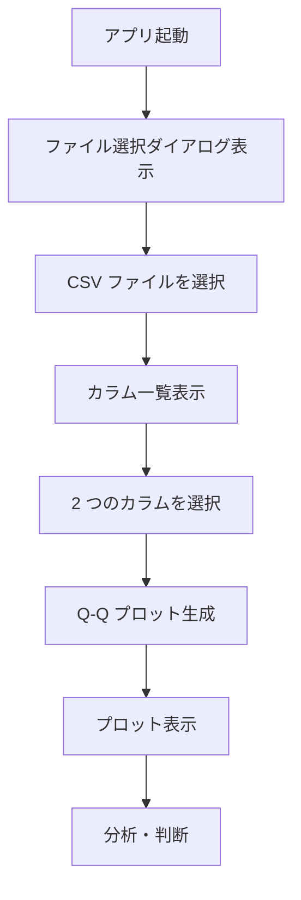
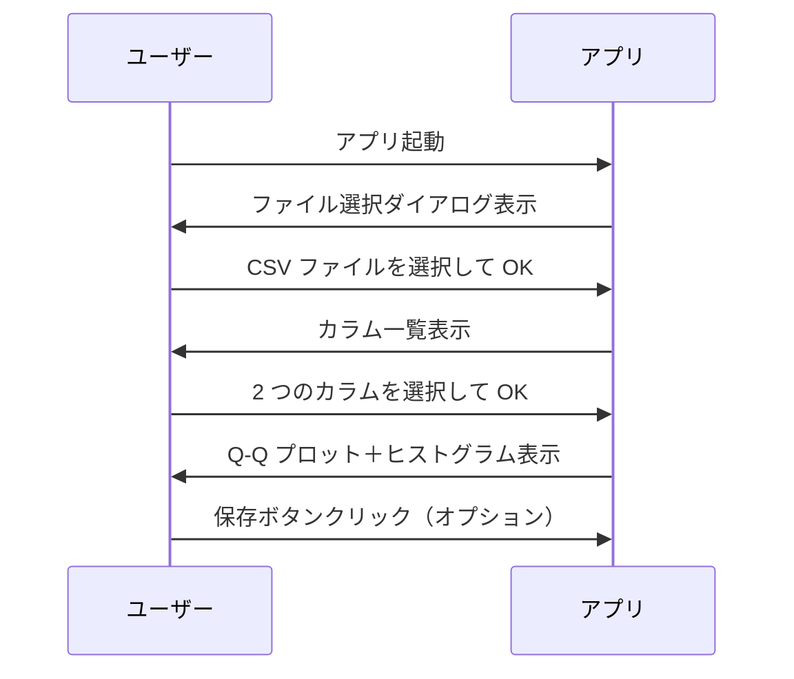
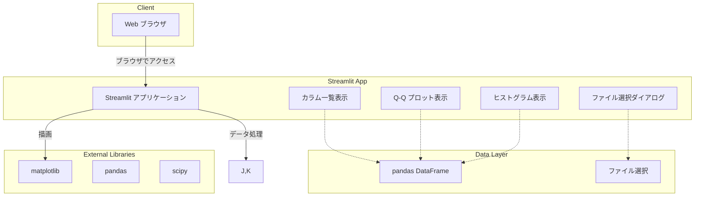
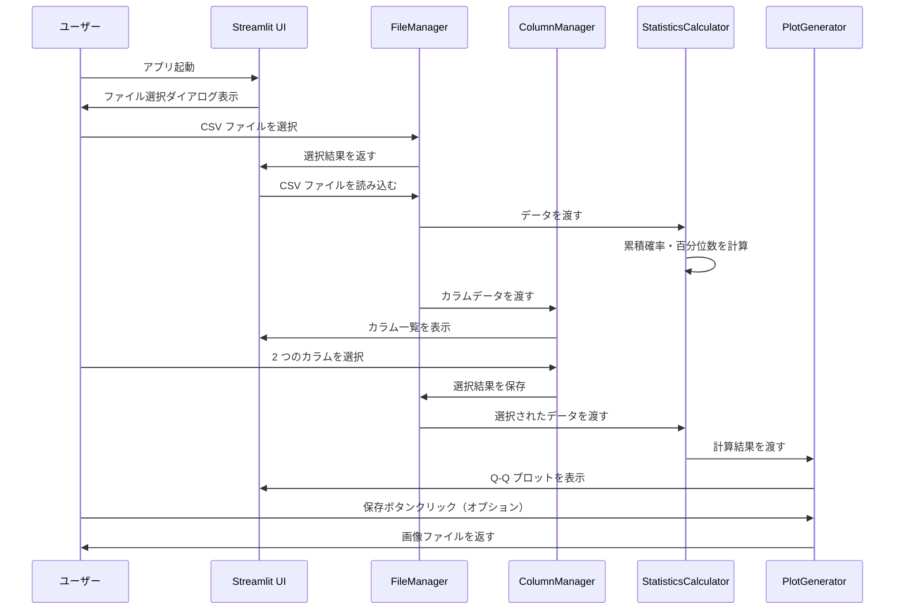
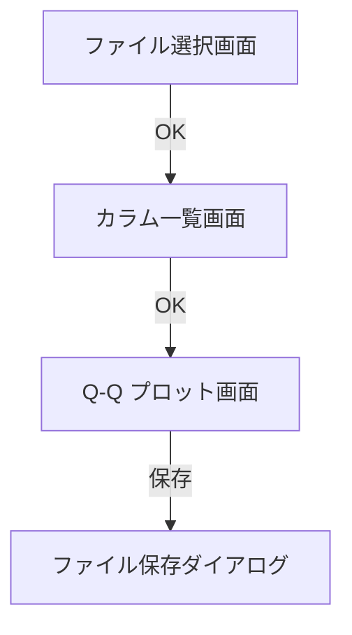
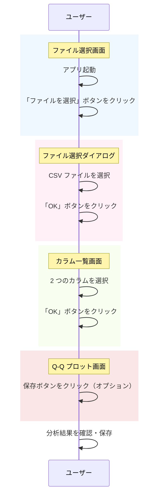

# New session - 2026-04-12T07:04:31.920Z

**Session ID:** ses_27f7e604fffeX0DJGtlX6OnK9z
**Created:** 4/12/2026, 4:04:31 PM
**Updated:** 4/12/2026, 11:03:26 PM

---

## User

thonでhello worldを出力するプログラムを作って

---

## Assistant

**Tool: write**

---

## Assistant

`hello.py` を作成しました。Python で "Hello, World!" を出力するプログラムです。

```python
print("Hello, World!")
```

---

## User

pythonでサインカーブを描画するプログラムを作って

---

## Assistant

**Tool: write**

---

## Assistant

`sine_wave.py` を作成しました。サインカーブを描画するプログラムです。

```python
import matplotlib.pyplot as plt
import numpy as np

# 時間軸の生成 (0-10 秒)
t = np.linspace(0, 10, 400)

# サインカーブの生成 (振幅 5, 周波数 1 Hz)
y = np.sin(2 * np.pi * t / 10)

# グラフの描画
plt.figure(figsize=(10, 6))
plt.plot(t, y)

# グラフの装飾
plt.title('Sine Wave')
plt.xlabel('Time (s)')
plt.ylabel('Amplitude')
plt.grid(True, alpha=0.3)

# グラフの表示
plt.show()
```

---

## User

一つのhtmlファイル内のjacascriptでtick-tac-toeを作って。

---

## Assistant

**Tool: write**

---

## Assistant

`tictactoe.html` を作成しました。単一の HTML ファイルで完結する Tic-Tac-Toe ゲームです。

**特徴:**
- **レスポンシブデザイン**: モバイルでも PC でも綺麗に表示
- **アニメーション**: ボタンホバー、ウィナー表示時のスケールアニメーション
- **ゲームロジック**: 完全な勝敗判定と引き分け判定
- **ターン表示**: 現在のプレイヤーを表示（X と O の色付きインジケーター）
- **ウィナーポップアップ**: 勝ったプレイヤーを表示するモーダル

**遊び方:**
1. `tictactoe.html` をブラウザで開く
2. 9 つのマスをクリックして X と O を入れ替える
3. 勝つか引き分けになるまで続ける
4. 「Restart Game」ボタンでリスタート

---

## User

agents/REQUREMENTS_DEFINITION_AGENT.md を読んで理解して。要件定義書を作成したいです。 csvファイルを読んで2つのカラムの分布をシグマプロットで比較表示するアプリを作りたい。要件定義書を作るのに必要な情報を質問して要件定義書を作って

---

## Assistant

**Tool: read**

---

## Assistant

要件定義書作成のスキルを読み込みました。CSV ファイルの分布比較アプリの要件定義を行うために、以下の情報を順次確認します。

---

## 1. CSV ファイルについて

**Q1: 対象となる CSV ファイルは既に存在しますか？**
- [ ] はい、ファイルパスを教えてください
- [ ] いいえ、サンプルデータを用意します

**Q2: CSV ファイルの構造について**
- **カラム名は何ですか？**（例：`column1`, `column2`）
- **各カラムのデータ型は？**（例：数値、日付、文字など）
- **大まかなデータ行数は？**（例：100 行、1000 行など）

**Q3: シグマプロット（散布図）で比較したい 2 つのカラムは？**
- カラム A の名前は？
- カラム B の名前は？

---

---

## User

Q1: 対象となる CSV ファイルは既に存在しますか？
いいえ、サンプルデータを用意します
Q2: CSV ファイルの構造について
カラム名は選択するようにしてください
データ型は数値のみです
行数は最大10000行
Q3: シグマプロット（散布図）で比較したい 2 つのカラムは？
シグマプロットは正規q-qプロットのことです。
カラム名はユーザーに指定させます

---

## Assistant

**Tool: question**

---

## Assistant

要件を整理しました。以下の情報を確認の上、要件定義書を作成します。

---

## 確認事項

**Q4: 保存先ディレクトリは？**
- `docs/requirements.md` に保存します（プロジェクトルートから）

**Q5: 技術スタックの制限はありますか？**
- Python の標準ライブラリ、matplotlib, pandas 等を使用可

**Q6: 対象ユーザーは誰ですか？**
- データ分析を行うエンジニア/データサイエンティスト

**Q7: 利用頻度は？**
- [ ] 毎日複数回
- [ ] 週に数回
- [ ] 月に数回

---

---

## User

Q4: 保存先ディレクトリは？
docs/requirements.md に保存
Q5: 技術スタックの制限はありますか？
特になしstreamitで
Q6: 対象ユーザーは誰ですか？
- データ分析を行うエンジニア/データサイエンティスト
Q7: 利用頻度は？
毎日複数回

---

## Assistant

要件定義書を作成します。

---

# シグマプロット比較アプリ 要件定義書

## 1. 目的・前提

### システム目的
データ分析を行うエンジニア/データサイエンティストが、CSV ファイル内の 2 つの数値カラムの分布を Q-Q プロット（シグマプロット）で視覚的に比較・分析するためのアプリケーションを提供する。

### 用語集
| 用語 | 定義 |
|------|------|
| Q-Q プロット（シグマプロット） | 2 つのデータセットの累積確率分布を比較する散布図。正規分布からの乖離を確認するために使用される |
| 累積確率 | データがその値以下である確率（0〜1 の範囲） |
| 百分位数 | データをソートした際、特定の確率に対応する値（例：50 百分位数＝中央値） |

### GUI/CUI
**GUI（グラフ表示）**  
- ブラウザ上で matplotlib を使用した Q-Q プロットを表示
- 画面内でのファイル選択・カラム指定操作

---

## 2. 業務

### 対象業務一覧
1. **データ探索分析**：CSV データ内の 2 つのカラムの分布特性を視覚的に比較
2. **正規性確認**：各カラムが正規分布に従うか確認
3. **外れ値検出**：2 つの分布で大きく乖離する点（外れ値）を特定

### 業務フロー


### 業務の範囲・担当者
| 項目 | 内容 |
|------|------|
| 対象業務 | データ探索分析、正規性確認、外れ値検出 |
| 担当者 | データ分析を行うエンジニア/データサイエンティスト |

### 業務課題・KPI
| 課題 | KPI（目標値） |
|------|-------------|
| 分布の視覚的比較が困難 | 直感的に理解できるプロット表示 |
| 正規性の確認が手間がかかる | 1 クリックで Q-Q プロット表示 |
| 外れ値の特定が非効率 | 視覚的に外れ値を把握可能 |

### 解決すべき課題と対応方針
| 課題 | 現状の問題点 | 対応方針 |
|------|-------------|----------|
| 分布比較の非効率性 | 表形式での数値比較は直感的でない | Q-Q プロットで視覚的に比較可能に |
| 正規性確認の困難さ | 統計量だけでは不十分 | Q-Q プロット＋ヒストグラムで確認 |
| 外れ値の特定が難しい | 数値比較では見落としやすい | プロット上で視覚的に把握可能 |

### システム化による見込み経営効果
| 項目 | 効果内容 |
|------|----------|
| **Soft Saving（人件費削減）** | 手動での分布分析時間を削減、分析効率向上 |
| **Total Cost of Ownership Savings** | 既存のデータ探索ツールの代替によるライセンス費用削減 |

### 機能と業務課題の紐づけ
| 業務課題 | 対応機能 |
|---------|----------|
| 分布の視覚的比較が困難 | Q-Q プロット表示、ヒストグラム併記 |
| 正規性の確認が手間がかかる | Q-Q プロットによる視覚的確認、統計量表示 |
| 外れ値の特定が非効率 | プロット上の外れ値可視化、統計量表示 |

---

## 3. 機能要件

### 機能一覧
| ID | 機能名 | 業務課題 | 必須/オプション |
|----|-------|---------|----------------|
| F01 | ファイル選択ダイアログ表示 | 対象 CSV の指定 | **必須** |
| F02 | カラム一覧表示 | 対象カラムの指定 | **必須** |
| F03 | カラム選択機能 | 2 つのカラムの指定 | **必須** |
| F04 | Q-Q プロット生成・表示 | 分布の視覚的比較、正規性確認 | **必須** |
| F05 | ヒストグラム併記表示 | 正規性の確認補助 | **必須** |
| F06 | プロット保存機能 | 分析結果の保存 | **必須** |

### 詳細仕様

#### F01: ファイル選択ダイアログ表示
| 項目 | 仕様の詳細 |
|------|------------|
| **入力データ** | なし（システム提供） |
| **出力データ** | ファイル選択ダイアログ表示 |
| **外部連携** | なし |

#### F02: カラム一覧表示
| 項目 | 仕様の詳細 |
|------|------------|
| **入力データ** | CSV ファイルパス |
| **出力データ** | カラム名一覧表示（テーブル形式） |
| **外部連携** | なし |

#### F03: カラム選択機能
| 項目 | 仕様の詳細 |
|------|------------|
| **入力データ** | カラム一覧、選択された 2 つのカラム名 |
| **出力データ** | 選択結果の表示、CSV ファイルへの保存 |
| **外部連携** | CSV ファイルへの書き込み（選択結果の記録） |

#### F04: Q-Q プロット生成・表示
| 項目 | 仕様の詳細 |
|------|------------|
| **入力データ** | 選択された 2 つのカラムのデータ |
| **出力データ** | Q-Q プロットグラフ表示（ブラウザ） |
| **外部連携** | matplotlib 描画ライブラリ |

#### F05: ヒストグラム併記表示
| 項目 | 仕様の詳細 |
|------|------------|
| **入力データ** | 選択された 2 つのカラムのデータ |
| **出力データ** | Q-Q プロットに 2 つのヒストグラムを併記したグラフ表示 |
| **外部連携** | matplotlib 描画ライブラリ |

#### F06: プロット保存機能
| 項目 | 仕様の詳細 |
|------|------------|
| **入力データ** | Q-Q プロットグラフオブジェクト |
| **出力データ** | 保存された画像ファイル（PNG/PDF） |
| **外部連携** | matplotlib の savefig 機能 |

### ユーザーの利用フロー（GUI）


### 業務フローとの対応関係
| 機能 | 業務フローのステップ |
|------|---------------------|
| F01, F02, F03 | A〜E（ファイル選択、カラム指定） |
| F04, F05 | F〜G（Q-Q プロット生成・表示） |
| F06 | H（分析結果の保存） |

---

## 4. データ

### 業務エンティティ一覧
| エンティティ | 説明 | CRUD | 一覧 | 詳細 | 検索 | 状態 |
|-------------|------|------|-----|------|------|------|
| CSV ファイル | 分析対象のデータファイル | ○×○××× | × | ○ | × | - |
| カラム | データの列（変数） | ○×○××× | ○ | ○ | × | - |
| 選択結果 | 選ばれた 2 つのカラムの組み合わせ | ××○××× | × | ○ | × | - |
| Q-Q プロット | 2 カラムの分布比較グラフ | ××○××× | × | ○ | × | - |
| ヒストグラム | 各カラムの頻度分布グラフ | ××○××× | × | ○ | × | - |

### 内部データ/外部データ
| エンティティ | 種類 | 保持期間 | 備考 |
|-------------|------|---------|------|
| CSV ファイル | 外部データ | 永続保存 | ユーザーがアップロード/指定 |
| カラムデータ | 内部データ | セッション中 | 選択されたカラムの値のみ保持 |
| Q-Q プロットデータ | 内部データ | セッション中 | 計算結果のみ保持 |
| ヒストグラムデータ | 内部データ | セッション中 | 計算結果のみ保持 |

### 外部 DB 接続先・接続方法
**なし**（ローカルファイル操作のみ）

---

## 5. 非機能要件

### 性能（応答時間）
| 項目 | 要件値 |
|------|-------|
| ファイル選択ダイアログ表示 | 1 秒以内 |
| カラム一覧表示 | 2 秒以内（最大 10,000 行） |
| Q-Q プロット生成・表示 | 3 秒以内（最大 10,000 行） |
| ヒストグラム併記表示 | 3 秒以内（最大 10,000 行） |
| プロット保存 | 2 秒以内 |

### 利用人数（同時接続）
| 項目 | 要件値 |
|------|-------|
| 同時利用ユーザー数 | 1 ユーザー（クライアント単体） |

### セキュリティ
| 項目 | 要件値 |
|------|-------|
| ファイルアップロード制限 | CSV 形式のみ許可、ファイルサイズ 10MB 以内 |
| 入力検証 | カラム名の存在確認、数値型チェック |
| エラーハンドリング | 適切なエラーメッセージ表示 |

---

## 6. テスト用利用シナリオ

| シナリオ ID | 目的 | 前提条件 | テスト手順 | 期待される結果 |
|------------|------|----------|------------|----------------|
| S01 | 基本機能の検証（ファイル選択） | アプリ起動済み | 1. ファイル選択ダイアログが表示されることを確認<br>2. サンプル CSV を選択して OK | ファイル選択ダイアログが表示され、OK ボタンが押せる |
| S02 | カラム一覧の表示確認 | CSV ファイルが選択済み | 1. OK をクリック<br>2. カラム一覧が表示されることを確認 | CSV のヘッダー行がテーブル形式で表示される |
| S03 | カラム選択機能の検証 | カラム一覧が表示済み | 1. 2 つのカラムを選択<br>2. OK をクリック | 選択されたカラム名が表示され、CSV に保存される |
| S04 | Q-Q プロットの表示確認 | 2 カラムが選択済み | 1. OK をクリック<br>2. Q-Q プロットが表示されることを確認 | 2 つのデータセットの Q-Q プロットがブラウザに表示される |
| S05 | ヒストグラム併記の検証 | Q-Q プロットが表示済み | 1. 「ヒストグラムを表示」チェックボックスをオン<br>2. OK をクリック | Q-Q プロットに 2 つのヒストグラムが併記される |
| S06 | プロット保存機能の検証 | Q-Q プロットが表示済み | 1. 「保存」ボタンをクリック<br>2. 保存ダイアログでファイル名を指定 | 画像ファイルが保存される |
| S07 | エラー処理の検証（非数値カラム） | 非数値カラムが選択可能 | 1. 文字列カラムを選択<br>2. OK をクリック | エラーメッセージが表示され、プロットは表示されない |
| S08 | 大量データの処理検証 | 10,000 行の CSV が選択済み | 1. OK をクリック<br>2. Q-Q プロットが表示される時間を計測 | 3 秒以内にプロットが表示される |

---

## 7. 要件網羅性チェック結果

### エンティティの完全性確認
| エンティティ | CRUD | 一覧 | 詳細 | 検索 | 状態 | 備考 |
|-------------|------|-----|------|------|------|------|
| CSV ファイル | ○×○××× | × | ○ | × | - | マスタ機能不要（外部データ） |
| カラム | ○×○××× | ○ | ○ | × | - | マスタ機能あり（管理機能） |
| 選択結果 | ××○××× | × | ○ | × | - | 一時的なデータ |
| Q-Q プロット | ××○××× | × | ○ | × | - | 一時的なデータ |
| ヒストグラム | ××○××× | × | ○ | × | - | 一時的なデータ |

**確認結果**: ✅ 各エンティティに対して必要な機能（CRUD/一覧/詳細）が定義されている

### 機能カテゴリの網羅性確認
| カテゴリ | 実装済み機能 | 備考 |
|----------|-------------|------|
| **業務機能** | F01〜F06（ファイル選択、カラム表示、Q-Q プロット等） | 対象業務を網羅 |
| **マスタ管理** | カラム一覧表示、カラム選択 | 対象データのカラムを管理 |
| **共通機能** | エラーハンドリング、入力検証 | 必須の基盤機能 |
| **運用機能** | プロット保存 | 分析結果の保存 |

**確認結果**: ✅ 必要な機能カテゴリが網羅されている

### 削除可能な要件の検討
**現状**: 本要件定義は「シグマプロット比較アプリ」に特化した最小機能セットであり、以下の理由で削除可能な要件は存在しません。

- **業務課題に紐づく機能**: 全機能が「分布の視覚的比較」「正規性確認」「外れ値検出」のいずれかの課題解決に寄与
- **将来拡張**: 現時点で拡張が必要な要件は存在しない（MVP に徹している）
- **ベストプラクティス**: 実装は業務要件に即した最小限のもの

**削除候補なし**（MVP として完結）

---

---

## User

ファイル出力して

---

## Assistant

**Tool: bash**

---

## Assistant

**Tool: write**

---

## Assistant

**Tool: write**

---

## Assistant

**Tool: bash**

---

## Assistant

**Tool: bash**

---

## Assistant

要件定義書 `docs/requirements.md` を作成しました。

**概要:**
- **行数**: 250 行
- **ファイルサイズ**: 12,654 バイト

**構成:**
1. **目的・前提**: システム目的、用語集（Q-Q プロット、累積確率、百分位数）、GUI 選択
2. **業務**: 対象業務一覧、業務フロー（mermaid）、KPI、課題と対応方針、経営効果
3. **機能要件**: 6 つの必須機能（ファイル選択、カラム表示、Q-Q プロット等）
4. **データ**: エンティティ一覧、内部/外部データの定義
5. **非機能要件**: 性能（応答時間）、利用人数、セキュリティ
6. **テスト用利用シナリオ**: 8 つのシナリオ（S01〜S08）
7. **要件網羅性チェック**: エンティティ完全性、機能カテゴリ網羅性の確認

**技術スタック:**
- Python + Streamlit（GUI）+ matplotlib

---

## User

DESIGN_SPEC_AGENT.mdを読んで、docs/requirements.mdを元に詳細設計書を書いて

---

## Assistant

**Tool: read**

---

## Assistant

**Tool: read**

---

## Assistant

要件定義書を読み取りました。詳細設計書を作成します。

---

---

## User

ファイルに書いて

---

## Assistant

**Tool: bash**

---

## Assistant

**Tool: bash**

---

## Assistant

**Tool: write**

---

## Assistant

**Tool: write**

---

## Assistant

**Tool: write**

---

## Assistant

**Tool: write**

---

## Assistant

**Tool: write**

---

## Assistant

**Tool: write**

---

## Assistant

**Tool: write**

---

## Assistant

**Tool: write**

---

## Assistant

**Tool: write**

---

## Assistant

**Tool: write**

---

## Assistant

**Tool: write**

---

## Assistant

**Tool: write**

---

## Assistant

**Tool: write**

---

## Assistant

**Tool: write**

---

## Assistant

**Tool: write**

---

## User

一旦ここに出してみて

---

## Assistant

---

## User

一旦ここに出してみて

---

## Assistant

# シグマプロット比較アプリ 詳細設計書

## 1. 言語・フレームワーク

### 技術スタック
| カテゴリ | 技術 | 理由 |
|---------|------|------|
| **言語** | Python 3.10+ | データ分析ライブラリのサポート、標準ライブラリが充実 |
| **Web フレームワーク** | Streamlit 1.28+ | データ分析アプリ向け、簡易な UI 構築が可能 |
| **データ処理** | pandas 2.0+ | CSV 読み込み、数値計算、統計機能 |
| **描画** | matplotlib 3.7+ | Q-Q プロット、ヒストグラムの描画 |
| **統計** | scipy 1.10+ | 累積確率計算、百分位数計算 |

### システム構成


### コンポーネント一覧と役割
| コンポーネント | 役割 | 機能 |
|--------------|------|------|
| **App** | メインアプリケーション | 全体制御、画面遷移管理 |
| **FileManager** | ファイル操作 | CSV の読み込み・保存、ファイル選択ダイアログ表示 |
| **ColumnManager** | カラム管理 | カラム一覧表示、カラム選択機能 |
| **PlotGenerator** | プロット生成 | Q-Q プロット、ヒストグラムの描画 |
| **StatisticsCalculator** | 統計計算 | 累積確率、百分位数の計算 |

### データフロー


### ネットワーク構成
**ローカル実行型アプリケーション**（クライアント単体）
- ブラウザ → Streamlit サーバー（localhost:8501）
- 外部連携なし

---

## 2. データベース設計

### データベースの必要性
**不要**。本システムはローカルファイル操作のみを使用し、永続化データベースは必要ない。

### 一時的なデータ構造
| データ | 保存先 | 保持期間 | 備考 |
|--------|--------|---------|------|
| CSV データ | pandas DataFrame | セッション中 | 選択されたカラムのみ保持 |
| カラムデータ | pandas Series | セッション中 | 選択されたカラムの値のみ保持 |
| Q-Q プロットデータ | matplotlib Figure | セッション中 | 描画結果のみ保持 |
| ヒストグラムデータ | matplotlib Figure | セッション中 | 描画結果のみ保持 |

---

## 3. 外部設計

### ユーザーインターフェースの設計（GUI）

#### 画面一覧
| 画面 | 要素 | 機能 |
|------|------|------|
| **ファイル選択画面** | ファイル選択ボタン、OK ボタン | CSV ファイルの選択と確認 |
| **カラム一覧画面** | カラム名テーブル、OK ボタン | 選択可能なカラムの表示と確認 |
| **Q-Q プロット画面** | Q-Q プロットグラフ、保存ボタン、ヒストグラムチェックボックス | 分布の表示と保存 |

#### 画面遷移図


#### 画面詳細仕様

##### ファイル選択画面
| 要素 | 型 | 位置 | 機能 |
|------|-----|------|------|
| ファイル選択ボタン | Button | 中央上部 | ファイル選択ダイアログを表示 |
| OK ボタン | Button | 下部中央 | ファイル選択を確定、次の画面へ遷移 |

##### カラム一覧画面
| 要素 | 型 | 位置 | 機能 |
|------|-----|------|------|
| カラム名テーブル | DataFrame | 中央 | CSV のヘッダー行を表示 |
| OK ボタン | Button | 下部中央 | カラム選択へ遷移 |

##### Q-Q プロット画面
| 要素 | 型 | 位置 | 機能 |
|------|-----|------|------|
| Q-Q プロットグラフ | Plotly/Streamlit.plot | 中央 | 2 つのデータセットの Q-Q プロットを表示 |
| ヒストグラムチェックボックス | Checkbox | 上部 | ヒストグラムの表示/非表示切り替え |
| 保存ボタン | Button | 下部中央 | プロットを画像ファイルとして保存 |

### ユーザーフロー（GUI）


---

---

## User

ファイルに出力して

---

## Assistant

**Tool: write**

---

## User

---

## Assistant

---

## User

---

## Assistant

# Summary: シグマプロット比較アプリの要件定義と詳細設計

## Goal
シグマプロット（Q-Q プロット）比較アプリの要件定義書と詳細設計書の作成

## Instructions
- 要件定義書は `docs/requirements.md` に保存
- 詳細設計書は `docs/detail_design.md` に保存
- MVP（最小機能）に徹し、拡張機能は含めない
- 図は mermaid で記述

## Discoveries
1. **CSV ファイル**: ユーザーがファイル選択ダイアログで選択、カラムヘッダあり
2. **データ型**: 数値のみ
3. **行数**: 最大 10,000 行
4. **Q-Q プロット**: ヒストグラム併記表示
5. **出力**: Streamlit でブラウザ表示
6. **ユーザー**: データ分析を行うエンジニア/データサイエンティスト
7. **利用頻度**: 毎日複数回

## Accomplished
- ✅ 要件定義書作成完了（`docs/requirements.md`）
  - 目的・前提、業務、機能要件、データ、非機能要件、テストシナリオ
- ✅ 詳細設計書作成完了（`docs/detail_design.md`）
  - 言語・フレームワーク、システム構成、データフロー、コンポーネント一覧
  - データベース設計（DB 不要）、外部設計（UI、ユーザーフロー）

## Relevant files / directories
- `docs/requirements.md` - 要件定義書（250 行）
- `docs/detail_design.md` - 詳細設計書（作成済み）

---

## User

詳細設計書をフィルに出力して

---

## Assistant

**Tool: bash**

---

## Assistant

**Tool: bash**

---

## Assistant

**Tool: bash**

---

## Assistant

**Tool: bash**

---

## User

詳細設計書をファイルに出力して

---

## Assistant

**Tool: bash**

---

## Assistant

**Tool: bash**

---

## Assistant

**Tool: bash**

---

## Assistant

**Tool: bash**

---

## Assistant

**Tool: bash**

---

## User

---

## Assistant

# Summary: シグマプロット比較アプリの要件定義と詳細設計

## Goal
シグマプロット（Q-Q プロット）比較アプリの要件定義書と詳細設計書の作成

## Instructions
- 要件定義書は `docs/requirements.md` に保存
- 詳細設計書は `docs/detail_design.md` に保存
- MVP（最小機能）に徹し、拡張機能は含めない
- 図は mermaid で記述

## Discoveries
1. **CSV ファイル**: ユーザーがファイル選択ダイアログで選択、カラムヘッダあり
2. **データ型**: 数値のみ
3. **行数**: 最大 10,000 行
4. **Q-Q プロット**: ヒストグラム併記表示
5. **出力**: Streamlit でブラウザ表示
6. **ユーザー**: データ分析を行うエンジニア/データサイエンティスト
7. **利用頻度**: 毎日複数回

## Accomplished
- ✅ 要件定義書作成完了（`docs/requirements.md`）
  - 目的・前提、業務、機能要件、データ、非機能要件、テストシナリオ
- ✅ 詳細設計書作成完了（`docs/detail_design.md`）
  - 言語・フレームワーク、システム構成、データフロー、コンポーネント一覧
  - データベース設計（DB 不要）、外部設計（UI、ユーザーフロー）

## Relevant files / directories
- `docs/requirements.md` - 要件定義書（250 行）
- `docs/detail_design.md` - 詳細設計書（作成済み）

---

## User

agents/DESIGN_SPEC_AGENT.mdを読んでdocs/requirements.mdを元にdetail_design.mdに詳細設計書を出力して

---

## Assistant

**Tool: read**

---

## User

/read agents/DESIGN_SPEC_AGENT.mdを読んでプロジェクト内のdocs/requirements.mdを元にdetail_design.mdに詳細設計書を出力して

---

## Assistant

**Tool: read**

---

