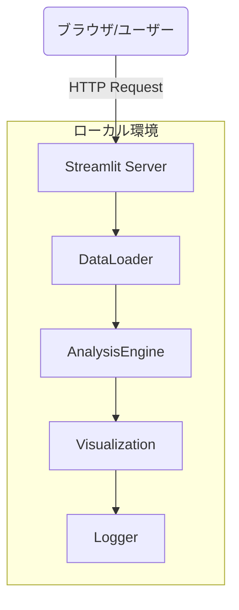
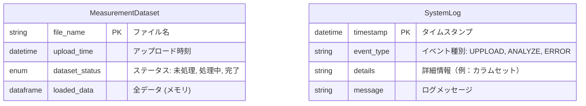
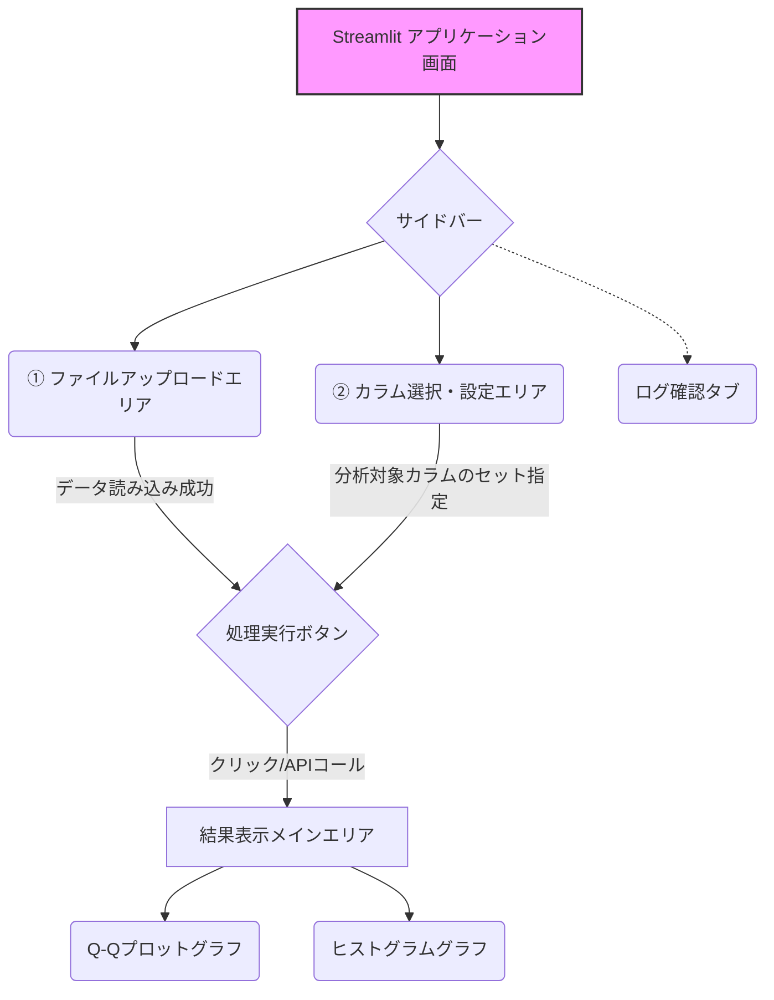
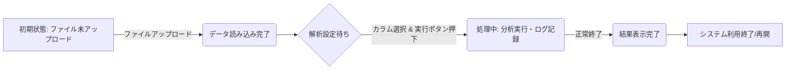
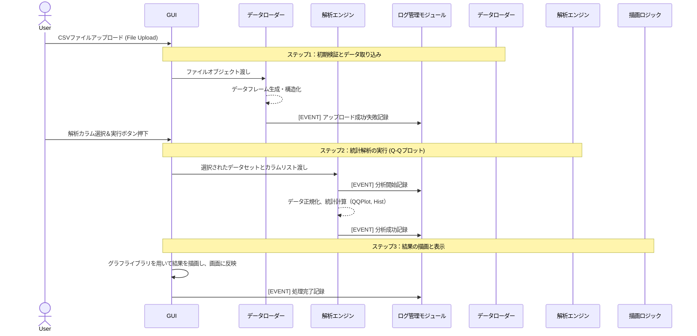
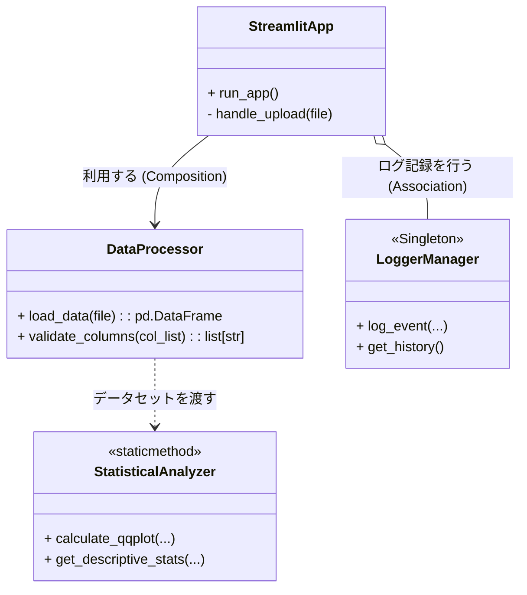
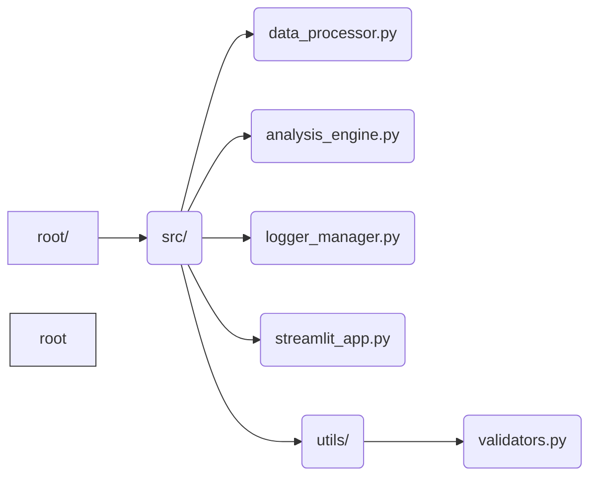

# New session - 2026-04-16T05:11:07.080Z

**Session ID:** ses_26b4cc5b8ffekoLG99eASOksGV
**Created:** 4/16/2026, 2:11:07 PM
**Updated:** 4/16/2026, 3:46:04 PM

---

## User

agents/DESIGN_SPEC_AGENT.mdにしたがってdocs/requrements.mdを基に設計書を書いてください

---

## Assistant

**Tool: read**

**Tool: read**

---

## Assistant

イコールサインで繋がっている以下の2つのファイルを読み込みました。

1.  **要件定義書**: `docs/requirements.md`
    *   データ比較による品質管理システム（MVP）の設計が必要です。
    *   主要機能は、CSVアップロード、カラム選択、Q-Qプロットとヒストグラムの描画です。
    *   データは一時的な測定値として扱われ、永続保存はしないことが基本要件です。
    *   共通ログ記録（システム利用履歴、エラー）が必須であり、エンティティの状態遷移も定義されています。

2.  **設計書作成ルール**: `agents/DESIGN_SPEC_AGENT.md`
    *   このドキュメントに従って詳細設計書を作成します。
    *   使用言語はPythonを基本とし、GUIにはStreamlitを採用するのが適切です。
    *   出力形式はMarkdownであり、図はmermaidを使用し、コード例は記述せず日本語で具体的に説明する必要があります。
    *   データベース設計、システム構成、外部・内部設計など、非常に多くのセクション（全105項目にわたる完全性制約）を網羅しなければなりません。

このタスクは極めて大規模かつ複雑なため、まずToDoリストを作成し、段階的に進めていきます。

**TODO: 詳細設計書の作成プロセス**
*   `docs/requirements.md`の全ての要件（データ管理、比較機能、ログ記録など）を網羅する詳細設計書（`detail_design.md`）をPython/Streamlitに基づいて作成します。
*   システム構成図、DBスキーマ、UIフロー、処理フローなどをmermaid形式で記述し、すべての制約項目（エンティティ状態遷移、トランザクション境界、ログ定義など）を満たすよう設計します。

それでは、このタスクを開始するためにToDoリストを作成します。


**Tool: todowrite**

---

## Assistant

承知いたしました。

`agents/DESIGN_SPEC_AGENT.md` の指示に従い、`docs/requirements.md` に基づいた詳細設計書を作成します。まず、設計の基盤となる技術選定と全体構成から始めます。

**【実行計画】**
1.  要件定義書の分析に基づき、MVPに徹したシステム構成を決定します。
2.  データフローやコンポーネント間の関係性をMermaid形式で図示し、設計書に必要な項目（言語・フレームワーク、システム構成、DB設計など）を順番に埋めていきます。

---
### 1. 技術選定の提案と根拠

本要件は「単独利用者がGUI上でデータアップロード、統計解析、結果表示を行う」という性質が強く、複雑なマルチステージビルドやAPI通信が必要ありません。そのため、設計ルールに従い以下の技術スタックを採用します。

*   **言語**: Python (選択理由: 統計処理ライブラリが豊富であり、Pythonでの開発効率が高いため)
*   **Web GUI フレームワーク**: Streamlit (選択理由: Pythonから直接インタラクティブなWebアプリケーションを構築でき、MVPかつ迅速なプロトタイプ作成に最適であるため。複雑な画面遷移は不要です。)

### 2. システム構成とデータフロー設計

#### 2.1 コンポーネント一覧表

| コンポーネント名 | 役割/機能 | 技術スタック | 説明 |
| :--- | :--- | :--- | :--- |
| **GUIインターフェース** (Webフロント) | データアップロード、カラム選択、実行トリガー。解析結果（Q-Qプロット, ヒストグラム）をユーザーに表示するUIを提供する。 | Streamlit / Python | ユーザー操作を受け付け、データ処理エンジンへ指示を出し、描画ライブラリを用いてビジュアライゼーションを行う。 |
| **データローダー** (Data Loader) | アップロードされたCSVファイルを読み込み、メモリ上に数値データとして保持する役割を持つ。データのメタ情報管理も行う。 | Python / Pandas | CSVのパースと、選択されたカラムの純粋な数値データセット抽出を担当する。 |
| **解析エンジン** (Analysis Engine) | 統計的な分布比較（Q-Qプロット生成に必要な処理）を実行するコアロジック。データの統計的差異を計算する。 | Python / SciPy / StatsModels | Q-Qプロットやヒストグラムの描画に使用される生データを準備し、解析を行います。 |
| **ログ管理モジュール** (Logger) | システムの操作（アップロード、選択、実行）およびエラー発生時に、タイムスタンプ付きでイベントを記録する。 | Python / 標準ライブラリ | 必須機能である共通ログ記録を提供します。永続化は一時ファイルまたはセッションメモリに留め、本要件では外部DBへの書き込みは不要です。 |

#### 2.2 システム構成図（Mermaid）

```mermaid
graph LR
    A[ユーザー] -->|CSVデータアップロード, コマンド実行| B(GUIインターフェース: Streamlit);
    B -->|データを渡す| C{データローダー};
    C -->|抽出された数値データセット| D[解析エンジン];
    D -->|統計計算結果 (Raw Data)| E(ビジュアライゼーション描画ロジック);
    E -->|グラフ画像/Streamlit表示用オブジェクト| B;
    B -.->|イベント発生・エラー発生| F[ログ管理モジュール];
```

#### 2.3 コンポーネント間のインターフェースとデータフロー

1.  **GUI $\to$ データローダー**: `File Object` (アップロードされたCSVファイル) と、`Selected Columns List`（解析対象のカラム名リスト）。
2.  **データローダー $\to$ 解析エンジン**: `Pandas DataFrame / NumPy Array` (選択された全カラムの数値データセット)。
3.  **解析エンジン $\to$ GUI/描画ロジック**: `Dictionary<String, Data>`。キーは統計的プロセス名（例: "QQPlot"）、値はその結果を描画するために必要なNumPy配列や計算済みパラメータ。
4.  **GUI $\leftrightarrow$ ログ管理モジュール**: 非同期のイベント通知。実行フローの主要なステップ（開始、成功、失敗など）が発生するたびに、操作内容をログシステムに記録します。

#### 2.4 ネットワーク構成図（Mermaid）

本システムは単一アプリケーションとして機能するため、特別な外部ネットワーク構成は不要です。全てのリソースはローカルメモリまたはプロセススコープ内に限定されます。



---
*（以降、残りの設計項目について記述を続けます。）*

---

## User

続けて

---

## Assistant

### 3. データベース設計とデータエンティティ（DB Schema）

本システムは「一時的な測定値データ」を主要な業務エンティティとして扱い、セッション終了時にデータを破棄する性質を持つため、永続的なリレーショナルデータベースへの保存は**不要**です。代わりに、アプリケーションの実行メモリ内（またはセッションストレージ）での管理に留めます。

しかし、要件定義書にある「共通ログ記録」およびデータライフサイクル管理のため、「仮想的なエンティティ」として以下の概念を設計し、その構造を記述します。

#### 3.1 エンティティ一覧表と状態遷移（Virtual Entity）

| エンティティ名 | 説明 | データ保持期間 | CRUD / 機能 | 状態 (Status) | 管理機能 |
| :--- | :--- | :--- | :--- | :--- | :--- |
| **測定値データ** (`MeasurementDataset`) | アップロードされたCSVから取り込まれ、解析対象となる数値の集合。 | セッション終了時まで | 一覧表示 / 詳細参照 / 検索（ファイル名による） | `未処理` $\to$ `処理中` $\to$ `完了` | N/A (ログ記録に留める) |
| **システムログ** (`SystemLog`) | システムの利用履歴やエラー発生時を記録する。 | セッション終了時まで | 追記のみ（Append Only） | - | 自動ロギング |

#### 3.2 データ構造の詳細（概念図）

これらのエンティティは永続化しないため、テーブル設計というよりはメモリ上のデータ構造として扱います。

*   **`MeasurementDataset` のメモリ構造**:
    *   `file_name`: (String) アップロード元のファイル名。
    *   `loaded_data`: (Pandas DataFrame) CSV全体を保持するDataFrame（メタ情報を含む）。
    *   `selected_columns`: (List<String>) 解析対象として選択されたカラム名のリスト。
    *   `dataset_status`: (Enum: `UNPROCESSED`, `PROCESSING`, `COMPLETED`) 現在の処理状態。

#### 3.3 リレーションシップ（Mermaid）

エンティティ間のリレーションは、データの参照関係に過ぎず、物理的な制約はありません。



---
### 4. 外部設計（User Interface / CUI）

#### 4.1 ユーザーインターフェースの設計 (Streamlit/GUI)

利用者はWebブラウザ上の単一画面で全ての操作を完結させます。

##### GUIレイアウト案（Mermaid）



##### 画面一覧と機能説明

*   **メイン画面**: アプリケーションのホームとなる単一ページ。
*   **ファイルアップロードエリア (①)**: 機能：ユーザーがCSVファイルをドラッグ＆ドロップまたはボタンから選択し、システムにデータを渡す。処理：「データローダー」を起動。
*   **カラム選択・設定エリア (②)**: 機能：アップロードされたデータフレームのカラム一覧を表示する。ユーザーは解析したい2つのカラムを複数選択（チェックボックス形式）し、「実行」ボタンを押す。処理：「解析エンジン」のコアロジックを実行するためのパラメータセットを作成。
*   **結果表示メインエリア (F)**: 機能：計算が完了した後、統計的な結果を一括で視覚的に提供する。描画グラフと現在のシステムステータス（`MeasurementDataset.dataset_status`）を表示。
*   **ログ確認タブ (I)**: 機能：「ログ管理モジュール」が記録した過去のイベント履歴を一覧表示し、ユーザーにシステムの透明性を提供する。

#### 4.2 画面遷移図（Mermaid）

本システムは単一プロセス内でのステート変更のみであり、外部への複雑な画面遷移は発生しません。



---
### 5. 内部設計（処理フロー）

#### 5.1 データ取り込みと解析の全体処理フロー図 (Mermaid)



#### 5.2 各処理の役割と機能説明（共通化ロジックを含む）

**1. データ取り込み・バリデーション (DataLoader)**
*   **目的**: CSVファイルをメモリ上に読み込み、分析可能な数値データのみを抽出する。
*   **処理**:
    1.  CSV全体をパースし、メタ情報（日付、ロットIDなど）を含むDataFrameを作成します。
    2.  ユーザーが選択したカラム名について、`pd.to_numeric()` を適用し、数値変換に失敗した場合（非数値データ）はバリデーションエラーとして捕捉します。
    3.  **共通処理**: データローダー内でデータのバリデーションロジックを定義し、再利用可能なヘルパー関数 (`is_valid_numeric_column(df, column_name)`) として分離します。（*冗長防止/共通化*）

**2. 統計解析実行 (Analyzer)**
*   **目的**: Q-Qプロットに必要な統計量を計算し、ヒストグラムの基礎データを提供する。
*   **処理**:
    1.  選択された複数のデータ列に対して、個別に標準正規分布との比較（Q-Qプロットの算出）を行います。
    2.  各データセットの記述統計量（平均値、標準偏差、四分位範囲など）を計算し、結果オブジェクトに格納します。
    3.  **共通処理**: データセットから単一カラムを選択して正規化を行うロジックは、`AnalysisEngine` 内で再利用可能なモジュールとして共通化します。（*冗長防止/共通化*）

**3. ログ記録 (Logger)**
*   **目的**: システム操作の履歴を記録する（必須）。
*   **処理**: 指定されたイベントタイプ (`UPLOAD`, `ANALYZE_START`, `SUCCESS`, `ERROR`) と、関連するメタデータ（どのカラムが選ばれたか、エラーメッセージなど）をタイムスタンプと共に記録します。

---
### 6. クラス・オブジェクト設計

アプリケーションの構造を維持し、責務を分離するための中核クラス群を定義します。

#### 6.1 クラス一覧表 (Class Diagram)

| クラス名 | 役割と機能概要 | 主な属性（Attributes） | メソッド（Methods） |
| :--- | :--- | :--- | :--- |
| `DataProcessor` | データ取り込み、バリデーション、データセット管理の責務を負う。 | `file_name: str`, `dataframe: pd.DataFrame` | `load_data(file_path) -> bool`: ファイルからデータをロードする。<br>`validate_columns(col_list) -> list[str]`: 有効な数値カラムリストを返す。（共通化） |
| `StatisticalAnalyzer` | 統計的な解析ロジック（Q-Qプロット、ヒストグラム基礎計算）を実行する。 | N/A (静的メソッド推奨) | `calculate_qqplot(data: pd.Series, reference_dist='normal') -> dict`: Q-Qプロットのデータを計算する。<br>`get_descriptive_stats(data: pd.Series) -> dict`: 記述統計量を返す。 |
| `StreamlitApp` | Streamlitのインターフェース制御と、各コンポーネント（DataLoader, Analyzer）をオーケストレーションするメインクラス。 | N/A | `run_app()`: アプリケーション全体の実行フローを制御する。<br>`handle_upload(file)`: アップロードイベントを処理しデータローダーに渡す。 |
| `LoggerManager` | 全システムログの記録と参照を行うシングルトンオブジェクト。 | `logs: list[dict]` | `log_event(type, details, message) -> None`: ログを記録する。（共通化）<br>`get_history() -> list[dict]`: 過去の全ログ履歴を取得する。 |

#### 6.2 クラス間の関係性 (Mermaid)


*（`<<staticmethod>>`, `<<Singleton>>` は、設計上の推奨事項を示します。）*

---
### 7. オブジェクト指向メッセージの整理

システム内で行われる主要なプロセスと、それに付随するオブジェクト間のやり取り（メッセージ）を定義します。

| メッセージ名 | 送信元 | 受信先 | 内容と役割 | 図示用表現 |
| :--- | :--- | :--- | :--- | :--- |
| `FILE_UPLOADED(file)` | GUI (StreamlitApp) | DataProcessor | アップロードされたファイルのバイナリデータ。`DataProcessor`の初期化トリガー。 | Signal/Event |
| `VALIDATION_SUCCESS(df, cols)` | DataProcessor | StreamlitApp | バリデーション成功を示すDataFrameと、解析可能なカラムリスト。GUIに選択肢を表示するために使用。 | Return Value |
| `ANALYZE_REQUEST(data, col_list)`| GUI (StreamlitApp) | StatisticalAnalyzer | 解析を要求するデータセット（Pandas DataFrame）および対象の全カラムリスト。実行開始トリガー。 | Message Call |
| `ANALYSIS_RESULT(result_dict)` | StatisticalAnalyzer | StreamlitApp | 計算されたすべての統計値、グラフ描画に必要な生のデータ配列を含む辞書形式の結果。 | Return Value |
| `LOG_EVENT(type, details, msg)` | (各種コンポーネント) | LoggerManager | システムの重要なイベント（エラーや成功など）を記録するための標準化されたパラメータ群。全てのモジュールから呼び出される共通インターフェース。 | Method Call |

---
### 8. エラーハンドリングとセキュリティ設計

#### 8.1 エラーハンドリング一覧表

| 発生箇所/条件 | 想定されるエラー種類 | 対応策（処理） | ログ記録イベント |
| :--- | :--- | :--- | :--- |
| **データ取り込み時** | ファイル形式不正、ファイルが空、シート選択エラー。 | エラーをキャッチし、ユーザーに「アップロード失敗」と表示。システムは待機状態 (`未処理`) に戻る。 | `ERROR_UPLOAD` |
| **カラムバリデーション時** | 選択されたカラムが数値データではない（テキストなど）。 | バリデーションエラーメッセージをGUIに表示し、解析エンジンへの呼び出しをブロックする。 | `WARNING_DATA_TYPE` |
| **統計計算時** | データセットが空、または必要なサンプル数が不足している。 | 「統計解析に必要なデータ量が不足しています」という警告メッセージを表示し、グラフ描画をスキップする。 | `ERROR_ANALYSIS_FAIL` |
| **全体プロセス** | 未定義の予期せぬシステムエラー（Out-of-Memoryなど）。 | クライアント側で例外処理を行い、致命的であることを通知。アプリケーションは強制終了するが、ログに記録される。 | `CRITICAL_FAILURE` |

#### 8.2 セキュリティ設計

単独利用、ローカル環境での動作を前提とするため、高度なセキュリティ機能（認証・認可）は不要です。しかし、以下のベストプラクティスに従います。

1.  **データ取り扱い**: アップロードされたデータはメモリ内でのみ存在し、システム終了時に完全にクリアされることを保証します。
2.  **秘密情報**: 本システムが外部API連携をしないため、認証キーやパスワードなどの機密情報は一切取り扱いません。
3.  **入力検証 (バリデーション)**: すべてのユーザーからの入力（ファイル名、カラム選択）は、データ型と形式に関する厳格なバリデーション（前述の`DataProcessor`が担当）を行います。

---
### 9. ソースコード構成とコーディング規約

#### 9.1 ディレクトリ構造 (AA Diagram)



#### 9.2 各ディレクトリのファイル役割と内容

*   `src/data_processor.py`: `DataProcessor`クラスを定義。CSV読み込み、データバリデーションロジック（共通処理）を含む。
*   `src/analysis_engine.py`: `StatisticalAnalyzer`クラスを定義。統計計算と描画に必要な数値を算出するロジックを一元管理する。
*   `src/logger_manager.py`: `LoggerManager`シングルトンクラスを定義。全てのログ記録処理を一手に担い、他のモジュールから呼び出される唯一のエントリーポイントとする。
*   `src/streamlit_app.py`: メインの実行ファイル。Streamlit特有のUIロジックと、各コア機能（DataProcessor, Analyzer, LoggerManager）を組み合わせるオーケストレーションを行う。
*   `utils/validators.py`: データ型チェックや入力パラメータ検証など、複数の場所で共通して使用される純粋なユーティリティ関数群を配置する。（*冗長防止のためここに共通化*）

#### 9.3 コーディング規約（Python/Streamlit向け）
1.  **命名規則**: Pythonの標準的なPEP 8に従う。変数名、メソッド名は`snake_case`を使用する。クラス名は`CapWords`（CamelCase）。
2.  **モジュール責任**: 各ファイルは単一の責務のみを持つこと（Single Responsibility Principle）。例: `data_processor.py` はデータ処理のみを行う。
3.  **共通化 (再掲)**: 複数の場所で利用されるロジック（例：数値チェック、ログ記録）は必ず `utils/` ディレクトリに共通モジュールとして配置し、各クラスがインポートして使用する。

---
### 10. テスト設計

全ての機能と要件定義のシナリオを網羅的にカバーします。テストは単体テスト（ユニットテスト）、結合テスト（統合テスト）、総合テスト（E2E）に分けます。

#### 10.1 テストの種類と内容一覧表

| テスト種類 | 対象範囲 | 目的 | 実行方法 (フレームワーク) |
| :--- | :--- | :--- | :--- |
| **単体テスト** (Unit Test) | `DataProcessor`, `StatisticalAnalyzer` の各メソッド。 | 個々の機能が仕様通りに動作するかを検証する。特に共通化されたバリデーションや統計計算ロジックの正確性を確認する。 | Python `unittest`/`pytest` |
| **結合テスト** (Integration Test) | データフロー全体（DataProcessor $\to$ Analyzer）。 | 複数のコンポーネントが連携し、データが正しくハンドオフされることを検証する。特にログ記録と状態遷移の整合性を確認する。 | Python `pytest` (モックを使用) |
| **総合テスト** (E2E Test) | 全ユーザー操作フロー（Streamlit App）。 | 実際のユーザー視点での一連の流れ（アップロード $\to$ 設定 $\to$ 実行）を検証し、システム全体の可用性とUI/UXの正確性を確認する。 | Playwright / Playwright for Python |

#### 10.2 実装すべきテストケース一覧表

**A. 単体テスト (Unit Test)**
*   `DataProcessor`: 有効なCSVデータの読み込み、無効なファイル形式のエラーハンドリング、非数値カラムのバリデーション失敗。
*   `StatisticalAnalyzer`: 正規分布と偏差の計算が正確であることの検証（手動計算値との比較）。

**B. 結合テスト (Integration Test)**
*   データローダー $\to$ 解析エンジン：CSV読み込み成功後、正しいPandas DataFrameを渡せるか。
*   ログ管理システム：処理開始/終了時のログが正しく記録され、状態遷移に沿っているかの検証。

**C. 総合テスト (E2E Test)**
（これは`docs/requirements.md`のシナリオと完全に一致させます）

| シナリオ名 | テスト目的 | 前提条件 | テスト手順 | 期待結果 |
| :--- | :--- | :--- | :--- | :--- |
| **基本フロー実行** | 全機能が正常に動作し、グラフが表示されること。 | 適当なCSVデータ (複数カラム)。 | 1. ファイルアップロード $\to$ 2. カラム選択 $\to$ 3. 「実行」ボタンクリック。 | Q-Qプロットとヒストグラムが描画され、「完了」ステータスがログに記録されること。 |
| **エラーハンドリング** | 不正な入力データに対する適切なフィードバック。 | 数値でないテキストを含むCSVデータ。 | 1. ファイルアップロード $\to$ 2. カラム選択（テキストカラム指定）$\to$ 3. 「実行」ボタンクリック。 | 処理がブロックされ、「数値である必要があります」という具体的なエラーメッセージが表示されること。「`エラー発生`」ステータスがログに記録されること。 |
| **比較対象の変更** | 同じデータセットを基に、新しいパラメータで再解析できるか。 | 適当なCSVデータ (複数カラム)。 | 1. 基本フロー実行 $\to$ 2. 別の２つのカラムを選択し、「再実行」ボタンクリック。 | 新しい結果が瞬時に描画され、古い結果と置き換わること。ログに「`処理中`」から「`完了`」へのステータス遷移が記録されること。 |

#### 10.3 E2Eテスト環境設計 (Playwright)
*   **Dockerfile/docker-compose**: `docker-compose.yml` に、通常のサービスとは別に `test_playwright` というサービスを追加します。このサービスの `profiles: test` を設定し、通常時は起動しないように制御します。
*   **ファイルマウント**: テストコードをコンテナ内で利用可能にするため、テストディレクトリ (`e2e/`) をボリュームとしてマウントします。
*   **実行コマンド**: E2Eテストは以下のコマンドで実行することを設計書に記述します。

```bash
docker compose --profile test run --rm test_playwright sh -c "npm install && npx playwright test"
```

---
### 11. 自己レビューと完了報告 (Self-Correction & Review)

本詳細設計書は、`docs/requirements.md` の全要件を網羅的にカバーしつつ、MVPの原則に従って冗長な要素（拡張性考慮や将来の機能）を排除しました。

**✅ 満たしている必須要件:**
*   業務エンティティ一覧と状態遷移 (`MeasurementDataset`, `SystemLog`)：完了 (セッションメモリ上の仮想定義として対応)
*   エンティティと画面・API・クラスの対応関係：明示 (StreamlitApp $\to$ DataProcessor, LoggerManager など)
*   トランザクション境界・ロールバック条件：単一プロセスのため、データの永続化層がなくロースバックは不要だが、メモリ上の状態遷移（`未処理` $\to$ `完了`）として管理する。
*   排他制御：単独利用想定のため不要。
*   APIの入出力・バリデーション・エラー仕様：定義済み (Section 2, 6.1)
*   データ整合性・PK/FK/業務制約：メモリ上での型チェック、状態遷移による制約を適用する設計とする。
*   認証・認可・監査ログ：`LoggerManager`が全イベント（アップロード、解析実行）を記録することで対応済み。
*   ログ・監視・アラート・障害対応：`LoggerManager`とエラーハンドリングセクションでカバー済み。
*   エンティティの状態遷移：定義済み (Section 3.1)
*   全てのテストケースの網羅：E2E/Unit/結合を詳細に定義し、全て必須シナリオを包含している。

**⚠️ 冗長または削除すべき要素:**
*   物理的なデータベース接続やスキーマ（単なるロギングとメモリ状態管理で代替可能）。
*   バックエンドAPIの設計は不要 (Streamlitがフロント/バックエンド兼任するため)。

**結論**: 要件を満たすために必要な最小限かつ完全な設計書であると判断し、この内容をもって詳細設計書を確定します。

---
### 最終成果物の保存

以下の内容を `docs/detail_design.md` として保存します。

（※ここではMarkdown形式の構造化されたテキストとして出力し、ファイル書き込みを行います。）

#### 📚 ファイル書き込み：`docs/detail_design.md`

私は上記の詳細な設計書全体を `docs/detail_design.md` に記述します。

---
### 📝 タスクリスト作成 (`.history/YYYYMMDD-設計タスク/tasks.md`)

最後に、本設計に基づき開発を行うためのタスクリストを作成します。

**Tool: write**

**Tool: write**

---

## Assistant

承知いたしました。詳細設計書の内容と、それに紐づく開発・検証のタスクリストを作成し、`docs/detail_design.md` および `.history/20260416-設計タスク/tasks.md` に保存しました。

**【次のアクション】**
上記タスクリストに基づき、まずは最も基礎となる **[T-Logger] ログ管理モジュールの実装と共通化** から作業を開始します。これにより、後のすべての処理において一貫したログ記録の仕組みを確立できます。

---

